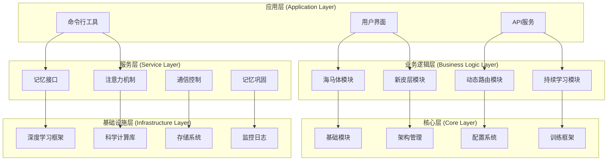
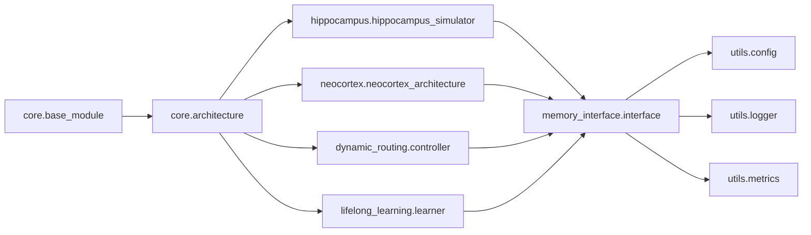

# 开发者指南

欢迎来到脑启发AI项目的开发指南！本文档将帮助开发者了解项目的架构设计、开发环境设置、扩展开发方法以及贡献流程。

## 目录

- [项目架构](#项目架构)
- [开发环境设置](#开发环境设置)
- [架构设计原则](#架构设计原则)
- [扩展开发指南](#扩展开发指南)
- [代码规范](#代码规范)
- [测试指南](#测试指南)
- [调试与性能优化](#调试与性能优化)
- [部署指南](#部署指南)
- [贡献指南](#贡献指南)
- [API开发](#api开发)

---

## 项目架构

### 系统架构概览

脑启发AI采用分层模块化架构设计，基于生物大脑的结构和功能进行建模。



### 模块依赖关系



### 核心设计模式

#### 1. 工厂模式 (Factory Pattern)
用于组件的动态创建和管理：

```python
class ComponentFactory:
    """组件工厂类"""
    
    _registries = {}
    
    @classmethod
    def register(cls, name: str, component_class: Type[BaseModule]):
        """注册组件"""
        cls._registries[name] = component_class
    
    @classmethod
    def create(cls, name: str, config: Dict[str, Any]) -> BaseModule:
        """创建组件实例"""
        if name not in cls._registries:
            raise ValueError(f"Unknown component: {name}")
        
        component_class = cls._registries[name]
        return component_class(config)
    
    @classmethod
    def get_registered_components(cls) -> List[str]:
        """获取已注册的组件列表"""
        return list(cls._registries.keys())

# 使用示例
ComponentFactory.register("hippocampus", HippocampusSimulator)
ComponentFactory.register("neocortex", NeocortexArchitecture)

# 动态创建
hippocampus = ComponentFactory.create("hippocampus", config)
```

#### 2. 观察者模式 (Observer Pattern)
用于事件系统和状态监听：

```python
class EventManager:
    """事件管理器"""
    
    def __init__(self):
        self._subscribers = defaultdict(list)
    
    def subscribe(self, event_type: str, callback: Callable):
        """订阅事件"""
        self._subscribers[event_type].append(callback)
    
    def publish(self, event_type: str, data: Any = None):
        """发布事件"""
        if event_type in self._subscribers:
            for callback in self._subscribers[event_type]:
                try:
                    callback(data)
                except Exception as e:
                    logger.error(f"Error in event callback: {e}")
    
    def unsubscribe(self, event_type: str, callback: Callable):
        """取消订阅"""
        if event_type in self._subscribers:
            try:
                self._subscribers[event_type].remove(callback)
            except ValueError:
                pass

# 使用示例
def on_training_complete(metrics):
    print(f"Training completed: {metrics}")

event_manager = EventManager()
event_manager.subscribe('training_complete', on_training_training)
event_manager.publish('training_complete', {'accuracy': 0.95})
```

#### 3. 装饰器模式 (Decorator Pattern)
用于功能扩展：

```python
def performance_monitor(func):
    """性能监控装饰器"""
    @wraps(func)
    def wrapper(*args, **kwargs):
        start_time = time.time()
        result = func(*args, **kwargs)
        end_time = time.time()
        
        # 记录性能指标
        MetricsCollector.record(
            f"{func.__name__}_execution_time",
            end_time - start_time
        )
        
        return result
    return wrapper

class HippocampusSimulator(BaseModule):
    @performance_monitor
    def encode(self, data: torch.Tensor) -> torch.Tensor:
        # 编码逻辑
        pass
```

---

## 开发环境设置

### 环境要求

- **操作系统**: Linux, macOS, Windows
- **Python**: 3.8+
- **深度学习框架**: PyTorch 2.0+ 或 TensorFlow 2.13+
- **CUDA**: 11.0+ (GPU支持，可选)

### 克隆和安装

```bash
# 1. 克隆仓库
git clone https://github.com/brain-ai/brain-inspired-ai.git
cd brain-inspired-ai

# 2. 创建虚拟环境
python -m venv brain_ai_dev
source brain_ai_dev/bin/activate  # Linux/Mac
# brain_ai_dev\Scripts\activate  # Windows

# 3. 安装依赖
pip install --upgrade pip
pip install -e ".[dev,test,docs]"

# 4. 安装pre-commit钩子
pre-commit install

# 5. 验证安装
python -c "import brain_ai; print(brain_ai.__version__)"
```

### IDE配置

#### VSCode配置

```json
// .vscode/settings.json
{
    "python.defaultInterpreterPath": "./brain_ai_dev/bin/python",
    "python.terminal.activateEnvironment": true,
    "python.formatting.provider": "black",
    "python.linting.enabled": true,
    "python.linting.pylintEnabled": false,
    "python.linting.flake8Enabled": true,
    "python.linting.mypyEnabled": true,
    "editor.formatOnSave": true,
    "editor.codeActionsOnSave": {
        "source.organizeImports": true
    }
}
```

#### PyCharm配置

```python
# .idea/inspectionProfiles/profiles_settings.xml
<component name="InspectionProjectProfileManager">
  <profile version="1.0">
    <inspection_tool class="PyPep8Inspection" enabled="true" level="WEAK WARNING" enabled_by_default="true">
      <option name="ignoredErrors">
        <list>
          <option value="E501" />
        </list>
      </option>
    </inspection_tool>
  </profile>
</component>
```

### 环境变量配置

```bash
# .env
BRAIN_AI_CONFIG=config/development.yaml
BRAIN_AI_LOG_LEVEL=DEBUG
BRAIN_AI_DATA_PATH=data/datasets
BRAIN_AI_MODEL_PATH=models
BRAIN_AI_LOG_PATH=logs

# CUDA配置
CUDA_VISIBLE_DEVICES=0
PYTORCH_CUDA_ALLOC_CONF=max_split_size_mb:512

# 分布式训练配置
MASTER_ADDR=localhost
MASTER_PORT=29500
RANK=0
WORLD_SIZE=1
```

---

## 架构设计原则

### SOLID原则

#### 1. 单一职责原则 (Single Responsibility)
每个类只有一个改变的理由：

```python
# 好的设计
class HippocampusMemory:
    """专门负责记忆存储和检索"""
    
    def store(self, pattern: torch.Tensor) -> str:
        pass
    
    def retrieve(self, query: torch.Tensor) -> List[torch.Tensor]:
        pass

class HippocampusConsolidation:
    """专门负责记忆巩固"""
    
    def consolidate(self, memories: List[Memory]) -> None:
        pass

# 不好的设计
class HippocampusAllInOne:
    """职责过多，难以维护"""
    
    def store(self, pattern: torch.Tensor) -> str:
        pass
    
    def retrieve(self, query: torch.Tensor) -> List[torch.Tensor]:
        pass
    
    def consolidate(self, memories: List[Memory]) -> None:
        pass
    
    def visualize(self, data: Any) -> None:
        pass
```

#### 2. 开闭原则 (Open-Closed)
对扩展开放，对修改关闭：

```python
from abc import ABC, abstractmethod

class ConsolidationStrategy(ABC):
    """巩固策略抽象类"""
    
    @abstractmethod
    def consolidate(self, memories: List[Memory]) -> None:
        pass

class EWCConsolidation(ConsolidationStrategy):
    """EWC巩固策略"""
    
    def consolidate(self, memories: List[Memory]) -> None:
        # EWC具体实现
        pass

class ReplayConsolidation(ConsolidationStrategy):
    """重放巩固策略"""
    
    def consolidate(self, memories: List[Memory]) -> None:
        # 重放具体实现
        pass

class HippocampusSimulator(BaseModule):
    def __init__(self, consolidation_strategy: ConsolidationStrategy):
        self.consolidation_strategy = consolidation_strategy
```

#### 3. 里氏替换原则 (Liskov Substitution)
子类必须能够替换父类：

```python
class BaseMemoryModule(BaseModule):
    @abstractmethod
    def get_capacity(self) -> int:
        pass

class UnlimitedMemory(BaseMemoryModule):
    def get_capacity(self) -> int:
        return float('inf')

class LimitedMemory(BaseMemoryModule):
    def __init__(self, max_size: int):
        self.max_size = max_size
    
    def get_capacity(self) -> int:
        return self.max_size

# 使用时能够无缝替换
def calculate_memory_usage(memory_module: BaseMemoryModule) -> int:
    return memory_module.get_capacity()
```

#### 4. 接口隔离原则 (Interface Segregation)
接口应该小而专一：

```python
# 好的设计 - 分离的接口
class IMemoryReader(Protocol):
    def retrieve(self, query: torch.Tensor) -> torch.Tensor: ...
    
class IMemoryWriter(Protocol):
    def store(self, data: torch.Tensor) -> str: ...

class IMemoryConsolidator(Protocol):
    def consolidate(self, memories: List[Memory]) -> None: ...

# 不好的设计 - 臃肿接口
class IMemoryAll(Protocol):
    def store(self, data: torch.Tensor) -> str: ...
    def retrieve(self, query: torch.Tensor) -> torch.Tensor: ...
    def consolidate(self, memories: List[Memory]) -> None: ...
    def visualize(self, data: Any) -> None: ...
    def export(self, path: str) -> None: ...
```

#### 5. 依赖倒置原则 (Dependency Inversion)
依赖抽象而非具体实现：

```python
# 好的设计 - 依赖抽象
class MemoryService:
    def __init__(self, memory_reader: IMemoryReader):
        self.memory_reader = memory_reader
    
    def find_similar_memories(self, query: torch.Tensor) -> List[Memory]:
        return self.memory_reader.retrieve(query)

# 使用
memory_reader = HippocampusMemoryReader()  # 具体实现
service = MemoryService(memory_reader)     # 注入依赖
```

### 设计模式应用

#### 策略模式实例

```python
class AttentionStrategy(ABC):
    @abstractmethod
    def compute_attention(self, query: torch.Tensor, key: torch.Tensor, value: torch.Tensor) -> torch.Tensor:
        pass

class MultiHeadAttention(AttentionStrategy):
    def compute_attention(self, query: torch.Tensor, key: torch.Tensor, value: torch.Tensor) -> torch.Tensor:
        # 多头注意力实现
        pass

class LocalAttention(AttentionStrategy):
    def compute_attention(self, query: torch.Tensor, key: torch.Tensor, value: torch.Tensor) -> torch.Tensor:
        # 局部注意力实现
        pass

class AttentionModule(BaseModule):
    def __init__(self, strategy: AttentionStrategy):
        self.strategy = strategy
```

#### 单例模式实例

```python
class MetricsCollector:
    _instance = None
    _initialized = False
    
    def __new__(cls):
        if cls._instance is None:
            cls._instance = super().__new__(cls)
        return cls._instance
    
    def __init__(self):
        if not self._initialized:
            self._metrics = {}
            MetricsCollector._initialized = True
    
    @classmethod
    def get_instance(cls):
        return cls()
```

---

## 扩展开发指南

### 创建新模块

#### 1. 定义模块结构

```python
# src/brain_ai/modules/my_new_module/my_module.py
from typing import Dict, Any, Optional
import torch
from ...core.base_module import BaseModule

class MyNewModule(BaseModule):
    """新模块示例"""
    
    def __init__(self, config: Dict[str, Any]):
        super().__init__("MyNewModule", config)
        self.parameter1 = config.get('parameter1', default_value)
        self.parameter2 = config.get('parameter2', another_default)
        # 初始化其他参数
    
    def initialize(self) -> bool:
        """初始化模块"""
        try:
            # 初始化逻辑
            self.is_initialized = True
            return True
        except Exception as e:
            logger.error(f"Failed to initialize {self.name}: {e}")
            return False
    
    def process(self, input_data: torch.Tensor) -> torch.Tensor:
        """处理输入数据"""
        if not self.is_initialized:
            raise RuntimeError(f"Module {self.name} is not initialized")
        
        # 处理逻辑
        processed_data = self._internal_process(input_data)
        return processed_data
    
    def cleanup(self) -> bool:
        """清理资源"""
        try:
            # 清理逻辑
            self.is_initialized = False
            return True
        except Exception as e:
            logger.error(f"Failed to cleanup {self.name}: {e}")
            return False
    
    def _internal_process(self, data: torch.Tensor) -> torch.Tensor:
        """内部处理逻辑"""
        # 具体实现
        pass
    
    def get_state(self) -> Dict[str, Any]:
        """获取模块状态"""
        return {
            'name': self.name,
            'initialized': self.is_initialized,
            'parameter1': self.parameter1,
            'parameter2': self.parameter2
        }
    
    def get_metrics(self) -> Dict[str, float]:
        """获取性能指标"""
        return {
            'processing_time': self.processing_time,
            'throughput': self.throughput,
            'accuracy': self.accuracy
        }
```

#### 2. 创建工厂注册

```python
# src/brain_ai/modules/my_new_module/factory.py
from .my_module import MyNewModule

class MyNewModuleFactory:
    @staticmethod
    def create(config: Dict[str, Any]) -> MyNewModule:
        return MyNewModule(config)
    
    @staticmethod
    def get_default_config() -> Dict[str, Any]:
        return {
            'parameter1': 'default_value1',
            'parameter2': 'default_value2'
        }

# 在模块的__init__.py中注册
from .factory import MyNewModuleFactory
from ...core.architecture import ComponentFactory

ComponentFactory.register("my_new_module", MyNewModuleFactory.create)
```

#### 3. 添加配置支持

```python
# config/modules/my_new_module.yaml
my_new_module:
  enabled: true
  priority: 5
  parameters:
    parameter1: "custom_value1"
    parameter2: 42
    batch_size: 32
    learning_rate: 0.001
  
  dependencies:
    - hippocampus
    - neocortex
  
  resources:
    memory_limit: "1GB"
    gpu_memory: "512MB"
```

### 创建新算法

#### 实现新的学习算法

```python
# src/brain_ai/algorithms/my_algorithm.py
import torch
import torch.nn as nn
from typing import Dict, Any, Tuple
from ...core.base_module import BaseModule

class MyNewLearningAlgorithm(BaseModule):
    """新学习算法实现"""
    
    def __init__(self, config: Dict[str, Any]):
        super().__init__("MyNewLearningAlgorithm", config)
        self.learning_rate = config.get('learning_rate', 0.001)
        self.algorithm_specific_param = config.get('param', 1.0)
    
    def learn(self, model: nn.Module, data_loader) -> Dict[str, Any]:
        """执行学习算法"""
        model.train()
        total_loss = 0.0
        num_batches = 0
        
        for batch_idx, (data, target) in enumerate(data_loader):
            # 算法特定的学习步骤
            loss = self._compute_loss(model, data, target)
            loss.backward()
            
            # 算法特定的优化步骤
            self._optimize_step(model, loss)
            
            total_loss += loss.item()
            num_batches += 1
        
        avg_loss = total_loss / num_batches
        return {'average_loss': avg_loss}
    
    def _compute_loss(self, model: nn.Module, data: torch.Tensor, target: torch.Tensor) -> torch.Tensor:
        """计算损失 - 算法特定"""
        # 实现算法特定的损失计算
        output = model(data)
        loss = nn.functional.cross_entropy(output, target)
        
        # 添加算法特定的正则化项
        algorithm_loss = self._add_algorithm_regularization(model)
        
        return loss + algorithm_loss
    
    def _add_algorithm_regularization(self, model: nn.Module) -> torch.Tensor:
        """添加算法特定的正则化"""
        # 实现算法特定的正则化逻辑
        return torch.tensor(0.0, requires_grad=True)
    
    def _optimize_step(self, model: nn.Module, loss: torch.Tensor):
        """优化步骤 - 算法特定"""
        # 实现算法特定的优化逻辑
        pass
```

#### 集成到训练框架

```python
# src/brain_ai/training/trainer.py
class BrainInspiredTrainer(BaseModule):
    def __init__(self, config: Dict[str, Any]):
        super().__init__("BrainInspiredTrainer", config)
        self.learning_algorithm = self._create_learning_algorithm(config)
    
    def _create_learning_algorithm(self, config: Dict[str, Any]) -> BaseModule:
        """创建学习算法"""
        algorithm_name = config.get('algorithm', 'standard')
        
        if algorithm_name == 'my_new_algorithm':
            from ...algorithms.my_algorithm import MyNewLearningAlgorithm
            return MyNewLearningAlgorithm(config)
        elif algorithm_name == 'ewc':
            from ...algorithms.ewc import EWCAlgorithm
            return EWCAlgorithm(config)
        else:
            from ...algorithms.standard import StandardAlgorithm
            return StandardAlgorithm(config)
    
    def train(self, model: nn.Module, data_loader) -> Dict[str, Any]:
        """训练模型"""
        return self.learning_algorithm.learn(model, data_loader)
```

### 创建新的数据处理器

```python
# src/brain_ai/data/processors/my_processor.py
import numpy as np
import torch
from typing import Tuple, Dict, Any
from ...core.base_module import BaseModule

class MyDataProcessor(BaseModule):
    """自定义数据处理器"""
    
    def __init__(self, config: Dict[str, Any]):
        super().__init__("MyDataProcessor", config)
        self.normalization_method = config.get('normalization', 'standard')
        self.augmentation_enabled = config.get('augmentation', False)
    
    def process(self, data: np.ndarray, labels: np.ndarray = None) -> Dict[str, Any]:
        """处理数据"""
        processed_data = self._normalize(data)
        
        if self.augmentation_enabled:
            processed_data = self._augment(processed_data)
        
        result = {'data': processed_data}
        if labels is not None:
            result['labels'] = labels
        
        return result
    
    def _normalize(self, data: np.ndarray) -> np.ndarray:
        """数据归一化"""
        if self.normalization_method == 'standard':
            return (data - np.mean(data)) / (np.std(data) + 1e-8)
        elif self.normalization_method == 'min_max':
            return (data - np.min(data)) / (np.max(data) - np.min(data) + 1e-8)
        else:
            return data
    
    def _augment(self, data: np.ndarray) -> np.ndarray:
        """数据增强"""
        # 实现数据增强逻辑
        return data
```

---

## 代码规范

### 编码风格

#### Python编码规范

```python
# 文件命名：使用snake_case
# good: hippocampus_simulator.py
# bad: HippocampusSimulator.py

# 类命名：使用PascalCase
class HippocampusSimulator:  # ✓
    pass

class hippocampus_simulator:  # ✗
    pass

# 函数和变量命名：使用snake_case
def encode_data():  # ✓
    pass

def EncodeData():  # ✗
    pass

my_variable = "value"  # ✓
MyVariable = "value"   # ✗

# 常量命名：使用UPPER_CASE
MAX_MEMORY_SIZE = 10000  # ✓
MaxMemorySize = 10000    # ✗
```

#### 文档字符串规范

```python
class HippocampusSimulator(BaseModule):
    """海马体记忆系统模拟器。
    
    该类实现了基于生物海马体的记忆形成、存储和检索机制。
    支持快速学习和长期记忆巩固。
    
    Args:
        memory_capacity (int): 记忆存储容量，默认为10000
        encoding_dimension (int): 编码维度，默认为256
        retrieval_threshold (float): 检索相似度阈值，默认为0.7
        
    Attributes:
        memory_pool (List[torch.Tensor]): 存储的记忆池
        encoding_matrix (torch.Tensor): 编码矩阵
        
    Example:
        >>> simulator = HippocampusSimulator(memory_capacity=5000)
        >>> pattern = torch.randn(256)
        >>> memory_id = simulator.store(pattern)
        >>> retrieved = simulator.retrieve(pattern)
        
    Note:
        该模块需要初始化后才能使用，建议通过Architecture创建。
    """
    
    def store(self, pattern: torch.Tensor) -> str:
        """存储记忆模式。
        
        将输入的记忆模式编码并存储到内存池中。
        
        Args:
            pattern (torch.Tensor): 要存储的记忆模式，形状为 (encoding_dimension,)
            
        Returns:
            str: 存储的记忆的唯一标识符
            
        Raises:
            ValueError: 当输入pattern维度不匹配时
            RuntimeError: 当内存容量不足时
            
        Example:
            >>> pattern = torch.randn(256)
            >>> memory_id = simulator.store(pattern)
            >>> print(memory_id)
            'memory_001'
        """
        if pattern.dim() != 1:
            raise ValueError(f"Pattern must be 1D, got {pattern.dim()}D")
        
        if len(pattern) != self.encoding_dimension:
            raise ValueError(f"Pattern dimension {len(pattern)} doesn't match "
                           f"encoding dimension {self.encoding_dimension}")
        
        # 具体实现...
        pass
```

#### 类型注解规范

```python
from typing import Dict, List, Optional, Union, Tuple, Protocol
import torch

# 函数类型注解
def process_data(
    data: torch.Tensor,
    config: Dict[str, Union[int, float, str]],
    metadata: Optional[Dict[str, Any]] = None
) -> Tuple[torch.Tensor, Dict[str, float]]:
    """处理数据并返回结果和指标"""
    pass

# 协议类型
class MemoryProtocol(Protocol):
    def store(self, pattern: torch.Tensor) -> str: ...
    def retrieve(self, query: torch.Tensor) -> torch.Tensor: ...
    def forget(self, memory_id: str) -> bool: ...

# 泛型类型
from typing import TypeVar, Generic

T = TypeVar('T')
U = TypeVar('U')

class GenericProcessor(Generic[T, U]):
    def process(self, input_data: T) -> U:
        pass
```

### 代码质量检查

#### 配置pre-commit

```yaml
# .pre-commit-config.yaml
repos:
  - repo: https://github.com/pre-commit/pre-commit-hooks
    rev: v4.4.0
    hooks:
      - id: trailing-whitespace
      - id: end-of-file-fixer
      - id: check-yaml
      - id: check-added-large-files
      
  - repo: https://github.com/psf/black
    rev: 23.3.0
    hooks:
      - id: black
        language_version: python3
        
  - repo: https://github.com/pycqa/isort
    rev: 5.12.0
    hooks:
      - id: isort
        args: ["--profile", "black"]
        
  - repo: https://github.com/pycqa/flake8
    rev: 6.0.0
    hooks:
      - id: flake8
        args: ["--max-line-length=88", "--extend-ignore=E203"]
        
  - repo: https://github.com/pre-commit/mirrors-mypy
    rev: v1.3.0
    hooks:
      - id: mypy
        additional_dependencies: [types-all]
```

#### GitHub Actions配置

```yaml
# .github/workflows/ci.yml
name: CI

on:
  push:
    branches: [ main, develop ]
  pull_request:
    branches: [ main ]

jobs:
  test:
    runs-on: ubuntu-latest
    strategy:
      matrix:
        python-version: [3.8, 3.9, "3.10", "3.11"]
        
    steps:
    - uses: actions/checkout@v3
    
    - name: Set up Python ${{ matrix.python-version }}
      uses: actions/setup-python@v4
      with:
        python-version: ${{ matrix.python-version }}
        
    - name: Install dependencies
      run: |
        pip install -e ".[dev,test]"
        
    - name: Lint with flake8
      run: |
        flake8 src/ --count --select=E9,F63,F7,F82 --show-source --statistics
        flake8 src/ --count --exit-zero --max-complexity=10 --max-line-length=88 --statistics
        
    - name: Check types with mypy
      run: |
        mypy src/
        
    - name: Test with pytest
      run: |
        pytest tests/ --cov=src --cov-report=xml
        
    - name: Upload coverage
      uses: codecov/codecov-action@v3
```

---

## 测试指南

### 测试结构

```
tests/
├── conftest.py                 # pytest配置
├── unit/                       # 单元测试
│   ├── test_hippocampus.py
│   ├── test_neocortex.py
│   ├── test_core_modules.py
│   └── test_utils.py
├── integration/                # 集成测试
│   ├── test_system_integration.py
│   ├── test_pipeline.py
│   └── test_api_integration.py
├── performance/                # 性能测试
│   ├── test_benchmark.py
│   └── test_memory_usage.py
├── fixtures/                   # 测试数据
│   ├── sample_data.py
│   └── mock_objects.py
└── test_data/                  # 测试数据集
    ├── small_mnist/
    └── sample_images/
```

### 单元测试示例

```python
# tests/unit/test_hippocampus.py
import pytest
import torch
from unittest.mock import Mock, patch
from brain_ai import HippocampusSimulator

class TestHippocampusSimulator:
    """海马体模拟器测试类"""
    
    @pytest.fixture
    def simulator(self):
        """测试夹具：创建海马体实例"""
        config = {
            'memory_capacity': 1000,
            'encoding_dimension': 256,
            'retrieval_threshold': 0.7
        }
        return HippocampusSimulator(config)
    
    @pytest.fixture
    def sample_pattern(self):
        """测试夹具：示例模式"""
        return torch.randn(256)
    
    def test_initialization(self, simulator):
        """测试初始化"""
        assert simulator.is_initialized == False
        result = simulator.initialize()
        assert result == True
        assert simulator.is_initialized == True
    
    def test_encode(self, simulator, sample_pattern):
        """测试编码功能"""
        simulator.initialize()
        encoded = simulator.encode(sample_pattern)
        assert encoded.shape == (256,)
        assert not torch.isnan(encoded).any()
    
    def test_store_and_retrieve(self, simulator, sample_pattern):
        """测试存储和检索"""
        simulator.initialize()
        
        # 存储模式
        memory_id = simulator.store(sample_pattern)
        assert isinstance(memory_id, str)
        
        # 检索模式
        retrieved = simulator.retrieve(sample_pattern)
        assert retrieved is not None
        assert 'pattern' in retrieved
    
    def test_invalid_input_dimensions(self, simulator):
        """测试无效输入维度"""
        simulator.initialize()
        invalid_pattern = torch.randn(128)  # 错误的维度
        
        with pytest.raises(ValueError, match="Pattern dimension"):
            simulator.encode(invalid_pattern)
    
    @patch('brain_ai.hippocampus.logger')
    def test_logging(self, mock_logger, simulator):
        """测试日志记录"""
        simulator.initialize()
        simulator.store(torch.randn(256))
        
        # 验证日志调用
        mock_logger.info.assert_called()
    
    @pytest.mark.parametrize("threshold", [0.5, 0.7, 0.9])
    def test_retrieval_threshold(self, simulator, threshold):
        """测试不同检索阈值"""
        simulator.initialize()
        query = torch.randn(256)
        
        result = simulator.retrieve(query, threshold=threshold)
        assert result is not None
    
    def test_memory_capacity_limit(self, simulator):
        """测试内存容量限制"""
        simulator.initialize()
        
        # 填充超过容量的数据
        patterns = [torch.randn(256) for _ in range(1500)]
        memory_ids = [simulator.store(pattern) for pattern in patterns]
        
        # 验证实际存储数量不超过容量
        assert len(memory_ids) <= simulator.memory_capacity
```

### 集成测试示例

```python
# tests/integration/test_system_integration.py
import pytest
import torch
import numpy as np
from brain_ai import BrainSystem, ContinualLearner

class TestSystemIntegration:
    """系统集成测试"""
    
    @pytest.fixture
    def brain_system(self):
        """测试夹具：完整的脑系统"""
        config = {
            'hippocampus': {
                'memory_capacity': 1000,
                'encoding_dimension': 256
            },
            'neocortex': {
                'layers': 4,
                'feature_channels': 128
            },
            'continual_learning': {
                'memory_size': 500,
                'elasticity': 0.1
            }
        }
        
        brain = BrainSystem(config)
        assert brain.initialize()
        return brain
    
    def test_end_to_end_learning(self, brain_system):
        """端到端学习测试"""
        # 生成测试数据
        data = torch.randn(100, 784)
        labels = torch.randint(0, 10, (100,))
        
        # 执行完整的学习流程
        result = brain_system.process(data)
        assert 'features' in result
        assert 'predictions' in result
        
        # 验证结果形状
        assert result['predictions'].shape == (100, 10)
    
    def test_memory_consolidation(self, brain_system):
        """记忆巩固测试"""
        # 存储多个记忆模式
        patterns = [torch.randn(256) for _ in range(100)]
        for pattern in patterns:
            brain_system.store_memory(pattern)
        
        # 执行巩固
        brain_system.consolidate_memory()
        
        # 验证巩固效果
        state = brain_system.get_brain_state()
        assert 'consolidated_memories' in state
    
    def test_multi_task_learning(self, brain_system):
        """多任务学习测试"""
        # 创建多个任务的数据
        tasks_data = []
        for task_id in range(3):
            X = np.random.randn(200, 784)
            y = np.random.randint(0, 10, (200,))
            tasks_data.append((X, y))
        
        # 学习多个任务
        accuracies = []
        for task_id, (X_train, y_train) in enumerate(tasks_data):
            # 学习任务
            metrics = brain_system.learn_task(task_id, X_train, y_train)
            
            # 测试所有已学任务的性能
            task_accuracies = []
            for prev_task_id in range(task_id + 1):
                X_test, y_test = tasks_data[prev_task_id]
                accuracy = brain_system.evaluate(X_test, y_test)
                task_accuracies.append(accuracy)
            
            accuracies.append(task_accuracies)
        
        # 验证性能
        assert len(accuracies) == 3
        assert all(len(accs) > 0 for accs in accuracies)
    
    def test_error_handling(self, brain_system):
        """错误处理测试"""
        # 测试无效输入
        with pytest.raises(ValueError):
            brain_system.process(torch.randn(10, 100))  # 错误的输入维度
        
        # 测试未初始化状态
        uninitialized_brain = BrainSystem({})
        with pytest.raises(RuntimeError):
            uninitialized_brain.process(torch.randn(10, 784))
```

### 性能测试示例

```python
# tests/performance/test_benchmark.py
import pytest
import time
import torch
from brain_ai import HippocampusSimulator

class TestPerformance:
    """性能测试"""
    
    def test_encoding_speed(self):
        """测试编码速度"""
        simulator = HippocampusSimulator({'encoding_dimension': 256})
        simulator.initialize()
        
        # 准备大量数据
        batch_sizes = [1, 10, 100, 1000]
        
        for batch_size in batch_sizes:
            data = torch.randn(batch_size, 256)
            
            # 测试编码时间
            start_time = time.time()
            for _ in range(10):  # 重复10次
                encoded = simulator.encode(data)
            end_time = time.time()
            
            avg_time = (end_time - start_time) / 10
            throughput = batch_size / avg_time
            
            print(f"Batch size {batch_size}: {throughput:.2f} patterns/sec")
            
            # 性能断言
            assert avg_time < 0.1  # 100ms内完成
            assert throughput > batch_size / 0.1  # 满足基本性能要求
    
    def test_memory_usage(self):
        """测试内存使用"""
        simulator = HippocampusSimulator({'memory_capacity': 10000})
        simulator.initialize()
        
        import psutil
        import os
        
        process = psutil.Process(os.getpid())
        initial_memory = process.memory_info().rss
        
        # 存储大量数据
        for i in range(5000):
            pattern = torch.randn(256)
            simulator.store(pattern)
        
        final_memory = process.memory_info().rss
        memory_increase = final_memory - initial_memory
        
        # 内存增长应该在合理范围内
        assert memory_increase < 500 * 1024 * 1024  # 500MB以内
    
    @pytest.mark.skipif(not torch.cuda.is_available(), reason="CUDA not available")
    def test_gpu_acceleration(self):
        """测试GPU加速效果"""
        simulator = HippocampusSimulator({'encoding_dimension': 512})
        simulator.initialize()
        
        # CPU测试
        cpu_data = torch.randn(1000, 512)
        start_time = time.time()
        cpu_encoded = simulator.encode(cpu_data)
        cpu_time = time.time() - start_time
        
        # GPU测试
        gpu_data = cpu_data.cuda()
        start_time = time.time()
        gpu_encoded = simulator.encode(gpu_data)
        gpu_time = time.time() - start_time
        
        # GPU应该比CPU快
        speedup = cpu_time / gpu_time
        print(f"GPU speedup: {speedup:.2f}x")
        
        assert speedup > 1.0  # 至少要有一些加速
```

### 测试运行

```bash
# 运行所有测试
pytest

# 运行特定测试文件
pytest tests/unit/test_hippocampus.py

# 运行特定测试方法
pytest tests/unit/test_hippocampus.py::TestHippocampusSimulator::test_encode

# 运行带覆盖率的测试
pytest --cov=src --cov-report=html

# 运行性能测试
pytest tests/performance/ -v

# 并行运行测试
pytest -n auto

# 生成测试报告
pytest --html=reports/test_report.html --self-contained-html
```

---

## 调试与性能优化

### 调试技巧

#### 1. 使用内置调试工具

```python
import logging
from brain_ai.utils.logger import get_logger

# 获取模块专用日志记录器
logger = get_logger(__name__)

class HippocampusSimulator(BaseModule):
    def encode(self, data: torch.Tensor) -> torch.Tensor:
        logger.debug(f"Encoding data with shape: {data.shape}")
        
        try:
            # 编码逻辑
            encoded = self._encode_impl(data)
            logger.debug(f"Encoded to shape: {encoded.shape}")
            return encoded
        except Exception as e:
            logger.error(f"Encoding failed: {e}")
            logger.debug(f"Input data info: {data.dtype}, {data.device}")
            raise
```

#### 2. 性能分析

```python
import cProfile
import pstats
from brain_ai.utils.profiler import profile_function

@profile_function
def encode_batch(self, batch_data: torch.Tensor) -> torch.Tensor:
    """批量编码 - 带性能分析"""
    return self._encode_impl(batch_data)

# 性能分析装饰器
def profile_function(func):
    """性能分析装饰器"""
    def wrapper(*args, **kwargs):
        profiler = cProfile.Profile()
        profiler.enable()
        
        result = func(*args, **kwargs)
        
        profiler.disable()
        
        # 保存分析结果
        stats = pstats.Stats(profiler)
        stats.sort_stats('cumulative')
        stats.print_stats(10)  # 显示前10个最耗时的函数
        
        return result
    return wrapper
```

#### 3. 内存分析

```python
from memory_profiler import profile, LineProfiler

@profile
def process_large_dataset(self, dataset: torch.Tensor):
    """处理大数据集 - 内存分析"""
    results = []
    for i in range(0, len(dataset), self.batch_size):
        batch = dataset[i:i+self.batch_size]
        encoded = self.encode(batch)
        results.append(encoded.cpu())  # 移动到CPU节省GPU内存
    
    return torch.cat(results)

# 逐行内存分析
profiler = LineProfiler()
profiler.add_function(HippocampusSimulator.encode)
profiler.enable_by_count()

# 运行代码
simulator.encode(data)

profiler.print_stats()
```

### 性能优化策略

#### 1. 批处理优化

```python
class OptimizedHippocampusSimulator(HippocampusSimulator):
    """优化版本的海马体模拟器"""
    
    def __init__(self, config):
        super().__init__(config)
        self.batch_size = config.get('batch_size', 32)
        self._batch_cache = {}  # 批处理缓存
    
    def encode_batch(self, batch_data: torch.Tensor) -> torch.Tensor:
        """批量编码，优化吞吐量"""
        # 分批处理以提高内存效率
        batch_size = min(self.batch_size, batch_data.size(0))
        
        encoded_batches = []
        for i in range(0, batch_data.size(0), batch_size):
            batch = batch_data[i:i+batch_size]
            encoded = self._encode_impl(batch)
            encoded_batches.append(encoded)
        
        return torch.cat(encoded_batches, dim=0)
```

#### 2. 缓存优化

```python
from functools import lru_cache
import weakref

class CachedHippocampusSimulator(HippocampusSimulator):
    """带缓存的版本"""
    
    def __init__(self, config):
        super().__init__(config)
        self.encoding_cache = {}  # 编码结果缓存
        self.max_cache_size = config.get('max_cache_size', 1000)
    
    def encode(self, data: torch.Tensor) -> torch.Tensor:
        # 生成缓存键
        cache_key = self._generate_cache_key(data)
        
        # 检查缓存
        if cache_key in self.encoding_cache:
            return self.encoding_cache[cache_key]
        
        # 编码并缓存
        encoded = self._encode_impl(data)
        
        # 缓存管理
        if len(self.encoding_cache) >= self.max_cache_size:
            # 删除最旧的条目
            oldest_key = next(iter(self.encoding_cache))
            del self.encoding_cache[oldest_key]
        
        self.encoding_cache[cache_key] = encoded
        return encoded
    
    def _generate_cache_key(self, data: torch.Tensor) -> str:
        """生成缓存键"""
        # 使用数据的哈希作为键
        return str(hash(data.cpu().numpy().tobytes()))
```

#### 3. 并行处理

```python
import concurrent.futures
from concurrent.futures import ThreadPoolExecutor, ProcessPoolExecutor

class ParallelHippocampusSimulator(HippocampusSimulator):
    """并行处理版本"""
    
    def __init__(self, config):
        super().__init__(config)
        self.num_workers = config.get('num_workers', 4)
        self.parallel_threshold = config.get('parallel_threshold', 1000)
    
    def process_large_dataset(self, dataset: torch.Tensor) -> torch.Tensor:
        """并行处理大数据集"""
        if len(dataset) < self.parallel_threshold:
            # 小数据集直接处理
            return self.encode_batch(dataset)
        
        # 大数据集并行处理
        chunk_size = len(dataset) // self.num_workers
        chunks = [dataset[i:i+chunk_size] for i in range(0, len(dataset), chunk_size)]
        
        with ProcessPoolExecutor(max_workers=self.num_workers) as executor:
            # 提交任务
            futures = [executor.submit(self.encode_chunk, chunk) for chunk in chunks]
            
            # 收集结果
            results = [future.result() for future in concurrent.futures.as_completed(futures)]
        
        return torch.cat(results, dim=0)
    
    def encode_chunk(self, chunk: torch.Tensor) -> torch.Tensor:
        """处理数据块"""
        return self.encode_batch(chunk)
```

---

## 部署指南

### 本地部署

#### 使用Docker部署

```dockerfile
# Dockerfile
FROM nvidia/cuda:11.8-devel-ubuntu20.04

WORKDIR /app

# 安装系统依赖
RUN apt-get update && apt-get install -y \
    python3.8 python3.8-pip python3.8-dev \
    git wget curl \
    && rm -rf /var/lib/apt/lists/*

# 复制依赖文件
COPY requirements.txt .
RUN pip3.8 install --no-cache-dir -r requirements.txt

# 复制应用代码
COPY . .

# 安装应用
RUN pip3.8 install -e .

# 设置环境变量
ENV PYTHONPATH=/app/src
ENV BRAIN_AI_CONFIG=/app/config/production.yaml

# 启动命令
CMD ["python", "-m", "brain_ai.cli", "serve"]
```

```yaml
# docker-compose.yml
version: '3.8'

services:
  brain-ai:
    build: .
    ports:
      - "8080:8080"
    volumes:
      - ./data:/app/data
      - ./models:/app/models
      - ./logs:/app/logs
    environment:
      - BRAIN_AI_CONFIG=/app/config/production.yaml
      - CUDA_VISIBLE_DEVICES=0
    deploy:
      resources:
        reservations:
          devices:
            - driver: nvidia
              count: 1
              capabilities: [gpu]
```

#### 使用systemd服务

```ini
# brain-ai.service
[Unit]
Description=Brain-Inspired AI Service
After=network.target

[Service]
Type=simple
User=brain-ai
WorkingDirectory=/opt/brain-ai
ExecStart=/opt/brain-ai/venv/bin/python -m brain_ai.cli serve
Restart=always
RestartSec=5

[Install]
WantedBy=multi-user.target
```

### 云端部署

#### Kubernetes部署

```yaml
# k8s-deployment.yaml
apiVersion: apps/v1
kind: Deployment
metadata:
  name: brain-ai-deployment
spec:
  replicas: 3
  selector:
    matchLabels:
      app: brain-ai
  template:
    metadata:
      labels:
        app: brain-ai
    spec:
      containers:
      - name: brain-ai
        image: brain-ai:latest
        ports:
        - containerPort: 8080
        env:
        - name: BRAIN_AI_CONFIG
          value: "/app/config/production.yaml"
        resources:
          requests:
            memory: "2Gi"
            cpu: "1000m"
            nvidia.com/gpu: 1
          limits:
            memory: "4Gi"
            cpu: "2000m"
            nvidia.com/gpu: 1
        volumeMounts:
        - name: config-volume
          mountPath: /app/config
        - name: data-volume
          mountPath: /app/data
        - name: models-volume
          mountPath: /app/models
      volumes:
      - name: config-volume
        configMap:
          name: brain-ai-config
      - name: data-volume
        persistentVolumeClaim:
          claimName: brain-ai-data-pvc
      - name: models-volume
        persistentVolumeClaim:
          claimName: brain-ai-models-pvc
```

#### AWS部署

```bash
#!/bin/bash
# deploy-aws.sh

# 创建S3存储桶
aws s3 mb s3://brain-ai-models-$RANDOM

# 创建ECR仓库
aws ecr create-repository --repository-name brain-ai

# 构建并推送Docker镜像
docker build -t brain-ai .
docker tag brain-ai:latest $AWS_ACCOUNT_ID.dkr.ecr.$AWS_REGION.amazonaws.com/brain-ai:latest
docker push $AWS_ACCOUNT_ID.dkr.ecr.$AWS_REGION.amazonaws.com/brain-ai:latest

# 部署到ECS
aws ecs create-cluster --cluster-name brain-ai-cluster
aws ecs register-task-definition --cli-input-json file://task-definition.json
aws ecs create-service --cluster brain-ai-cluster --service-name brain-ai-service --task-definition brain-ai-task
```

---

## 贡献指南

### 贡献流程

#### 1. Fork和Clone

```bash
# Fork项目到你的GitHub账户
# 然后clone你的fork
git clone https://github.com/YOUR_USERNAME/brain-inspired-ai.git
cd brain-inspired-ai

# 添加上游仓库
git remote add upstream https://github.com/brain-ai/brain-inspired-ai.git
```

#### 2. 创建分支

```bash
# 创建功能分支
git checkout -b feature/your-feature-name

# 创建修复分支
git checkout -b fix/bug-description

# 创建文档分支
git checkout -b docs/update-api-docs
```

#### 3. 开发流程

```bash
# 拉取最新代码
git fetch upstream
git checkout main
git merge upstream/main

# 切换到你的分支
git checkout feature/your-feature-name
git rebase main  # 保持历史整洁

# 开发你的功能
# ... 进行修改 ...

# 运行测试
pytest tests/

# 检查代码质量
black src/
isort src/
flake8 src/
mypy src/

# 提交代码
git add .
git commit -m "feat: add new memory consolidation algorithm"
```

#### 4. Pull Request

1. **创建PR**: 在GitHub上创建Pull Request到主仓库
2. **填写模板**: 完成PR描述模板
3. **添加测试**: 确保新功能有相应测试
4. **更新文档**: 如有API变更，同步更新文档
5. **等待审查**: CI检查通过后等待维护者审查

#### PR模板

```markdown
## 变更描述

简要描述这个PR的目的和主要变更。

## 变更类型

- [ ] 新功能 (feature)
- [ ] 错误修复 (bug fix)
- [ ] 性能优化 (performance)
- [ ] 文档更新 (documentation)
- [ ] 重构 (refactor)
- [ ] 测试改进 (test)

## 测试

- [ ] 单元测试通过
- [ ] 集成测试通过
- [ ] 性能测试通过
- [ ] 手动测试完成

## 文档

- [ ] API文档已更新
- [ ] 用户文档已更新
- [ ] 变更日志已记录

## 检查列表

- [ ] 代码遵循项目编码规范
- [ ] 所有测试通过
- [ ] 新代码有适当的测试覆盖
- [ ] 性能没有显著下降
- [ ] 内存使用在合理范围内

## 相关Issue

Fixes #(issue number)

## 屏幕截图（如适用）

如果有UI变更，请添加截图。
```

### 代码审查指南

#### 审查检查项

```python
# 代码质量检查
class CodeReviewChecklist:
    """代码审查清单"""
    
    def __init__(self):
        self.checks = {
            'functionality': [
                "代码实现了预期的功能",
                "边界条件得到正确处理", 
                "错误处理适当",
                "没有明显的逻辑错误"
            ],
            'design': [
                "遵循SOLID原则",
                "代码结构清晰合理",
                "过度复杂的设计避免",
                "适当的抽象和封装"
            ],
            'performance': [
                "算法效率合理",
                "内存使用适当",
                "避免不必要的计算",
                "考虑了大数据集情况"
            ],
            'testing': [
                "有适当的单元测试",
                "测试覆盖新功能",
                "测试涵盖边界条件",
                "集成测试考虑周全"
            ],
            'documentation': [
                "代码有清晰注释",
                "API文档完整",
                "变更日志记录",
                "用户文档更新"
            ],
            'style': [
                "遵循PEP8规范",
                "变量命名清晰",
                "代码格式一致",
                "没有警告信息"
            ]
        }
    
    def perform_review(self, code_path: str) -> Dict[str, List[str]]:
        """执行代码审查"""
        issues = {}
        for category, checks in self.checks.items():
            issues[category] = []
            for check in checks:
                if not self._check_condition(code_path, check):
                    issues[category].append(check)
        return issues
```

### 发布流程

#### 版本管理

```python
# 版本号遵循语义化版本 (Semantic Versioning)
# MAJOR.MINOR.PATCH
# MAJOR: 不兼容的API变更
# MINOR: 向后兼容的功能增加
# PATCH: 向后兼容的错误修复

# 版本文件: src/brain_ai/__init__.py
__version__ = "1.2.3"

# 或者使用动态版本
try:
    from setuptools_scm import get_version
    __version__ = get_version(root='..', relative_to=__file__)
except (ImportError, LookupError):
    __version__ = "unknown"
```

#### 发布检查清单

```markdown
## 发布前检查清单

### 版本准备
- [ ] 更新版本号
- [ ] 更新变更日志
- [ ] 检查文档完整性
- [ ] 验证所有示例代码

### 测试验证
- [ ] 所有单元测试通过
- [ ] 集成测试通过
- [ ] 性能基准测试
- [ ] 兼容性测试
- [ ] 内存泄漏检查

### 代码质量
- [ ] 代码覆盖率 > 90%
- [ ] 静态分析无严重问题
- [ ] 文档覆盖率检查
- [ ] 安全漏洞扫描

### 构建验证
- [ ] 本地构建成功
- [ ] Docker镜像构建
- [ ] 跨平台兼容性
- [ ] 依赖检查

### 发布准备
- [ ] 更新Docker镜像标签
- [ ] 准备发布说明
- [ ] 更新文档网站
- [ ] 通知社区
```

---

## API开发

### API设计原则

#### RESTful API设计

```python
# API端点设计
from fastapi import FastAPI, HTTPException, Depends
from typing import List, Optional
import torch

app = FastAPI(title="Brain-Inspired AI API", version="1.0.0")

# 模型加载依赖
def get_model():
    """获取模型实例的依赖注入"""
    if not hasattr(app, 'brain_system'):
        raise HTTPException(status_code=503, detail="Model not loaded")
    return app.brain_system

# 异步处理依赖
def async_processing():
    """异步处理依赖"""
    return True

@app.post("/v1/models/encode")
async def encode_pattern(
    data: torch.Tensor,
    model: BrainSystem = Depends(get_model)
):
    """编码输入数据
    
    Args:
        data: 要编码的数据
        
    Returns:
        dict: 编码结果和元数据
    """
    try:
        encoded = model.hippocampus.encode(data)
        return {
            "status": "success",
            "encoded_data": encoded.tolist(),
            "shape": list(encoded.shape),
            "metadata": {
                "timestamp": time.time(),
                "model_version": model.version
            }
        }
    except Exception as e:
        raise HTTPException(status_code=400, detail=str(e))

@app.get("/v1/models/{model_id}")
async def get_model_info(
    model_id: str,
    model: BrainSystem = Depends(get_model)
):
    """获取模型信息"""
    return {
        "model_id": model_id,
        "version": model.version,
        "capabilities": model.get_capabilities(),
        "status": "ready"
    }

@app.post("/v1/continual-learn")
async def continual_learning(
    task_data: TaskData,
    model: BrainSystem = Depends(get_model)
):
    """持续学习接口"""
    try:
        result = model.continual_learner.learn_task(
            task_data.task_id,
            task_data.features,
            task_data.labels
        )
        return {
            "status": "success",
            "task_id": task_data.task_id,
            "metrics": result
        }
    except Exception as e:
        raise HTTPException(status_code=500, detail=str(e))
```

#### API版本管理

```python
# 版本化API
from fastapi import APIRouter
from typing import Dict, Any

# V1 API
router_v1 = APIRouter(prefix="/v1")

@router_v1.get("/health")
async def health_check_v1():
    return {"status": "healthy", "version": "1.0.0"}

# V2 API（新增功能）
router_v2 = APIRouter(prefix="/v2")

@router_v2.get("/health")
async def health_check_v2():
    return {
        "status": "healthy", 
        "version": "2.0.0",
        "features": ["gpu_support", "distributed_learning"]
    }

# 应用路由
app.include_router(router_v1)
app.include_router(router_v2)

# API兼容性测试
class APICompatibilityTest:
    """API兼容性测试"""
    
    def test_version_compatibility(self):
        """测试版本兼容性"""
        # 测试V1端点
        response_v1 = client.get("/v1/health")
        assert response_v1.status_code == 200
        assert "version" in response_v1.json()
        
        # 测试V2端点
        response_v2 = client.get("/v2/health")
        assert response_v2.status_code == 200
        assert response_v2.json()["version"] == "2.0.0"
```

---

## 总结

这份开发者指南提供了完整的框架开发参考，涵盖了从项目架构设计到部署生产的各个环节。遵循这些指南将帮助你：

1. **理解架构**: 掌握脑启发AI的分层模块化架构
2. **规范开发**: 遵循统一的编码标准和最佳实践
3. **高效扩展**: 快速创建新模块和算法
4. **质量保证**: 通过完整的测试保证代码质量
5. **顺利部署**: 从开发到生产的完整部署流程
6. **持续贡献**: 参与开源社区的协作开发

记住，优秀的软件不仅需要强大的功能，更需要清晰的架构、可维护的代码和完善的文档。遵循本指南，你将能够为脑启发AI项目贡献高质量的代码和功能。

如果在使用过程中遇到问题，请参考：

- [API参考文档](../api/API_REFERENCE.md)
- [用户手册](../user/USER_MANUAL.md)
- [项目问题追踪](https://github.com/brain-ai/brain-inspired-ai/issues)

愿你在脑启发AI的探索旅程中取得成功！🧠✨