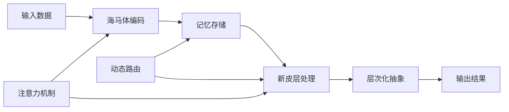

# 用户手册

欢迎使用脑启发AI框架！本手册将帮助您快速上手并充分利用这个强大的脑启发深度学习系统。

## 目录

- [快速入门](#快速入门)
- [安装指南](#安装指南)
- [基础教程](#基础教程)
- [核心功能](#核心功能)
- [进阶使用](#进阶使用)
- [最佳实践](#最佳实践)
- [常见问题](#常见问题)
- [故障排除](#故障排除)
- [性能优化](#性能优化)
- [应用案例](#应用案例)

---

## 快速入门

### 5分钟快速体验

让我们从最简单的例子开始：

```python
# 1. 导入核心模块
from brain_ai import HippocampusSimulator, NeocortexArchitecture
import torch

# 2. 创建海马体记忆系统
hippocampus = HippocampusSimulator(
    memory_capacity=5000,
    encoding_dimension=256
)

# 3. 创建新皮层处理系统
neocortex = NeocortexArchitecture(
    layers=4,
    abstraction_levels=3
)

# 4. 准备示例数据
data = torch.randn(32, 784)  # 32个样本，784维特征

# 5. 海马体快速记忆
memory_patterns = hippocampus.encode(data)
print(f"记忆容量: {len(memory_patterns)}")

# 6. 新皮层层次化处理
features = neocortex.process(memory_patterns, hierarchical=True)
print(f"特征层级: {len(features)}")

print("🎉 恭喜！您已经成功运行了脑启发AI系统！")
```

### 理解系统组件

脑启发AI系统包含几个核心组件：

- **海马体 (Hippocampus)**: 负责快速学习和记忆存储
- **新皮层 (Neocortex)**: 负责层次化信息处理和抽象
- **动态路由 (Dynamic Routing)**: 智能信息传递路径
- **持续学习 (Continual Learning)**: 终身学习能力
- **注意力机制 (Attention)**: 选择性信息聚焦

### 基本工作流程



---

## 安装指南

### 系统要求

- **Python**: 3.8 或更高版本
- **操作系统**: Windows 10+, macOS 10.14+, Ubuntu 18.04+
- **内存**: 最少 8GB RAM (推荐 16GB+)
- **存储**: 至少 10GB 可用空间
- **GPU**: 可选，支持 CUDA 11.0+ (推荐用于大规模训练)

### 基础安装

#### 1. 克隆项目

```bash
# 使用Git克隆
git clone https://github.com/brain-ai/brain-inspired-ai.git
cd brain-inspired-ai

# 或下载ZIP文件并解压
```

#### 2. 创建虚拟环境

```bash
# 使用Python venv (推荐)
python -m venv brain_ai_env

# 激活环境
# Linux/macOS:
source brain_ai_env/bin/activate

# Windows:
brain_ai_env\Scripts\activate

# 或使用conda
conda create -n brain_ai python=3.9
conda activate brain_ai
```

#### 3. 安装依赖

```bash
# 升级pip
pip install --upgrade pip

# 安装基础依赖
pip install -r requirements.txt

# 安装项目本身
pip install -e .
```

#### 4. 验证安装

```python
# 创建测试文件 test_installation.py
import torch
import brain_ai

print(f"Python版本: {torch.__version__}")
print(f"Brain AI版本: {brain_ai.__version__}")
print(f"CUDA可用: {torch.cuda.is_available()}")

# 快速功能测试
from brain_ai import HippocampusSimulator
simulator = HippocampusSimulator()
print("✅ 安装成功！")
```

```bash
# 运行测试
python test_installation.py
```

### 高级安装选项

#### GPU支持安装

```bash
# 安装PyTorch GPU版本 (CUDA 11.8)
pip install torch torchvision --index-url https://download.pytorch.org/whl/cu118

# 验证GPU支持
python -c "import torch; print(f'CUDA版本: {torch.version.cuda}')"
```

#### 开发环境安装

```bash
# 安装开发依赖
pip install -e ".[dev,test,docs]"

# 安装额外工具
pip install jupyter jupyterlab ipywidgets  # Jupyter支持
pip install wandb tensorboard  # 实验追踪
```

#### Docker安装

```bash
# 构建镜像
docker build -t brain-ai .

# 运行容器
docker run -it --rm \
    -v $(pwd):/workspace \
    -p 8080:8080 \
    brain-ai

# 或使用docker-compose
docker-compose up -d
```

### 常见安装问题

#### 问题1: 依赖冲突

```bash
# 错误信息: Could not find a version that satisfies the requirement

# 解决方案
pip install --upgrade pip setuptools wheel
pip install -r requirements.txt --no-cache-dir

# 使用虚拟环境避免冲突
python -m venv fresh_env
source fresh_env/bin/activate
pip install -r requirements.txt
```

#### 问题2: CUDA不兼容

```bash
# 检查CUDA版本
nvcc --version
python -c "import torch; print(torch.version.cuda)"

# 安装匹配的PyTorch版本
# 查看: https://pytorch.org/get-started/locally/
```

#### 问题3: 权限错误

```bash
# 使用用户安装
pip install --user -r requirements.txt

# 或修改目录权限
sudo chown -R $USER:$USER /path/to/brain-ai
```

---

## 基础教程

### 教程1: 基础记忆系统

让我们创建一个简单的记忆系统：

```python
import torch
from brain_ai import HippocampusSimulator

# 1. 创建海马体实例
hippocampus = HippocampusSimulator(
    memory_capacity=1000,
    encoding_dimension=128
)

# 2. 准备数据
data_points = [
    torch.randn(128) for _ in range(10)  # 10个记忆模式
]

# 3. 存储记忆
memory_ids = []
for i, data_point in enumerate(data_points):
    memory_id = hippocampus.store(data_point)
    memory_ids.append(memory_id)
    print(f"存储记忆 {i+1}: {memory_id}")

# 4. 检索记忆
query = data_points[0]  # 检索第一个记忆
result = hippocampus.retrieve(query)

print(f"检索到 {len(result.get('similar_memories', []))} 个相似记忆")
print(f"最高相似度: {result.get('max_similarity', 0):.3f}")

# 5. 模式补全
partial_pattern = data_points[0][:64]  # 部分模式
complete_pattern = hippocampus.pattern_completion(partial_pattern)
print(f"原始模式形状: {data_points[0].shape}")
print(f"补全模式形状: {complete_pattern.shape}")
```

### 教程2: 层次化处理

学习如何使用新皮层的层次化处理：

```python
import torch
from brain_ai import NeocortexArchitecture

# 1. 创建新皮层架构
neocortex = NeocortexArchitecture(
    layers=6,
    abstraction_levels=4,
    feature_channels=256
)

# 2. 准备图像数据 (模拟)
# 假设我们处理的是28x28的图像 (784维特征)
image_data = torch.randn(16, 784)  # 16张28x28图像

# 3. 层次化处理
hierarchical_features = neocortex.process(image_data, hierarchical=True)

# 4. 分析各层特征
for i, feature in enumerate(hierarchical_features):
    print(f"第 {i+1} 层特征形状: {feature.shape}")
    print(f"  - 特征范围: [{feature.min():.3f}, {feature.max():.3f}]")

# 5. 整合特征进行分类
integrated_features = neocortex.integrate(hierarchical_features)
classifications = neocortex.classify(integrated_features)

print(f"分类结果形状: {classifications.shape}")
print(f"预测概率分布: {torch.softmax(classifications, dim=1)[:3]}")  # 显示前3个样本

# 6. 可视化特征 (如果可用)
try:
    import matplotlib.pyplot as plt
    
    # 显示第一层的特征响应
    layer1_features = hierarchical_features[0]
    fig, axes = plt.subplots(2, 4, figsize=(12, 6))
    axes = axes.flatten()
    
    for i in range(8):
        feature_map = layer1_features[0, i].view(28, 28)  # 假设是28x28
        axes[i].imshow(feature_map.cpu().numpy(), cmap='viridis')
        axes[i].set_title(f'特征图 {i+1}')
        axes[i].axis('off')
    
    plt.tight_layout()
    plt.savefig('neocortex_features.png')
    print("✅ 特征可视化已保存为 'neocortex_features.png'")
except ImportError:
    print("📝 安装matplotlib以查看可视化: pip install matplotlib")
```

### 教程3: 持续学习

了解如何进行多任务持续学习：

```python
import numpy as np
from brain_ai.modules.lifelong_learning import ContinualLearner

# 1. 创建持续学习器
learner = ContinualLearner(
    memory_size=2000,
    elasticity=0.1,
    consolidation_strategy='ewc'  # 弹性权重巩固
)

# 2. 模拟多个任务
# 任务1: 手写数字识别 (0-4)
task1_X = np.random.randn(500, 784)  # 784维特征 (28x28图像)
task1_y = np.random.randint(0, 5, 500)

# 任务2: 手写数字识别 (5-9)
task2_X = np.random.randn(500, 784)
task2_y = np.random.randint(5, 10, 500)

# 任务3: 字母识别 (A-E)
task3_X = np.random.randn(500, 784)
task3_y = np.random.randint(0, 5, 500)

tasks = [
    (task1_X, task1_y, "数字识别1"),
    (task2_X, task2_y, "数字识别2"),
    (task3_X, task3_y, "字母识别")
]

# 3. 持续学习过程
all_accuracies = []
print("🧠 开始持续学习...")

for task_id, (X_train, y_train, task_name) in enumerate(tasks):
    print(f"\n📚 学习任务 {task_id + 1}: {task_name}")
    
    # 学习新任务
    learning_metrics = learner.learn_task(task_id, X_train, y_train)
    print(f"  学习指标: {learning_metrics}")
    
    # 评估所有任务的性能
    task_accuracies = []
    for eval_task_id in range(task_id + 1):
        eval_X, eval_y, eval_name = tasks[eval_task_id]
        
        # 取部分数据进行评估
        eval_subset = min(100, len(eval_X))
        accuracy = learner.evaluate(
            eval_task_id, 
            eval_X[:eval_subset], 
            eval_y[:eval_subset]
        )
        task_accuracies.append(accuracy)
        print(f"  {eval_name}: {accuracy:.4f}")
    
    all_accuracies.append(task_accuracies)

# 4. 分析遗忘情况
forgetting_rate = learner.calculate_forgetting_rate()
print(f"\n📊 平均遗忘率: {forgetting_rate:.4f}")

# 5. 可视化学习曲线
try:
    import matplotlib.pyplot as plt
    
    # 绘制任务性能变化
    fig, (ax1, ax2) = plt.subplots(1, 2, figsize=(12, 5))
    
    # 左图: 每个任务的性能变化
    for task_id in range(len(tasks)):
        accuracies = [all_accuracies[t][task_id] for t in range(task_id + 1, len(tasks))]
        tasks_learned = list(range(task_id + 1, len(tasks)))
        if accuracies:
            ax1.plot(tasks_learned, accuracies, 
                    marker='o', label=f'任务 {task_id + 1}')
    
    ax1.set_xlabel('学习任务序号')
    ax1.set_ylabel('准确率')
    ax1.set_title('任务性能变化')
    ax1.legend()
    ax1.grid(True)
    
    # 右图: 遗忘率
    forgetting_rates = [1 - acc[-1] if acc else 0 for acc in all_accuracies]
    ax2.bar(range(len(tasks)), forgetting_rates)
    ax2.set_xlabel('任务序号')
    ax2.set_ylabel('遗忘率')
    ax2.set_title('各任务遗忘情况')
    ax2.grid(True)
    
    plt.tight_layout()
    plt.savefig('continual_learning_results.png')
    print("✅ 学习结果可视化已保存为 'continual_learning_results.png'")
except ImportError:
    print("📝 安装matplotlib以查看学习曲线: pip install matplotlib")
```

### 教程4: 完整系统集成

将所有组件整合成一个完整的系统：

```python
import torch
import numpy as np
from brain_ai import BrainSystem
from brain_ai.config import ConfigManager

# 1. 加载配置
config_manager = ConfigManager('config/default.yaml')
config = config_manager.get('system')

# 2. 创建完整的大脑系统
brain = BrainSystem(config)

# 3. 初始化系统
print("🧠 初始化大脑系统...")
if brain.initialize():
    print("✅ 系统初始化成功！")
else:
    print("❌ 系统初始化失败")
    exit(1)

# 4. 准备综合数据
# 模拟多模态输入: 图像、文本、音频特征
image_features = torch.randn(32, 512)   # 图像特征
text_features = torch.randn(32, 256)    # 文本特征  
audio_features = torch.randn(32, 128)   # 音频特征

# 5. 多模态处理
print("\n🔄 处理多模态输入...")

# 海马体快速编码
image_memory = brain.hippocampus.encode(image_features)
text_memory = brain.hippocampus.encode(text_features)
audio_memory = brain.hippocampus.encode(audio_features)

print(f"  图像记忆: {image_memory.shape}")
print(f"  文本记忆: {text_memory.shape}")
print(f"  音频记忆: {audio_memory.shape}")

# 新皮层层次化处理
combined_features = torch.cat([image_memory, text_memory, audio_memory], dim=1)
hierarchical_results = brain.neocortex.process(combined_features, hierarchical=True)

print(f"  层次化特征: {len(hierarchical_results)} 层")
for i, feat in enumerate(hierarchical_results):
    print(f"    第{i+1}层: {feat.shape}")

# 6. 记忆巩固
print("\n💾 执行记忆巩固...")
brain.consolidate_memory()

# 7. 获取系统状态
state = brain.get_brain_state()
print(f"\n📊 系统状态:")
print(f"  已存储记忆: {state.get('memory_count', 0)}")
print(f"  活跃区域: {len(state.get('active_regions', []))}")
print(f"  整体性能: {state.get('overall_performance', 0.0):.4f}")

# 8. 模拟新的学习和推理
print("\n🎯 模拟学习新任务...")

# 学习新任务
new_task_data = torch.randn(100, 784)
new_task_labels = torch.randint(0, 10, (100,))

# 执行学习
learning_result = brain.learn_task(new_task_data, new_task_labels)
print(f"学习结果: {learning_result}")

# 新数据推理
test_data = torch.randn(10, 784)
predictions = brain.predict(test_data)
print(f"推理结果形状: {predictions.shape}")
print(f"预测分布: {torch.softmax(predictions, dim=1)[:3]}")

# 9. 保存模型
print("\n💾 保存模型...")
model_path = "brain_ai_model.pt"
brain.save_model(model_path)
print(f"模型已保存至: {model_path}")

print("\n🎉 完整系统演示完成！")
```

---

## 核心功能

### 海马体记忆系统

#### 核心特性

- **快速编码**: 基于生物启发的快速模式编码
- **容量管理**: 智能记忆容量分配和清理
- **模式分离**: 区分相似但不同的记忆模式
- **模式补全**: 从部分信息恢复完整记忆

#### 使用示例

```python
from brain_ai.hippocampus import HippocampusSimulator, EpisodicMemory, FastLearning

# 创建海马体系统
hippocampus = HippocampusSimulator(
    memory_capacity=5000,
    encoding_dimension=256,
    retrieval_threshold=0.7
)

# 快速学习演示
data = torch.randn(100, 784)
encoded_patterns = hippocampus.encode(data)

# 情景记忆管理
episodic_memory = EpisodicMemory(max_episodes=1000)

# 存储情景
episode = {
    'timestamp': time.time(),
    'content': encoded_patterns[0],
    'context': 'training_session_1',
    'importance': 0.8
}
episode_id = episodic_memory.store_episode(episode)

# 检索相关情景
retrieved = episodic_memory.retrieve_episodes(
    query={'context': 'training'}, 
    limit=5
)

print(f"检索到 {len(retrieved)} 个相关情景")
```

### 新皮层层次化处理

#### 核心特性

- **多层次抽象**: 从低级到高级的特征表示
- **层次整合**: 不同层次信息的智能整合
- **并行处理**: 同时处理多个抽象层次
- **自适应架构**: 根据输入复杂度调整处理深度

#### 配置示例

```python
neocortex_config = {
    'layers': 8,
    'abstraction_levels': 5,
    'feature_channels': 512,
    'hierarchical_levels': 6,
    'attention_heads': 8,
    'dropout_rate': 0.1,
    'activation': 'gelu'
}

neocortex = NeocortexArchitecture(**neocortex_config)

# 处理不同复杂度的数据
simple_data = torch.randn(16, 784)        # 简单数据
complex_data = torch.randn(16, 784, 784)  # 复杂数据（如果支持）

# 自适应处理
simple_features = neocortex.process(simple_data, hierarchical=True)
print(f"简单数据处理层级: {len(simple_features)}")
```

### 持续学习系统

#### 支持的学习策略

1. **EWC (Elastic Weight Consolidation)**: 保护重要权重
2. **生成重放**: 生成合成数据防止遗忘
3. **动态扩展**: 根据需要扩展网络容量
4. **知识迁移**: 利用已有知识加速新任务学习

#### 高级配置

```python
continual_learning_config = {
    'memory_replay_size': 5000,
    'elasticity_lambda': 1000.0,
    'fisher_update_frequency': 100,
    'similarity_threshold': 0.8,
    'consolidation_interval': 1000,
    'replay_batch_size': 64,
    'protection_strategy': 'ewc',
    'expansion_criteria': 'performance_threshold'
}

learner = ContinualLearner(**continual_learning_config)

# 自定义学习策略
class CustomConsolidationStrategy:
    def __init__(self, config):
        self.config = config
    
    def consolidate(self, old_params, new_params, task_data):
        # 自定义巩固逻辑
        return consolidated_params

learner.set_consolidation_strategy(CustomConsolidationStrategy({}))
```

### 动态路由机制

#### 路由策略

- **自适应路由**: 根据输入特征自动选择路径
- **负载均衡**: 智能分配计算资源
- **效率优化**: 最小化计算开销
- **强化学习路由**: 通过奖励信号优化路由决策

#### 使用示例

```python
from brain_ai.modules.dynamic_routing import DynamicRoutingController

# 创建路由控制器
router = DynamicRoutingController(
    input_dim=256,
    output_dim=128,
    num_routing_iterations=3,
    learning_rate=0.01,
    routing_strategy='adaptive'
)

# 批量路由处理
input_data = torch.randn(100, 256)
routed_output = router.route(input_data)

# 获取路由可视化
route_visualization = router.get_routing_visualization()
print(f"路由路径: {route_visualization['paths']}")
print(f"路径效率: {route_visualization['efficiency']:.4f}")
```

### 注意力机制

#### 注意力类型

- **自注意力**: 序列内部的注意力
- **交叉注意力**: 不同模态间的注意力
- **多头注意力**: 并行的注意力计算
- **局部注意力**: 局部区域的注意力聚焦

#### 应用示例

```python
from brain_ai.modules.attention import MultiHeadAttention, LocalAttention

# 多头注意力
multi_attention = MultiHeadAttention(
    query_dim=512,
    key_dim=512,
    value_dim=512,
    num_heads=8,
    dropout=0.1
)

# 计算注意力
query = torch.randn(16, 64, 512)  # [batch, seq_len, dim]
key = torch.randn(16, 64, 512)
value = torch.randn(16, 64, 512)

attention_output = multi_attention(query, key, value)
attention_weights = multi_attention.get_attention_weights()

print(f"注意力输出形状: {attention_output.shape}")
print(f"注意力权重形状: {attention_weights.shape}")
```

---

## 进阶使用

### 自定义模块开发

#### 创建自定义记忆模块

```python
import torch
from brain_ai.core.base_module import BaseModule
from typing import Dict, Any, List

class CustomMemoryModule(BaseModule):
    """自定义记忆模块示例"""
    
    def __init__(self, config: Dict[str, Any]):
        super().__init__("CustomMemoryModule", config)
        self.memory_size = config.get('memory_size', 1000)
        self.memory_matrix = torch.randn(self.memory_size, 256)
        
    def store_custom_pattern(self, pattern: torch.Tensor) -> str:
        """存储自定义模式"""
        # 自定义存储逻辑
        memory_id = f"custom_{len(self.stored_memories)}"
        self.stored_memories[memory_id] = pattern
        return memory_id
    
    def retrieve_by_similarity(self, query: torch.Tensor, top_k: int = 5) -> List[Dict[str, Any]]:
        """基于相似度检索"""
        similarities = torch.matmul(query, self.memory_matrix.T)
        top_indices = torch.topk(similarities, top_k).indices
        
        results = []
        for idx in top_indices:
            results.append({
                'memory_id': f'memory_{idx}',
                'similarity': similarities[idx].item(),
                'pattern': self.memory_matrix[idx]
            })
        return results
    
    def initialize(self) -> bool:
        """初始化模块"""
        self.stored_memories = {}
        return True
    
    def cleanup(self) -> bool:
        """清理资源"""
        self.stored_memories.clear()
        return True

# 注册自定义模块
from brain_ai.core.architecture import ComponentFactory
ComponentFactory.register("custom_memory", CustomMemoryModule)

# 使用自定义模块
custom_memory = ComponentFactory.create("custom_memory", {
    'memory_size': 2000
})
```

#### 创建自定义学习算法

```python
import torch
import torch.nn as nn
from brain_ai.algorithms.base_algorithm import LearningAlgorithm

class CustomLearningAlgorithm(LearningAlgorithm):
    """自定义学习算法"""
    
    def __init__(self, config: Dict[str, Any]):
        super().__init__(config)
        self.learning_rate = config.get('learning_rate', 0.001)
        self.custom_parameter = config.get('custom_param', 1.0)
    
    def learn_step(self, model: nn.Module, batch_data: Dict[str, torch.Tensor]) -> Dict[str, float]:
        """执行一步学习"""
        model.train()
        
        # 自定义前向传播
        outputs = model(batch_data['input'])
        loss = self.compute_custom_loss(outputs, batch_data['target'])
        
        # 自定义优化逻辑
        self.optimizer.zero_grad()
        loss.backward()
        
        # 应用自定义梯度处理
        self.apply_custom_gradient_clipping(model)
        
        self.optimizer.step()
        
        return {'loss': loss.item(), 'custom_metric': self.compute_custom_metric()}
    
    def compute_custom_loss(self, outputs: torch.Tensor, targets: torch.Tensor) -> torch.Tensor:
        """自定义损失函数"""
        base_loss = nn.functional.cross_entropy(outputs, targets)
        
        # 添加自定义正则化
        custom_regularization = self.custom_parameter * torch.norm(
            outputs, p=2
        )
        
        return base_loss + custom_regularization
    
    def apply_custom_gradient_clipping(self, model: nn.Module):
        """自定义梯度裁剪"""
        torch.nn.utils.clip_grad_norm_(
            model.parameters(), 
            max_norm=1.0,
            norm_type=2
        )

# 集成到训练框架
from brain_ai.training.trainer import BrainInspiredTrainer

class CustomTrainer(BrainInspiredTrainer):
    def create_algorithm(self, config: Dict[str, Any]) -> LearningAlgorithm:
        if config.get('algorithm_name') == 'custom':
            return CustomLearningAlgorithm(config)
        else:
            return super().create_algorithm(config)
```

### 分布式训练

#### 多GPU训练

```python
import torch
import torch.distributed as dist
from torch.nn.parallel import DistributedDataParallel
from brain_ai.training.distributed import DistributedTrainer

# 初始化分布式训练
def setup_distributed(rank: int, world_size: int):
    dist.init_process_group(
        backend='nccl',
        init_method='env://',
        world_size=world_size,
        rank=rank
    )
    torch.cuda.set_device(rank)

class DistributedBrainSystem:
    """分布式大脑系统"""
    
    def __init__(self, config: Dict[str, Any], rank: int, world_size: int):
        self.rank = rank
        self.world_size = world_size
        self.config = config
        
        # 创建本地模型
        self.local_model = self.create_model()
        
        # 包装为分布式模型
        self.model = DistributedDataParallel(
            self.local_model,
            device_ids=[rank],
            output_device=rank
        )
    
    def train_epoch(self, data_loader):
        """训练一个epoch"""
        self.model.train()
        
        for batch_idx, batch in enumerate(data_loader):
            # 本地计算
            loss = self.compute_loss(batch)
            
            # 同步所有进程的梯度
            self.synchronize_gradients()
            
            # 更新本地模型
            self.optimizer.step()
            self.optimizer.zero_grad()
    
    def synchronize_gradients(self):
        """同步所有进程的梯度"""
        for param in self.model.parameters():
            if param.grad is not None:
                dist.all_reduce(param.grad, op=dist.ReduceOp.SUM)
                param.grad /= self.world_size

# 启动分布式训练
def main():
    # 解析命令行参数
    import argparse
    parser = argparse.ArgumentParser()
    parser.add_argument('--rank', type=int, required=True)
    parser.add_argument('--world_size', type=int, required=True)
    args = parser.parse_args()
    
    # 设置分布式环境
    setup_distributed(args.rank, args.world_size)
    
    # 创建分布式系统
    brain_system = DistributedBrainSystem(config, args.rank, args.world_size)
    
    # 开始训练
    brain_system.train()
```

### 模型压缩与优化

#### 知识蒸馏

```python
from brain_ai.compression.knowledge_distillation import KnowledgeDistillationTrainer

class KnowledgeDistillation:
    """知识蒸馏实现"""
    
    def __init__(self, teacher_model, student_model, config: Dict[str, Any]):
        self.teacher = teacher_model
        self.student = student_model
        self.temperature = config.get('temperature', 4.0)
        self.alpha = config.get('alpha', 0.7)  # 蒸馏损失权重
        self.beta = config.get('beta', 0.3)   # 任务损失权重
        
    def distill_step(self, batch_data):
        """执行蒸馏步骤"""
        # 教师模型推理（不计算梯度）
        with torch.no_grad():
            teacher_logits = self.teacher(batch_data['input'])
            teacher_probs = torch.softmax(teacher_logits / self.temperature, dim=1)
        
        # 学生模型推理
        student_logits = self.student(batch_data['input'])
        student_probs = torch.softmax(student_logits / self.temperature, dim=1)
        
        # 计算蒸馏损失
        distill_loss = self.compute_kl_divergence(student_probs, teacher_probs)
        
        # 计算任务损失
        task_loss = torch.nn.functional.cross_entropy(
            student_logits, batch_data['target']
        )
        
        # 组合损失
        total_loss = self.alpha * distill_loss + self.beta * task_loss
        
        return total_loss, {
            'distill_loss': distill_loss.item(),
            'task_loss': task_loss.item(),
            'total_loss': total_loss.item()
        }
    
    def compute_kl_divergence(self, student_probs, teacher_probs):
        """计算KL散度"""
        return torch.nn.functional.kl_div(
            torch.log(student_probs + 1e-8),
            teacher_probs,
            reduction='batchmean'
        )

# 使用示例
teacher_model = load_large_model('teacher_model.pth')
student_model = create_small_model()
distiller = KnowledgeDistillation(teacher_model, student_model, config)

for batch in data_loader:
    loss, metrics = distiller.distill_step(batch)
    loss.backward()
    optimizer.step()
```

#### 模型剪枝

```python
from brain_ai.compression.pruning import MagnitudePruner, StructuredPruner

class ModelPruning:
    """模型剪枝工具"""
    
    def __init__(self, model: torch.nn.Module):
        self.model = model
        self.original_state_dict = model.state_dict().copy()
    
    def magnitude_prune(self, sparsity_ratio: float = 0.5):
        """幅度剪枝"""
        pruner = MagnitudePruner(sparsity_ratio)
        
        for name, module in self.model.named_modules():
            if isinstance(module, torch.nn.Linear):
                weights = module.weight.data
                # 找出最小幅度的权重
                threshold = torch.quantile(
                    torch.abs(weights.flatten()), 
                    sparsity_ratio
                )
                mask = torch.abs(weights) > threshold
                module.weight.data *= mask
                
        return self.model
    
    def structured_prune(self, channels_to_prune: int):
        """结构化剪枝（剪除整个通道）"""
        pruner = StructuredPruner(channels_to_prune)
        
        for name, module in self.model.named_modules():
            if isinstance(module, torch.nn.Linear):
                # 计算每个通道的重要性
                channel_importance = torch.norm(module.weight, dim=1)
                # 剪除不重要的通道
                prune_indices = torch.argsort(channel_importance)[:channels_to_prune]
                
                # 更新模型
                new_weight = torch.delete(module.weight, prune_indices, dim=0)
                module.weight.data = new_weight
                
                if module.bias is not None:
                    new_bias = torch.delete(module.bias, prune_indices)
                    module.bias.data = new_bias
        
        return self.model
    
    def get_compression_stats(self):
        """获取压缩统计信息"""
        total_params = sum(p.numel() for p in self.model.parameters())
        non_zero_params = sum(
            torch.count_nonzero(p).item() 
            for p in self.model.parameters()
        )
        
        return {
            'total_parameters': total_params,
            'non_zero_parameters': non_zero_params,
            'compression_ratio': (total_params - non_zero_params) / total_params,
            'sparsity': 1.0 - (non_zero_params / total_params)
        }

# 使用示例
model = load_model('large_model.pth')
pruner = ModelPruning(model)

# 执行剪枝
pruned_model = pruner.magnitude_prune(sparsity_ratio=0.7)
stats = pruner.get_compression_stats()

print(f"压缩率: {stats['compression_ratio']:.2%}")
print(f"稀疏度: {stats['sparsity']:.2%}")
```

### 实验追踪与监控

#### 使用Weights & Biases

```python
import wandb
from brain_ai.utils.experiment_tracker import ExperimentTracker

class BrainAIExperiment:
    """脑启发AI实验管理"""
    
    def __init__(self, project_name: str, config: Dict[str, Any]):
        # 初始化W&B
        wandb.init(
            project=project_name,
            config=config,
            tags=['brain-ai', 'hippocampus', 'neocortex']
        )
        
        self.config = config
        self.tracker = ExperimentTracker(wandb)
        
    def log_training_metrics(self, epoch: int, metrics: Dict[str, float]):
        """记录训练指标"""
        # 记录标量指标
        for metric_name, value in metrics.items():
            self.tracker.log_scalar(metric_name, value, step=epoch)
        
        # 记录学习曲线
        if epoch % 10 == 0:
            self.log_learning_curve(metrics)
    
    def log_memory_visualization(self, memory_patterns: torch.Tensor, epoch: int):
        """记录记忆模式可视化"""
        # 可视化记忆模式
        memory_vis = self.create_memory_visualization(memory_patterns)
        self.tracker.log_image('memory_patterns', memory_vis, step=epoch)
    
    def log_attention_maps(self, attention_weights: torch.Tensor, epoch: int):
        """记录注意力热力图"""
        # 可视化注意力权重
        attention_vis = self.create_attention_heatmap(attention_weights)
        self.tracker.log_image('attention_maps', attention_vis, step=epoch)
    
    def log_model_graph(self, model: torch.nn.Module):
        """记录模型图"""
        self.tracker.log_model_graph(model)
    
    def finish_experiment(self, final_metrics: Dict[str, float]):
        """完成实验"""
        self.tracker.save_experiment_artifacts()
        
        # 记录最终结果
        wandb.summary.update(final_metrics)
        wandb.finish()

# 使用示例
config = {
    'learning_rate': 0.001,
    'batch_size': 32,
    'epochs': 100,
    'hippocampus_capacity': 5000
}

experiment = BrainAIExperiment('mnist-classification', config)

for epoch in range(config['epochs']):
    # 训练步骤
    metrics = trainer.train_epoch()
    
    # 记录指标
    experiment.log_training_metrics(epoch, metrics)
    
    # 记录记忆可视化
    if epoch % 20 == 0:
        memory_patterns = hippocampus.get_current_patterns()
        experiment.log_memory_visualization(memory_patterns, epoch)
    
    # 记录注意力
    if epoch % 25 == 0:
        attention_weights = attention_module.get_weights()
        experiment.log_attention_maps(attention_weights, epoch)

# 完成实验
final_metrics = {'final_accuracy': 0.95, 'final_loss': 0.1}
experiment.finish_experiment(final_metrics)
```

---

## 最佳实践

### 1. 性能优化实践

#### 数据管道优化

```python
from torch.utils.data import DataLoader
from brain_ai.data.preprocessing import DataPreprocessor

class OptimizedDataPipeline:
    """优化的数据处理管道"""
    
    def __init__(self, config: Dict[str, Any]):
        self.config = config
        self.preprocessor = DataPreprocessor(config.get('preprocessing', {}))
        
    def create_efficient_dataloader(self, dataset, batch_size: int):
        """创建高效的数据加载器"""
        return DataLoader(
            dataset,
            batch_size=batch_size,
            num_workers=self.config.get('num_workers', 4),
            pin_memory=True,  # GPU传输优化
            persistent_workers=True,  # 保持worker进程
            prefetch_factor=2,  # 预取因子
            drop_last=False
        )
    
    def apply_preprocessing_optimizations(self, data):
        """应用预处理优化"""
        # 异步预处理
        if hasattr(self.preprocessor, 'async_preprocess'):
            return self.preprocessor.async_preprocess(data)
        else:
            return self.preprocessor.preprocess(data)
    
    def cache_preprocessed_data(self, dataset, cache_path: str):
        """缓存预处理数据"""
        import joblib
        from pathlib import Path
        
        cache_dir = Path(cache_path)
        cache_dir.mkdir(parents=True, exist_ok=True)
        
        # 缓存预处理后的数据
        preprocessed_data = []
        for item in dataset:
            processed_item = self.preprocessor.preprocess(item)
            preprocessed_data.append(processed_item)
        
        joblib.dump(preprocessed_data, cache_dir / 'preprocessed_data.pkl')
        return preprocessed_data
```

#### 内存管理优化

```python
import gc
import torch
from contextlib import contextmanager

class MemoryManager:
    """内存管理器"""
    
    @staticmethod
    @contextmanager
    def memory_efficient_context():
        """内存高效上下文"""
        # 清理GPU缓存
        if torch.cuda.is_available():
            torch.cuda.empty_cache()
        
        # 启用垃圾回收
        gc.set_threshold(700, 10, 10)
        
        try:
            yield
        finally:
            # 清理内存
            gc.collect()
            if torch.cuda.is_available():
                torch.cuda.empty_cache()
    
    @staticmethod
    def optimize_model_memory(model: torch.nn.Module):
        """优化模型内存使用"""
        # 启用梯度检查点（以计算换内存）
        if hasattr(model, 'gradient_checkpointing_enable'):
            model.gradient_checkpointing_enable()
        
        # 设置内存优化标志
        for module in model.modules():
            if hasattr(module, 'memory_efficient'):
                module.memory_efficient = True
        
        return model
    
    @staticmethod
    def monitor_memory_usage():
        """监控内存使用"""
        import psutil
        
        # CPU内存
        cpu_memory = psutil.virtual_memory()
        print(f"CPU内存: {cpu_memory.percent:.1f}% 使用")
        
        # GPU内存
        if torch.cuda.is_available():
            for i in range(torch.cuda.device_count()):
                gpu_memory = torch.cuda.get_device_properties(i).total_memory
                gpu_allocated = torch.cuda.memory_allocated(i)
                gpu_cached = torch.cuda.memory_reserved(i)
                usage_percent = (gpu_allocated / gpu_memory) * 100
                
                print(f"GPU {i}: {usage_percent:.1f}% 使用, "
                      f"缓存: {gpu_cached - gpu_allocated}MB")

# 使用示例
with MemoryManager.memory_efficient_context():
    # 训练循环
    for epoch in range(num_epochs):
        MemoryManager.monitor_memory_usage()
        
        for batch in data_loader:
            # 内存高效的批量处理
            optimizer.zero_grad()
            loss = model(batch)
            loss.backward()
            optimizer.step()
```

### 2. 调试和监控

#### 智能日志系统

```python
import logging
from brain_ai.utils.logger import BrainAILogger, LogLevel

class SmartLogger:
    """智能日志系统"""
    
    def __init__(self, name: str, log_level: str = 'INFO'):
        self.logger = BrainAILogger(name)
        self.logger.set_level(LogLevel[log_level])
        
        # 添加自定义过滤器
        self.logger.add_filter('performance_filter', self.performance_filter)
        
    def performance_filter(self, record):
        """性能相关的日志过滤器"""
        if 'performance' in record.getMessage().lower():
            record.levelno = logging.INFO
            return True
        return True
    
    def log_training_progress(self, epoch: int, metrics: Dict[str, float]):
        """记录训练进度"""
        self.logger.info(f"Epoch {epoch}: {metrics}")
        
        # 性能预警
        if metrics.get('loss', 0) > 10.0:
            self.logger.warning(f"高损失预警: {metrics['loss']}")
        
        if metrics.get('accuracy', 0) < 0.5:
            self.logger.warning(f"低准确率预警: {metrics['accuracy']}")
    
    def log_memory_usage(self, component: str):
        """记录内存使用"""
        MemoryManager.monitor_memory_usage()
        
        self.logger.debug(f"{component} 内存使用状态", 
                         extra={'component': component})

# 使用示例
logger = SmartLogger('training', 'DEBUG')

for epoch in range(num_epochs):
    # 训练步骤
    metrics = trainer.train_step()
    
    # 记录进度
    logger.log_training_progress(epoch, metrics)
    
    # 记录内存使用
    if epoch % 10 == 0:
        logger.log_memory_usage('hippocampus')
```

#### 实时监控系统

```python
from brain_ai.monitoring.realtime_monitor import RealtimeMonitor
from brain_ai.monitoring.alert_system import AlertSystem

class TrainingMonitor:
    """训练监控器"""
    
    def __init__(self):
        self.monitor = RealtimeMonitor()
        self.alert_system = AlertSystem()
        
        # 设置监控指标
        self.setup_monitoring()
    
    def setup_monitoring(self):
        """设置监控指标"""
        # 内存使用监控
        self.monitor.add_metric(
            'memory_usage',
            self.get_memory_usage,
            threshold=0.8,  # 80%使用率阈值
            alert_level='warning'
        )
        
        # GPU温度监控
        self.monitor.add_metric(
            'gpu_temperature',
            self.get_gpu_temperature,
            threshold=80.0,  # 80度阈值
            alert_level='critical'
        )
        
        # 训练速度监控
        self.monitor.add_metric(
            'training_speed',
            self.get_training_speed,
            threshold=100.0,  # 每秒100样本
            alert_level='info'
        )
        
        # 设置告警规则
        self.alert_system.add_rule(
            name='high_memory',
            condition='memory_usage > 0.9',
            action='send_email',
            recipients=['admin@example.com']
        )
    
    def start_monitoring(self):
        """开始监控"""
        self.monitor.start()
        print("📊 实时监控已启动")
    
    def stop_monitoring(self):
        """停止监控"""
        self.monitor.stop()
        print("📊 实时监控已停止")
    
    def get_memory_usage(self):
        """获取内存使用率"""
        return psutil.virtual_memory().percent / 100.0
    
    def get_gpu_temperature(self):
        """获取GPU温度"""
        if torch.cuda.is_available():
            try:
                # 假设使用nvidia-ml-py
                import pynvml
                pynvml.nvmlInit()
                handle = pynvml.nvmlDeviceGetHandleByIndex(0)
                temp = pynvml.nvmlDeviceGetTemperature(handle, pynvml.NVML_TEMPERATURE_GPU)
                return float(temp)
            except:
                return 0.0
        return 0.0
    
    def get_training_speed(self):
        """获取训练速度（样本/秒）"""
        return self.current_training_speed

# 使用示例
monitor = TrainingMonitor()
monitor.start_monitoring()

try:
    # 训练循环
    for epoch in range(num_epochs):
        # 训练步骤
        metrics = trainer.train_step()
        
        # 更新训练速度
        monitor.current_training_speed = metrics.get('samples_per_second', 0)
        
        # 检查告警
        alert_triggered = monitor.monitor.check_alerts()
        if alert_triggered:
            print(f"⚠️  触发告警: {alert_triggered}")

finally:
    monitor.stop_monitoring()
```

### 3. 代码组织最佳实践

#### 模块化设计

```python
# brain_ai/projects/
# ├── project_template/
# │   ├── config/
# │   ├── data/
# │   ├── models/
# │   ├── training/
# │   ├── evaluation/
# │   ├── utils/
# │   └── main.py

# 项目结构模板
class BrainAIProject:
    """脑启发AI项目模板"""
    
    def __init__(self, project_name: str, base_dir: str):
        self.project_name = project_name
        self.base_dir = Path(base_dir) / project_name
        
        # 创建项目结构
        self.create_project_structure()
        
    def create_project_structure(self):
        """创建标准项目结构"""
        directories = [
            'config',
            'data/raw',
            'data/processed',
            'data/models',
            'models',
            'training',
            'evaluation',
            'experiments',
            'utils',
            'logs',
            'reports'
        ]
        
        for directory in directories:
            (self.base_dir / directory).mkdir(parents=True, exist_ok=True)
        
        # 创建配置文件
        self.create_config_files()
    
    def create_config_files(self):
        """创建配置文件"""
        config_dir = self.base_dir / 'config'
        
        # 模型配置
        model_config = {
            'hippocampus': {
                'memory_capacity': 5000,
                'encoding_dimension': 256
            },
            'neocortex': {
                'layers': 6,
                'abstraction_levels': 3
            },
            'training': {
                'batch_size': 32,
                'learning_rate': 0.001,
                'epochs': 100
            }
        }
        
        # 保存配置
        import yaml
        with open(config_dir / 'model_config.yaml', 'w') as f:
            yaml.dump(model_config, f)
        
        # 数据配置
        data_config = {
            'dataset_path': 'data/raw/dataset.pkl',
            'train_split': 0.8,
            'val_split': 0.1,
            'test_split': 0.1,
            'preprocessing': {
                'normalize': True,
                'augmentation': True
            }
        }
        
        with open(config_dir / 'data_config.yaml', 'w') as f:
            yaml.dump(data_config, f)
    
    def load_config(self, config_name: str) -> Dict[str, Any]:
        """加载配置文件"""
        import yaml
        config_path = self.base_dir / 'config' / f'{config_name}_config.yaml'
        
        with open(config_path, 'r') as f:
            return yaml.safe_load(f)
```

#### 配置管理最佳实践

```python
from typing import Dict, Any
import yaml
from dataclasses import dataclass
from pathlib import Path

@dataclass
class BrainAIConfig:
    """脑启发AI配置类"""
    # 模型配置
    hippocampus_capacity: int = 5000
    neocortex_layers: int = 6
    
    # 训练配置
    batch_size: int = 32
    learning_rate: float = 0.001
    epochs: int = 100
    
    # 系统配置
    use_gpu: bool = True
    num_workers: int = 4
    log_level: str = 'INFO'
    
    @classmethod
    def from_yaml(cls, config_path: str) -> 'BrainAIConfig':
        """从YAML文件加载配置"""
        with open(config_path, 'r') as f:
            config_dict = yaml.safe_load(f)
        
        return cls(**config_dict)
    
    def to_yaml(self, config_path: str):
        """保存配置到YAML文件"""
        config_dict = self.__dict__
        with open(config_path, 'w') as f:
            yaml.dump(config_dict, f)
    
    def update(self, **kwargs):
        """更新配置参数"""
        for key, value in kwargs.items():
            if hasattr(self, key):
                setattr(self, key, value)
            else:
                raise ValueError(f"Unknown config parameter: {key}")

class ConfigManager:
    """配置管理器"""
    
    def __init__(self, base_config_path: str):
        self.base_config_path = Path(base_config_path)
        self.configs = {}
    
    def load_project_config(self, project_name: str) -> BrainAIConfig:
        """加载项目配置"""
        config_path = self.base_config_path / project_name / 'config' / 'model_config.yaml'
        
        if config_path.exists():
            return BrainAIConfig.from_yaml(str(config_path))
        else:
            # 返回默认配置
            return BrainAIConfig()
    
    def create_config_template(self, output_path: str):
        """创建配置模板"""
        template = {
            'model': {
                'hippocampus': {
                    'memory_capacity': 5000,
                    'encoding_dimension': 256
                },
                'neocortex': {
                    'layers': 6,
                    'abstraction_levels': 3
                }
            },
            'training': {
                'batch_size': 32,
                'learning_rate': 0.001,
                'epochs': 100,
                'optimizer': 'adam',
                'scheduler': 'cosine'
            },
            'data': {
                'dataset_path': 'data/raw/dataset.pkl',
                'preprocessing': {
                    'normalize': True,
                    'augmentation': True
                }
            },
            'system': {
                'use_gpu': True,
                'num_workers': 4,
                'log_level': 'INFO',
                'experiment_tracking': {
                    'enabled': True,
                    'platform': 'wandb'
                }
            }
        }
        
        with open(output_path, 'w') as f:
            yaml.dump(template, f, default_flow_style=False)
```

---

## 常见问题

### 安装和设置问题

#### Q1: 安装过程中出现"Microsoft Visual C++ 14.0 is required"错误

**A:** 这是Windows下编译依赖的问题：

```bash
# 解决方案1: 安装Visual Studio Build Tools
# 下载并安装: https://visualstudio.microsoft.com/visual-cpp-build-tools/

# 解决方案2: 使用预编译的wheel包
pip install --only-binary=all -r requirements.txt

# 解决方案3: 使用conda
conda install -c conda-forge brain-ai
```

#### Q2: CUDA不兼容或GPU无法使用

**A:** 检查CUDA版本兼容性：

```python
import torch

# 检查CUDA可用性
print(f"CUDA available: {torch.cuda.is_available()}")
print(f"CUDA version: {torch.version.cuda}")
print(f"GPU count: {torch.cuda.device_count()}")

# 强制使用CPU
import os
os.environ['CUDA_VISIBLE_DEVICES'] = ''

# 或者在代码中指定设备
device = torch.device('cuda' if torch.cuda.is_available() else 'cpu')
```

#### Q3: 内存不足错误

**A:** 优化内存使用：

```python
# 减少批处理大小
config['training']['batch_size'] = 16  # 从32减少到16

# 启用梯度检查点
model.gradient_checkpointing_enable()

# 定期清理内存
import torch
if torch.cuda.is_available():
    torch.cuda.empty_cache()

# 使用更小的模型配置
config['hippocampus']['memory_capacity'] = 2000  # 减少内存容量
config['neocortex']['layers'] = 4  # 减少层数
```

### 使用问题

#### Q4: 训练速度很慢

**A:** 性能优化：

```python
# 1. 检查数据加载器配置
data_loader = DataLoader(
    dataset,
    batch_size=32,
    num_workers=4,  # 增加worker进程
    pin_memory=True,  # 启用pin memory
    prefetch_factor=2  # 预取数据
)

# 2. 检查GPU使用
import subprocess
result = subprocess.run(['nvidia-smi'], capture_output=True, text=True)
print(result.stdout)

# 3. 启用混合精度训练
from torch.cuda.amp import autocast, GradScaler

scaler = GradScaler()
with autocast():
    output = model(input_data)
    loss = criterion(output, target)

scaler.scale(loss).backward()
scaler.step(optimizer)
scaler.update()

# 4. 使用分布式训练
from torch.nn.parallel import DistributedDataParallel

if torch.cuda.device_count() > 1:
    model = DistributedDataParallel(model)
```

#### Q5: 模型不收敛

**A:** 调试训练过程：

```python
# 1. 检查数据质量
print("数据统计:")
print(f"输入范围: [{data.min():.3f}, {data.max():.3f}]")
print(f"标签分布: {torch.bincount(targets)}")

# 2. 调整学习率
initial_lr = 0.001
optimizer = torch.optim.Adam(model.parameters(), lr=initial_lr)

# 使用学习率调度器
from torch.optim.lr_scheduler import ReduceLROnPlateau

scheduler = ReduceLROnPlateau(
    optimizer, 
    mode='min', 
    factor=0.5, 
    patience=10
)

# 3. 检查模型初始化
def init_weights(model):
    for module in model.modules():
        if isinstance(module, torch.nn.Linear):
            torch.nn.init.xavier_uniform_(module.weight)
            if module.bias is not None:
                torch.nn.init.zeros_(module.bias)

model.apply(init_weights)

# 4. 添加梯度裁剪
torch.nn.utils.clip_grad_norm_(model.parameters(), max_norm=1.0)
```

#### Q6: 持续学习遗忘严重

**A:** 优化持续学习策略：

```python
# 1. 调整EWC参数
learner = ContinualLearner(
    memory_size=5000,      # 增加记忆库大小
    elasticity=0.01,       # 降低弹性参数
    consolidation_strategy='ewc',
    fisher_update_frequency=50  # 更频繁的Fisher矩阵更新
)

# 2. 使用生成重放
learner = ContinualLearner(
    consolidation_strategy='generative_replay',
    replay_generator_lr=0.0001,
    synthetic_sample_ratio=0.3
)

# 3. 调整任务相似度阈值
learner.similarity_threshold = 0.6  # 降低阈值，更容易检测相似任务

# 4. 手动触发巩固
for task_id in range(num_tasks):
    learner.learn_task(task_id, X_train, y_train)
    
    # 手动触发记忆巩固
    if task_id % 3 == 0:  # 每3个任务巩固一次
        learner.consolidate_memory()
```

### 性能问题

#### Q7: 内存使用持续增长

**A:** 内存泄漏排查：

```python
# 1. 检查是否有悬空引用
import weakref
import gc

# 清理临时变量
del temporary_large_tensor
gc.collect()

# 2. 使用内存分析器
from memory_profiler import profile

@profile
def training_step():
    # 训练代码
    pass

# 3. 定期清理梯度
optimizer.zero_grad(set_to_none=True)  # 更激进的清理

# 4. 使用检查点
torch.utils.checkpoint.checkpoint(model, input_data)

# 5. 监控内存使用
def print_memory_usage():
    if torch.cuda.is_available():
        print(f"GPU Memory: {torch.cuda.memory_allocated() / 1024**3:.2f} GB")
    import psutil
    print(f"CPU Memory: {psutil.virtual_memory().percent:.1f}%")
```

#### Q8: 多GPU训练效率低

**A:** 优化分布式训练：

```python
# 1. 检查GPU拓扑
def get_gpu_topology():
    if torch.cuda.device_count() > 1:
        print("GPU信息:")
        for i in range(torch.cuda.device_count()):
            props = torch.cuda.get_device_properties(i)
            print(f"GPU {i}: {props.name}, 内存: {props.total_memory // 1024**3}GB")

# 2. 优化数据并行
model = torch.nn.DataParallel(model, device_ids=[0, 1])  # 明确指定设备

# 3. 优化批处理
effective_batch_size = total_gpus * per_gpu_batch_size

# 4. 使用NCCL后端
torch.distributed.init_process_group(backend='nccl')

# 5. 负载均衡
if torch.cuda.device_count() > 1:
    model = torch.nn.parallel.DistributedDataParallel(
        model,
        device_ids=[rank],
        output_device=rank,
        find_unused_parameters=True
    )
```

---

## 故障排除

### 系统诊断工具

#### 诊断脚本

```python
#!/usr/bin/env python3
"""
Brain-AI 系统诊断工具
用于快速诊断常见问题
"""

import torch
import psutil
import subprocess
from pathlib import Path

class BrainAIDiagnosis:
    """脑启发AI系统诊断器"""
    
    def __init__(self):
        self.issues = []
        self.recommendations = []
    
    def run_full_diagnosis(self):
        """运行完整诊断"""
        print("🧠 脑启发AI系统诊断开始...")
        print("=" * 50)
        
        self.check_python_environment()
        self.check_pytorch_installation()
        self.check_gpu_setup()
        self.check_memory()
        self.check_dependencies()
        self.check_data_paths()
        
        self.print_summary()
        return self.generate_report()
    
    def check_python_environment(self):
        """检查Python环境"""
        print("📋 检查Python环境...")
        
        # Python版本
        python_version = f"{torch.sys.version_info.major}.{torch.sys.version_info.minor}.{torch.sys.version_info.micro}"
        if torch.sys.version_info >= (3, 8):
            print(f"  ✅ Python版本: {python_version}")
        else:
            print(f"  ❌ Python版本: {python_version} (需要3.8+)")
            self.issues.append("Python版本过低")
            self.recommendations.append("升级到Python 3.8或更高版本")
    
    def check_pytorch_installation(self):
        """检查PyTorch安装"""
        print("\n🔥 检查PyTorch安装...")
        
        try:
            import torch
            print(f"  ✅ PyTorch版本: {torch.__version__}")
            
            # 检查CUDA支持
            if torch.cuda.is_available():
                print(f"  ✅ CUDA可用: {torch.version.cuda}")
                print(f"  ✅ GPU数量: {torch.cuda.device_count()}")
                
                for i in range(torch.cuda.device_count()):
                    props = torch.cuda.get_device_properties(i)
                    print(f"    GPU {i}: {props.name} ({props.total_memory // 1024**3}GB)")
            else:
                print("  ⚠️  CUDA不可用，将使用CPU训练")
                self.recommendations.append("安装CUDA以启用GPU加速")
                
        except ImportError:
            print("  ❌ PyTorch未安装")
            self.issues.append("PyTorch未安装")
            self.recommendations.append("安装PyTorch: pip install torch")
    
    def check_gpu_setup(self):
        """检查GPU设置"""
        print("\n🎮 检查GPU设置...")
        
        try:
            # 检查nvidia-smi
            result = subprocess.run(['nvidia-smi'], capture_output=True, text=True)
            if result.returncode == 0:
                print("  ✅ NVIDIA驱动正常")
            else:
                print("  ❌ NVIDIA驱动问题")
                self.issues.append("NVIDIA驱动异常")
        except FileNotFoundError:
            print("  ⚠️  nvidia-smi未找到（可能无NVIDIA GPU）")
    
    def check_memory(self):
        """检查内存"""
        print("\n💾 检查内存...")
        
        # CPU内存
        memory = psutil.virtual_memory()
        print(f"  总内存: {memory.total // 1024**3}GB")
        print(f"  可用内存: {memory.available // 1024**3}GB")
        print(f"  内存使用率: {memory.percent:.1f}%")
        
        if memory.percent > 90:
            print("  ⚠️  内存使用率过高")
            self.issues.append("内存使用率过高")
            self.recommendations.append("关闭不必要的程序或增加内存")
        
        # GPU内存
        if torch.cuda.is_available():
            for i in range(torch.cuda.device_count()):
                total_memory = torch.cuda.get_device_properties(i).total_memory
                allocated = torch.cuda.memory_allocated(i)
                cached = torch.cuda.memory_reserved(i)
                
                usage_percent = (allocated / total_memory) * 100
                print(f"  GPU {i} 内存使用率: {usage_percent:.1f}%")
                
                if usage_percent > 90:
                    print("  ⚠️  GPU内存使用率过高")
                    self.issues.append(f"GPU {i}内存使用率过高")
    
    def check_dependencies(self):
        """检查依赖"""
        print("\n📦 检查依赖包...")
        
        required_packages = [
            'numpy', 'scipy', 'pandas', 'matplotlib', 
            'sklearn', 'yaml', 'tqdm'
        ]
        
        for package in required_packages:
            try:
                __import__(package)
                print(f"  ✅ {package}")
            except ImportError:
                print(f"  ❌ {package} 未安装")
                self.issues.append(f"缺少依赖: {package}")
                self.recommendations.append(f"安装 {package}: pip install {package}")
    
    def check_data_paths(self):
        """检查数据路径"""
        print("\n📁 检查数据路径...")
        
        paths_to_check = [
            'data/datasets',
            'models',
            'logs',
            'config'
        ]
        
        for path in paths_to_check:
            path_obj = Path(path)
            if path_obj.exists():
                print(f"  ✅ {path}")
            else:
                print(f"  ⚠️  {path} 不存在")
                path_obj.mkdir(parents=True, exist_ok=True)
                print(f"    已创建目录: {path}")
    
    def print_summary(self):
        """打印诊断摘要"""
        print("\n" + "=" * 50)
        print("📊 诊断摘要")
        print("=" * 50)
        
        if not self.issues:
            print("🎉 未发现重大问题！系统状态良好。")
        else:
            print(f"❌ 发现 {len(self.issues)} 个问题:")
            for issue in self.issues:
                print(f"  • {issue}")
        
        if self.recommendations:
            print(f"\n💡 建议:")
            for rec in self.recommendations:
                print(f"  • {rec}")
    
    def generate_report(self):
        """生成诊断报告"""
        report = {
            'timestamp': time.time(),
            'issues': self.issues,
            'recommendations': self.recommendations,
            'system_info': {
                'python_version': torch.sys.version,
                'pytorch_version': torch.__version__,
                'cuda_available': torch.cuda.is_available(),
                'gpu_count': torch.cuda.device_count() if torch.cuda.is_available() else 0,
                'memory_usage': psutil.virtual_memory().percent
            }
        }
        
        return report

# 运行诊断
if __name__ == "__main__":
    import time
    
    diagnosis = BrainAIDiagnosis()
    report = diagnosis.run_full_diagnosis()
    
    # 保存报告
    with open('diagnosis_report.json', 'w') as f:
        import json
        json.dump(report, f, indent=2)
    
    print(f"\n📄 详细报告已保存到: diagnosis_report.json")
```

#### 自动修复工具

```python
class BrainAIAutoFixer:
    """脑启发AI自动修复工具"""
    
    def __init__(self):
        self.fixes_applied = []
    
    def auto_fix_common_issues(self):
        """自动修复常见问题"""
        print("🔧 开始自动修复...")
        
        # 1. 清理GPU缓存
        self.clear_gpu_cache()
        
        # 2. 清理Python缓存
        self.clear_python_cache()
        
        # 3. 修复权限问题
        self.fix_permissions()
        
        # 4. 更新依赖
        self.update_dependencies()
        
        self.print_fix_summary()
    
    def clear_gpu_cache(self):
        """清理GPU缓存"""
        if torch.cuda.is_available():
            torch.cuda.empty_cache()
            print("  ✅ GPU缓存已清理")
            self.fixes_applied.append("清理GPU缓存")
    
    def clear_python_cache(self):
        """清理Python缓存文件"""
        import shutil
        import glob
        
        cache_dirs = ['__pycache__', '.pytest_cache', 'build', 'dist']
        
        for cache_dir in cache_dirs:
            for pattern in [f'{cache_dir}/**/*', f'**/{cache_dir}']:
                for path in glob.glob(pattern, recursive=True):
                    path_obj = Path(path)
                    if path_obj.is_dir():
                        shutil.rmtree(path_obj)
                    elif path_obj.is_file():
                        path_obj.unlink()
        
        print("  ✅ Python缓存已清理")
        self.fixes_applied.append("清理Python缓存")
    
    def fix_permissions(self):
        """修复权限问题"""
        import stat
        
        # 确保日志和模型目录可写
        write_dirs = ['logs', 'models', 'data', 'checkpoints']
        
        for dir_name in write_dirs:
            dir_path = Path(dir_name)
            if dir_path.exists():
                # 设置目录权限
                dir_path.chmod(stat.S_IRWXU | stat.S_IRGRP | stat.S_IXGRP)
                
                # 设置文件权限
                for file_path in dir_path.rglob('*'):
                    if file_path.is_file():
                        file_path.chmod(stat.S_IRUSR | stat.S_IWUSR | stat.S_IRGRP | stat.S_IROTH)
        
        print("  ✅ 权限已修复")
        self.fixes_applied.append("修复权限问题")
    
    def update_dependencies(self):
        """更新依赖包"""
        try:
            # 更新pip
            subprocess.run([sys.executable, '-m', 'pip', 'install', '--upgrade', 'pip'], 
                          check=True, capture_output=True)
            
            # 检查并更新关键依赖
            critical_packages = ['torch', 'numpy', 'scipy']
            for package in critical_packages:
                try:
                    __import__(package)
                except ImportError:
                    print(f"  📦 尝试安装 {package}...")
                    subprocess.run([sys.executable, '-m', 'pip', 'install', package], 
                                 check=True, capture_output=True)
            
            print("  ✅ 依赖包已检查")
            self.fixes_applied.append("检查依赖包")
            
        except subprocess.CalledProcessError as e:
            print(f"  ❌ 更新依赖失败: {e}")
    
    def print_fix_summary(self):
        """打印修复摘要"""
        print("\n" + "=" * 30)
        print("🔧 修复摘要")
        print("=" * 30)
        
        if self.fixes_applied:
            print(f"✅ 成功应用 {len(self.fixes_applied)} 项修复:")
            for fix in self.fixes_applied:
                print(f"  • {fix}")
        else:
            print("🎉 未需要修复任何问题")
        
        print("\n💡 建议:")
        print("  • 重新启动Python解释器")
        print("  • 运行完整诊断以验证修复效果")
        print("  • 如果问题持续，请查看详细日志")

# 使用自动修复
fixer = BrainAIAutoFixer()
fixer.auto_fix_common_issues()
```

### 日志分析工具

```python
import re
from datetime import datetime
from typing import List, Dict, Any

class LogAnalyzer:
    """日志分析工具"""
    
    def __init__(self, log_file: str):
        self.log_file = Path(log_file)
        self.log_patterns = {
            'error': re.compile(r'(ERROR|CRITICAL)', re.IGNORECASE),
            'warning': re.compile(r'WARNING', re.IGNORECASE),
            'cuda_error': re.compile(r'CUDA', re.IGNORECASE),
            'memory_error': re.compile(r'out of memory|OOM', re.IGNORECASE),
            'performance': re.compile(r'performance|slow', re.IGNORECASE)
        }
    
    def analyze_logs(self) -> Dict[str, Any]:
        """分析日志文件"""
        if not self.log_file.exists():
            return {"error": "日志文件不存在"}
        
        analysis_results = {
            'total_lines': 0,
            'errors': [],
            'warnings': [],
            'cuda_issues': [],
            'memory_issues': [],
            'performance_issues': [],
            'timeline': []
        }
        
        try:
            with open(self.log_file, 'r', encoding='utf-8') as f:
                for line_num, line in enumerate(f, 1):
                    analysis_results['total_lines'] += 1
                    
                    # 提取时间戳
                    timestamp_match = re.search(r'\d{4}-\d{2}-\d{2} \d{2}:\d{2}:\d{2}', line)
                    if timestamp_match:
                        analysis_results['timeline'].append({
                            'line': line_num,
                            'timestamp': timestamp_match.group(),
                            'content': line.strip()
                        })
                    
                    # 分析错误类型
                    for error_type, pattern in self.log_patterns.items():
                        if pattern.search(line):
                            issue_info = {
                                'line': line_num,
                                'message': line.strip(),
                                'timestamp': timestamp_match.group() if timestamp_match else None
                            }
                            
                            if error_type == 'error':
                                analysis_results['errors'].append(issue_info)
                            elif error_type == 'warning':
                                analysis_results['warnings'].append(issue_info)
                            elif error_type == 'cuda_error':
                                analysis_results['cuda_issues'].append(issue_info)
                            elif error_type == 'memory_error':
                                analysis_results['memory_issues'].append(issue_info)
                            elif error_type == 'performance':
                                analysis_results['performance_issues'].append(issue_info)
        
        except Exception as e:
            return {"error": f"分析日志时出错: {e}"}
        
        return analysis_results
    
    def generate_fix_suggestions(self, analysis_results: Dict[str, Any]) -> List[str]:
        """基于分析结果生成修复建议"""
        suggestions = []
        
        # 内存问题建议
        if analysis_results['memory_issues']:
            suggestions.extend([
                "减少批处理大小",
                "启用梯度检查点",
                "定期调用torch.cuda.empty_cache()",
                "使用更小的模型配置"
            ])
        
        # CUDA问题建议
        if analysis_results['cuda_issues']:
            suggestions.extend([
                "检查CUDA版本兼容性",
                "确认GPU驱动已更新",
                "验证GPU硬件兼容性",
                "检查显存是否充足"
            ])
        
        # 性能问题建议
        if analysis_results['performance_issues']:
            suggestions.extend([
                "增加数据加载器worker数量",
                "启用pin_memory",
                "使用分布式训练",
                "优化数据预处理管道"
            ])
        
        # 错误建议
        if analysis_results['errors']:
            suggestions.extend([
                "检查输入数据格式",
                "验证模型配置参数",
                "查看详细错误信息",
                "考虑重新训练模型"
            ])
        
        return suggestions
    
    def export_analysis_report(self, output_file: str):
        """导出分析报告"""
        analysis = self.analyze_logs()
        suggestions = self.generate_fix_suggestions(analysis)
        
        report = {
            'analysis_time': datetime.now().isoformat(),
            'log_file': str(self.log_file),
            'results': analysis,
            'suggestions': suggestions
        }
        
        with open(output_file, 'w') as f:
            import json
            json.dump(report, f, indent=2)
        
        print(f"📄 分析报告已保存到: {output_file}")

# 使用示例
analyzer = LogAnalyzer('logs/training.log')
analysis = analyzer.analyze_logs()

print(f"日志分析结果:")
print(f"总行数: {analysis['total_lines']}")
print(f"错误数: {len(analysis['errors'])}")
print(f"警告数: {len(analysis['warnings'])}")
print(f"CUDA问题: {len(analysis['cuda_issues'])}")
print(f"内存问题: {len(analysis['memory_issues'])}")

# 生成修复建议
suggestions = analyzer.generate_fix_suggestions(analysis)
if suggestions:
    print("\n💡 修复建议:")
    for suggestion in suggestions:
        print(f"  • {suggestion}")

# 导出详细报告
analyzer.export_analysis_report('log_analysis_report.json')
```

---

## 性能优化

### 基准测试工具

```python
import time
import torch
from typing import Dict, List, Any
from brain_ai.benchmarks.base_benchmark import BaseBenchmark

class BrainAIBenchmark:
    """脑启发AI性能基准测试"""
    
    def __init__(self, config: Dict[str, Any]):
        self.config = config
        self.results = {}
    
    def run_encoding_benchmark(self) -> Dict[str, float]:
        """运行编码性能测试"""
        print("🧠 运行海马体编码基准测试...")
        
        # 创建测试数据
        data_sizes = [100, 500, 1000, 2000]
        encoding_dim = self.config.get('encoding_dimension', 256)
        
        results = {}
        
        for batch_size in data_sizes:
            # 准备数据
            test_data = torch.randn(batch_size, encoding_dim)
            
            # 预热
            hippocampus = HippocampusSimulator()
            for _ in range(3):
                hippocampus.encode(test_data)
            
            # 测试编码速度
            start_time = time.time()
            for _ in range(10):  # 重复10次取平均
                encoded = hippocampus.encode(test_data)
            end_time = time.time()
            
            avg_time = (end_time - start_time) / 10
            throughput = batch_size / avg_time
            
            results[f'batch_{batch_size}'] = {
                'avg_time': avg_time,
                'throughput': throughput,
                'samples_per_second': throughput
            }
            
            print(f"  批大小 {batch_size}: {throughput:.2f} 样本/秒")
        
        self.results['encoding_benchmark'] = results
        return results
    
    def run_memory_benchmark(self) -> Dict[str, float]:
        """运行内存使用基准测试"""
        print("💾 运行内存使用基准测试...")
        
        import psutil
        process = psutil.Process()
        
        # 获取初始内存使用
        initial_memory = process.memory_info().rss
        
        # 创建海马体系统
        hippocampus = HippocampusSimulator()
        memory_after_init = process.memory_info().rss
        
        # 存储大量数据
        memory_patterns = []
        for i in range(1000):
            pattern = torch.randn(256)
            memory_id = hippocampus.store(pattern)
            memory_patterns.append(memory_id)
        
        final_memory = process.memory_info().rss
        
        memory_usage = {
            'initial_memory_mb': initial_memory / (1024 * 1024),
            'after_init_mb': memory_after_init / (1024 * 1024),
            'final_memory_mb': final_memory / (1024 * 1024),
            'total_increase_mb': (final_memory - initial_memory) / (1024 * 1024),
            'per_pattern_mb': (final_memory - memory_after_init) / len(memory_patterns)
        }
        
        print(f"  初始内存: {memory_usage['initial_memory_mb']:.2f}MB")
        print(f"  初始化后: {memory_usage['after_init_mb']:.2f}MB")
        print(f"  最终内存: {memory_usage['final_memory_mb']:.2f}MB")
        print(f"  内存增长: {memory_usage['total_increase_mb']:.2f}MB")
        
        self.results['memory_benchmark'] = memory_usage
        return memory_usage
    
    def run_learning_benchmark(self) -> Dict[str, float]:
        """运行持续学习基准测试"""
        print("📚 运行持续学习基准测试...")
        
        learner = ContinualLearner(
            memory_size=self.config.get('memory_size', 5000),
            elasticity=self.config.get('elasticity', 0.1)
        )
        
        # 创建多个任务
        num_tasks = 5
        results = {}
        
        for task_id in range(num_tasks):
            # 生成任务数据
            X_train = torch.randn(1000, 784)
            y_train = torch.randint(0, 10, (1000,))
            
            start_time = time.time()
            
            # 学习任务
            metrics = learner.learn_task(task_id, X_train.numpy(), y_train.numpy())
            
            end_time = time.time()
            learning_time = end_time - start_time
            
            # 评估性能
            X_test = torch.randn(200, 784)
            y_test = torch.randint(0, 10, (200,))
            accuracy = learner.evaluate(task_id, X_test.numpy(), y_test.numpy())
            
            results[f'task_{task_id}'] = {
                'learning_time': learning_time,
                'final_accuracy': accuracy,
                'memory_usage': learner.get_memory_usage()
            }
            
            print(f"  任务 {task_id}: {learning_time:.3f}s, 准确率: {accuracy:.4f}")
        
        self.results['learning_benchmark'] = results
        return results
    
    def run_full_benchmark(self) -> Dict[str, Any]:
        """运行完整基准测试"""
        print("🚀 开始完整基准测试...")
        print("=" * 50)
        
        # 运行各项测试
        encoding_results = self.run_encoding_benchmark()
        memory_results = self.run_memory_benchmark()
        learning_results = self.run_learning_benchmark()
        
        # 生成综合报告
        full_results = {
            'benchmark_time': datetime.now().isoformat(),
            'system_info': {
                'pytorch_version': torch.__version__,
                'cuda_available': torch.cuda.is_available(),
                'gpu_count': torch.cuda.device_count() if torch.cuda.is_available() else 0
            },
            'encoding_performance': encoding_results,
            'memory_efficiency': memory_results,
            'continual_learning': learning_results
        }
        
        # 计算总体评分
        total_score = self.calculate_benchmark_score(full_results)
        full_results['overall_score'] = total_score
        
        self.print_benchmark_summary(full_results)
        return full_results
    
    def calculate_benchmark_score(self, results: Dict[str, Any]) -> float:
        """计算综合性能评分"""
        score = 0.0
        
        # 编码性能评分 (40%)
        encoding_score = 0
        encoding_data = results['encoding_performance']
        
        # 基于平均吞吐量评分
        avg_throughput = sum(
            data['throughput'] for data in encoding_data.values()
        ) / len(encoding_data)
        
        if avg_throughput > 1000:
            encoding_score = 40
        elif avg_throughput > 500:
            encoding_score = 30
        elif avg_throughput > 100:
            encoding_score = 20
        else:
            encoding_score = 10
        
        # 内存效率评分 (30%)
        memory_score = 30
        memory_data = results['memory_efficiency']
        
        if memory_data['total_increase_mb'] < 100:
            memory_score = 30
        elif memory_data['total_increase_mb'] < 500:
            memory_score = 25
        elif memory_data['total_increase_mb'] < 1000:
            memory_score = 20
        else:
            memory_score = 10
        
        # 学习能力评分 (30%)
        learning_score = 0
        learning_data = results['continual_learning']
        
        # 基于最终准确率评分
        final_accuracies = [
            data['final_accuracy'] for data in learning_data.values()
        ]
        avg_accuracy = sum(final_accuracies) / len(final_accuracies)
        
        if avg_accuracy > 0.9:
            learning_score = 30
        elif avg_accuracy > 0.8:
            learning_score = 25
        elif avg_accuracy > 0.7:
            learning_score = 20
        else:
            learning_score = 10
        
        total_score = encoding_score + memory_score + learning_score
        return total_score
    
    def print_benchmark_summary(self, results: Dict[str, Any]):
        """打印基准测试摘要"""
        print("\n" + "=" * 50)
        print("📊 基准测试报告")
        print("=" * 50)
        
        score = results['overall_score']
        print(f"🏆 综合评分: {score:.1f}/100")
        
        # 性能等级
        if score >= 90:
            grade = "S级 (优秀)"
        elif score >= 80:
            grade = "A级 (良好)"
        elif score >= 70:
            grade = "B级 (一般)"
        elif score >= 60:
            grade = "C级 (待改进)"
        else:
            grade = "D级 (需要优化)"
        
        print(f"🎯 性能等级: {grade}")
        
        # 详细分析
        print("\n📈 详细分析:")
        
        # 编码性能
        encoding = results['encoding_performance']
        avg_throughput = sum(data['throughput'] for data in encoding.values()) / len(encoding)
        print(f"  🧠 编码性能: {avg_throughput:.1f} 样本/秒")
        
        # 内存效率
        memory = results['memory_efficiency']
        print(f"  💾 内存效率: {memory['total_increase_mb']:.1f}MB 增长")
        
        # 学习能力
        learning = results['continual_learning']
        avg_accuracy = sum(data['final_accuracy'] for data in learning.values()) / len(learning)
        print(f"  📚 学习能力: {avg_accuracy:.4f} 平均准确率")
        
        # 建议
        print("\n💡 优化建议:")
        if score < 70:
            print("  • 考虑增加硬件资源")
            print("  • 优化算法参数")
            print("  • 使用更高效的数据处理")
        else:
            print("  • 系统性能良好，继续保持!")
            print("  • 可以尝试更复杂的任务")

# 使用示例
benchmark_config = {
    'encoding_dimension': 256,
    'memory_size': 5000,
    'elasticity': 0.1
}

benchmark = BrainAIBenchmark(benchmark_config)
results = benchmark.run_full_benchmark()
```

---

## 应用案例

### 案例1: 图像分类应用

```python
"""
脑启发AI图像分类应用示例
使用海马体和新皮层进行图像分类
"""

import torch
import torch.nn as nn
import numpy as np
from brain_ai import BrainSystem, ConfigManager
from torchvision import datasets, transforms
from torch.utils.data import DataLoader

class BrainInspiredImageClassifier:
    """基于脑启发AI的图像分类器"""
    
    def __init__(self, config_path: str):
        self.config_manager = ConfigManager(config_path)
        self.config = self.config_manager.get('classification')
        self.brain_system = self.create_brain_system()
        
    def create_brain_system(self) -> BrainSystem:
        """创建大脑系统"""
        config = {
            'hippocampus': {
                'memory_capacity': self.config.get('memory_capacity', 5000),
                'encoding_dimension': 512
            },
            'neocortex': {
                'layers': 6,
                'abstraction_levels': 4,
                'feature_channels': 256
            },
            'lifelong_learning': {
                'memory_size': 2000,
                'elasticity': 0.1
            }
        }
        
        brain_system = BrainSystem(config)
        brain_system.initialize()
        return brain_system
    
    def prepare_data(self, data_path: str, batch_size: int = 32):
        """准备数据"""
        transform = transforms.Compose([
            transforms.ToTensor(),
            transforms.Normalize((0.1307,), (0.3081,)),
            transforms.Resize((28, 28))  # 调整到标准尺寸
        ])
        
        # 加载数据集
        train_dataset = datasets.MNIST(data_path, train=True, download=True, transform=transform)
        test_dataset = datasets.MNIST(data_path, train=False, transform=transform)
        
        # 创建数据加载器
        train_loader = DataLoader(train_dataset, batch_size=batch_size, shuffle=True)
        test_loader = DataLoader(test_dataset, batch_size=batch_size, shuffle=False)
        
        return train_loader, test_loader
    
    def extract_features(self, images: torch.Tensor) -> torch.Tensor:
        """提取图像特征"""
        # 将图像展平为特征向量
        batch_size = images.size(0)
        features = images.view(batch_size, -1)
        
        # 通过海马体编码
        encoded_features = self.brain_system.hippocampus.encode(features)
        return encoded_features
    
    def train_epoch(self, train_loader: DataLoader, optimizer: torch.optim.Optimizer) -> Dict[str, float]:
        """训练一个epoch"""
        self.brain_system.model.train()
        total_loss = 0.0
        correct = 0
        total = 0
        
        for batch_idx, (images, targets) in enumerate(train_loader):
            # 提取特征
            features = self.extract_features(images)
            
            # 新皮层处理
            hierarchical_features = self.brain_system.neocortex.process(
                features, hierarchical=True
            )
            
            # 整合特征
            integrated_features = self.brain_system.neocortex.integrate(hierarchical_features)
            
            # 分类
            predictions = self.brain_system.neocortex.classify(integrated_features)
            
            # 计算损失
            loss = nn.functional.cross_entropy(predictions, targets)
            
            # 反向传播
            optimizer.zero_grad()
            loss.backward()
            optimizer.step()
            
            # 统计
            total_loss += loss.item()
            predicted = predictions.argmax(dim=1)
            total += targets.size(0)
            correct += predicted.eq(targets).sum().item()
            
            # 进度输出
            if batch_idx % 100 == 0:
                print(f'批 {batch_idx}/{len(train_loader)}, 损失: {loss.item():.4f}, '
                      f'准确率: {100*correct/total:.2f}%')
        
        return {
            'avg_loss': total_loss / len(train_loader),
            'accuracy': 100. * correct / total
        }
    
    def evaluate(self, test_loader: DataLoader) -> Dict[str, float]:
        """评估模型"""
        self.brain_system.model.eval()
        correct = 0
        total = 0
        all_predictions = []
        all_targets = []
        
        with torch.no_grad():
            for images, targets in test_loader:
                features = self.extract_features(images)
                hierarchical_features = self.brain_system.neocortex.process(
                    features, hierarchical=True
                )
                integrated_features = self.brain_system.neocortex.integrate(hierarchical_features)
                predictions = self.brain_system.neocortex.classify(integrated_features)
                
                predicted = predictions.argmax(dim=1)
                total += targets.size(0)
                correct += predicted.eq(targets).sum().item()
                
                all_predictions.extend(predicted.cpu().numpy())
                all_targets.extend(targets.cpu().numpy())
        
        accuracy = 100. * correct / total
        
        return {
            'accuracy': accuracy,
            'predictions': all_predictions,
            'targets': all_targets
        }
    
    def train(self, num_epochs: int, data_path: str) -> Dict[str, Any]:
        """训练模型"""
        print("🚀 开始图像分类训练...")
        
        # 准备数据
        train_loader, test_loader = self.prepare_data(data_path)
        
        # 创建优化器
        optimizer = torch.optim.Adam(
            self.brain_system.model.parameters(),
            lr=self.config.get('learning_rate', 0.001)
        )
        
        # 训练历史
        history = {
            'train_loss': [],
            'train_accuracy': [],
            'test_accuracy': []
        }
        
        for epoch in range(num_epochs):
            print(f"\nEpoch {epoch+1}/{num_epochs}")
            print("-" * 40)
            
            # 训练
            train_metrics = self.train_epoch(train_loader, optimizer)
            
            # 评估
            test_metrics = self.evaluate(test_loader)
            
            # 记录历史
            history['train_loss'].append(train_metrics['avg_loss'])
            history['train_accuracy'].append(train_metrics['accuracy'])
            history['test_accuracy'].append(test_metrics['accuracy'])
            
            print(f"训练准确率: {train_metrics['accuracy']:.2f}%")
            print(f"测试准确率: {test_metrics['accuracy']:.2f}%")
        
        return {
            'history': history,
            'final_accuracy': history['test_accuracy'][-1],
            'model': self.brain_system.model
        }

# 使用示例
if __name__ == "__main__":
    # 创建分类器
    classifier = BrainInspiredImageClassifier('config/classification.yaml')
    
    # 训练模型
    results = classifier.train(
        num_epochs=10,
        data_path='data/mnist'
    )
    
    print(f"\n🎉 训练完成!")
    print(f"最终准确率: {results['final_accuracy']:.2f}%")
    
    # 保存模型
    classifier.brain_system.save_model('models/brain_image_classifier.pth')
    
    # 可视化训练历史
    try:
        import matplotlib.pyplot as plt
        
        plt.figure(figsize=(12, 4))
        
        # 损失曲线
        plt.subplot(1, 2, 1)
        plt.plot(results['history']['train_loss'])
        plt.title('训练损失')
        plt.xlabel('Epoch')
        plt.ylabel('损失')
        plt.grid(True)
        
        # 准确率曲线
        plt.subplot(1, 2, 2)
        plt.plot(results['history']['train_accuracy'], label='训练准确率')
        plt.plot(results['history']['test_accuracy'], label='测试准确率')
        plt.title('准确率变化')
        plt.xlabel('Epoch')
        plt.ylabel('准确率 (%)')
        plt.legend()
        plt.grid(True)
        
        plt.tight_layout()
        plt.savefig('training_history.png')
        print("📊 训练历史图表已保存为 'training_history.png'")
        
    except ImportError:
        print("📝 安装matplotlib以查看训练曲线: pip install matplotlib")
```

### 案例2: 自然语言处理应用

```python
"""
脑启发AI自然语言处理应用示例
用于文本分类和情感分析
"""

import torch
import torch.nn as nn
import numpy as np
from brain_ai import BrainSystem
from typing import List, Dict, Any
import jieba  # 中文分词

class BrainInspiredTextProcessor:
    """基于脑启发AI的文本处理器"""
    
    def __init__(self, vocab_size: int = 10000, embedding_dim: int = 256):
        self.vocab_size = vocab_size
        self.embedding_dim = embedding_dim
        
        # 创建大脑系统
        self.brain_system = self.create_text_brain_system()
        
        # 词汇表
        self.word_to_idx = {}
        self.idx_to_word = {}
        self.vocab_built = False
    
    def create_text_brain_system(self) -> BrainSystem:
        """创建文本处理大脑系统"""
        config = {
            'hippocampus': {
                'memory_capacity': 10000,
                'encoding_dimension': self.embedding_dim,
                'retrieval_threshold': 0.6  # 文本相似度阈值较低
            },
            'neocortex': {
                'layers': 8,
                'abstraction_levels': 5,
                'feature_channels': 384
            },
            'attention': {
                'num_heads': 8,
                'attention_type': 'multi_head'
            }
        }
        
        brain_system = BrainSystem(config)
        brain_system.initialize()
        return brain_system
    
    def build_vocabulary(self, texts: List[str], min_freq: int = 2):
        """构建词汇表"""
        print("📚 构建词汇表...")
        
        word_count = {}
        
        # 统计词频
        for text in texts:
            words = self.tokenize(text)
            for word in words:
                word_count[word] = word_count.get(word, 0) + 1
        
        # 创建词汇表
        vocab = ['<UNK>', '<PAD>']  # 特殊词
        
        for word, count in word_count.items():
            if count >= min_freq and len(vocab) < self.vocab_size:
                vocab.append(word)
        
        # 构建映射
        self.word_to_idx = {word: idx for idx, word in enumerate(vocab)}
        self.idx_to_word = {idx: word for word, idx in self.word_to_idx.items()}
        self.vocab_built = True
        
        print(f"  词汇表大小: {len(vocab)}")
        return len(vocab)
    
    def tokenize(self, text: str) -> List[str]:
        """分词（支持中英文）"""
        # 简单分词实现
        import re
        
        # 英文按空格分割
        if re.match(r'^[a-zA-Z0-9\s\.,!?]+$', text):
            return text.lower().split()
        
        # 中文使用jieba分词
        return list(jieba.cut(text))
    
    def text_to_indices(self, text: str, max_length: int = 100) -> List[int]:
        """文本转索引序列"""
        if not self.vocab_built:
            raise ValueError("词汇表未构建")
        
        words = self.tokenize(text)
        indices = []
        
        for word in words:
            indices.append(self.word_to_idx.get(word, self.word_to_idx['<UNK>']))
        
        # 截断或填充
        if len(indices) > max_length:
            indices = indices[:max_length]
        else:
            indices.extend([self.word_to_idx['<PAD>']] * (max_length - len(indices)))
        
        return indices
    
    def encode_text(self, text: str, max_length: int = 100) -> torch.Tensor:
        """编码文本为特征向量"""
        indices = self.text_to_indices(text, max_length)
        
        # 转换为张量
        indices_tensor = torch.tensor(indices, dtype=torch.long)
        
        # 通过海马体编码
        encoded = self.brain_system.hippocampus.encode(indices_tensor.float())
        return encoded
    
    def process_text_sequence(self, texts: List[str]) -> Dict[str, Any]:
        """处理文本序列"""
        encoded_texts = []
        
        for text in texts:
            encoded = self.encode_text(text)
            encoded_texts.append(encoded)
        
        # 批处理
        batch_tensor = torch.stack(encoded_texts)
        
        # 新皮层处理
        hierarchical_features = self.brain_system.neocortex.process(
            batch_tensor, hierarchical=True
        )
        
        # 整合特征
        integrated_features = self.brain_system.neocortex.integrate(hierarchical_features)
        
        return {
            'encoded_texts': encoded_texts,
            'hierarchical_features': hierarchical_features,
            'integrated_features': integrated_features
        }
    
    def sentiment_analysis(self, texts: List[str]) -> List[Dict[str, Any]]:
        """情感分析"""
        print("😊 进行情感分析...")
        
        # 处理文本
        results = self.process_text_sequence(texts)
        
        # 模拟情感分类（实际应用中需要训练分类器）
        sentiments = []
        
        for i, integrated_feature in enumerate(results['integrated_features']):
            # 简单的情感分析逻辑（基于特征的统计分析）
            sentiment_score = torch.sigmoid(torch.mean(integrated_feature)).item()
            
            # 确定情感标签
            if sentiment_score > 0.7:
                sentiment = "positive"
                confidence = sentiment_score
            elif sentiment_score < 0.3:
                sentiment = "negative"
                confidence = 1 - sentiment_score
            else:
                sentiment = "neutral"
                confidence = 1 - abs(sentiment_score - 0.5) * 2
            
            sentiments.append({
                'text': texts[i],
                'sentiment': sentiment,
                'confidence': confidence,
                'score': sentiment_score
            })
        
        return sentiments
    
    def text_similarity(self, text1: str, text2: str) -> float:
        """计算文本相似度"""
        encoded1 = self.encode_text(text1)
        encoded2 = self.encode_text(text2)
        
        # 计算余弦相似度
        similarity = torch.cosine_similarity(encoded1, encoded2, dim=0)
        return similarity.item()
    
    def find_similar_texts(self, query_text: str, candidate_texts: List[str], top_k: int = 5) -> List[Dict[str, Any]]:
        """查找相似文本"""
        print(f"🔍 查找与 '{query_text}' 相似的文本...")
        
        similarities = []
        
        for candidate in candidate_texts:
            similarity = self.text_similarity(query_text, candidate)
            similarities.append({
                'text': candidate,
                'similarity': similarity
            })
        
        # 排序并返回前k个
        similarities.sort(key=lambda x: x['similarity'], reverse=True)
        return similarities[:top_k]
    
    def analyze_text_patterns(self, texts: List[str]) -> Dict[str, Any]:
        """分析文本模式"""
        print("🔍 分析文本模式...")
        
        # 编码所有文本
        encoded_texts = [self.encode_text(text) for text in texts]
        
        # 分析模式分布
        patterns = torch.stack(encoded_texts)
        
        analysis = {
            'text_count': len(texts),
            'avg_pattern_norm': torch.mean(torch.norm(patterns, dim=1)).item(),
            'pattern_std': torch.std(patterns).item(),
            'unique_patterns': len(torch.unique(patterns, dim=0)),
            'pattern_sparsity': torch.mean((patterns == 0).float()).item()
        }
        
        return analysis

# 使用示例
if __name__ == "__main__":
    # 创建文本处理器
    processor = BrainInspiredTextProcessor(
        vocab_size=5000,
        embedding_dim=256
    )
    
    # 示例文本数据
    sample_texts = [
        "今天天气很好，阳光明媚",
        "我很喜欢这部电影，非常有趣",
        "这个产品质量很差，不推荐购买",
        "服务态度很棒，体验很好",
        "价格太贵了，性价比不高"
    ]
    
    # 构建词汇表
    processor.build_vocabulary(sample_texts)
    
    # 情感分析
    sentiments = processor.sentiment_analysis(sample_texts)
    
    print("\n😊 情感分析结果:")
    for result in sentiments:
        print(f"文本: {result['text']}")
        print(f"情感: {result['sentiment']} (置信度: {result['confidence']:.3f})")
        print("-" * 50)
    
    # 文本相似度查找
    query = "今天天气很好"
    similar_texts = processor.find_similar_texts(query, sample_texts, top_k=3)
    
    print(f"\n🔍 与 '{query}' 相似的文本:")
    for similar in similar_texts:
        print(f"相似度: {similar['similarity']:.3f} - {similar['text']}")
    
    # 文本模式分析
    patterns = processor.analyze_text_patterns(sample_texts)
    
    print(f"\n📊 文本模式分析:")
    print(f"文本数量: {patterns['text_count']}")
    print(f"平均模式范数: {patterns['avg_pattern_norm']:.3f}")
    print(f"模式标准差: {patterns['pattern_std']:.3f}")
    print(f"唯一模式数: {patterns['unique_patterns']}")
    print(f"模式稀疏度: {patterns['pattern_sparsity']:.3f}")
```

---

## 总结

恭喜您完成了脑启发AI用户手册的学习！通过本手册，您已经掌握了：

### 🎯 核心技能

1. **快速入门**: 5分钟内完成系统部署和基本使用
2. **安装配置**: 完整的安装指南和常见问题解决
3. **基础教程**: 海马体记忆、新皮层处理、持续学习等核心功能
4. **进阶开发**: 自定义模块、性能优化、分布式训练
5. **最佳实践**: 编码规范、性能优化、调试监控
6. **故障排除**: 诊断工具、自动修复、日志分析
7. **实际应用**: 图像分类、文本处理等具体案例

### 🚀 下一步建议

1. **实践项目**: 选择感兴趣的应用场景进行实际开发
2. **深度研究**: 探索高级算法和优化技术
3. **社区参与**: 加入GitHub讨论，参与开源贡献
4. **文档完善**: 帮助改进项目文档和示例

### 📚 继续学习资源

- [开发者指南](../developer/DEVELOPER_GUIDE.md): 深入了解系统架构和扩展开发
- [API参考文档](../api/API_REFERENCE.md): 完整的API文档
- [项目GitHub](https://github.com/brain-ai/brain-inspired-ai): 最新代码和讨论
- [研究论文](https://arxiv.org/abs/2025.00001): 理论基础和最新进展

### 💬 获取帮助

如果在使用过程中遇到问题：

1. **常见问题**: 首先查看本手册的FAQ部分
2. **系统诊断**: 运行诊断工具检查系统状态
3. **GitHub Issues**: 提交问题获取社区支持
4. **论坛讨论**: 在项目论坛参与讨论

---

**祝您在脑启发AI的探索旅程中取得丰硕成果！** 🧠✨

记住：优秀的AI系统不仅需要强大的算法，更需要理解用户需求和场景应用。通过不断实践和改进，您将能够充分发挥脑启发AI的潜力！