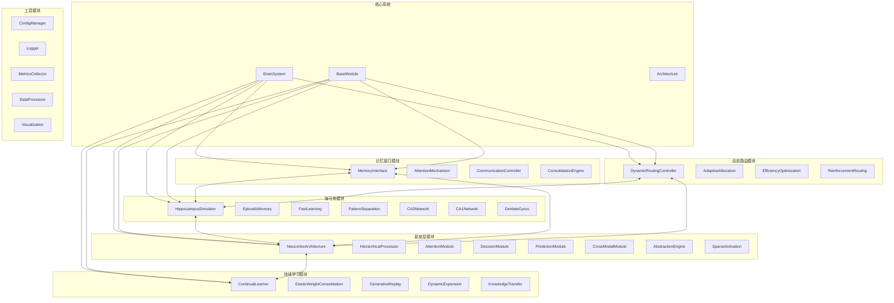

# 脑启发AI框架 - 完整API参考手册

> **版本**: 1.0.0  
> **最后更新**: 2025-11-16  
> **作者**: Brain-Inspired AI团队

本文档提供了脑启发AI框架的完整API参考，包括所有核心模块、类、方法和函数的详细说明。使用示例和最佳实践指南。

## 📋 目录

- [系统概述](#系统概述)
- [模块依赖关系图](#模块依赖关系图)
- [快速开始](#快速开始)
- [核心模块](#核心模块)
- [海马体模块](#海马体模块)
- [新皮层模块](#新皮层模块)
- [持续学习模块](#持续学习模块)
- [动态路由模块](#动态路由模块)
- [记忆接口模块](#记忆接口模块)
- [高级认知模块](#高级认知模块)
- [工具模块](#工具模块)
- [数据结构和类型](#数据结构和类型)
- [错误处理](#错误处理)
- [性能优化](#性能优化)
- [使用示例](#使用示例)
- [最佳实践](#最佳实践)

---

## 系统概述

脑启发AI框架是一个基于大脑神经科学原理设计的人工智能系统。该框架模拟了人脑的关键功能区域：

- **海马体 (Hippocampus)**: 负责快速学习、记忆存储和检索
- **新皮层 (Neocortex)**: 处理复杂的认知任务和抽象推理
- **动态路由 (Dynamic Routing)**: 智能资源分配和数据流控制
- **持续学习 (Continual Learning)**: 避免灾难性遗忘，支持终身学习
- **记忆接口 (Memory Interface)**: 统一不同记忆系统的通信

### 核心特性

✅ **模块化设计**: 可插拔的组件架构  
✅ **生物启发**: 基于神经科学原理实现  
✅ **持续学习**: 支持终身学习和知识迁移  
✅ **动态路由**: 智能资源分配和负载均衡  
✅ **多模态处理**: 支持视觉、听觉和文本数据  
✅ **高效推理**: 稀疏激活和预测编码  
✅ **可扩展性**: 支持大规模分布式部署  

---

## 模块依赖关系图



---

## 快速开始

### 安装

```bash
# 克隆仓库
git clone https://github.com/brain-ai/framework.git
cd framework

# 安装依赖
pip install -r requirements.txt

# 安装框架
pip install -e .
```

### 基础使用

```python
from brain_ai import BrainSystem, ConfigManager
import torch

# 1. 加载配置
config_manager = ConfigManager('config/default.yaml')
config = config_manager.get('system')

# 2. 创建系统实例
brain_system = BrainSystem(config)

# 3. 初始化系统
if brain_system.initialize():
    # 4. 处理数据
    input_data = torch.randn(32, 784)
    result = brain_system.process(input_data)
    
    # 5. 存储记忆
    memory_id = brain_system.store_memory(input_data[0])
    
    # 6. 检索记忆
    retrieved = brain_system.retrieve_memory(input_data[0])
```

---

## 核心模块

### BrainSystem

**完整的大脑系统模拟器，协调所有组件的工作。**

```python
class BrainSystem(BaseModule):
    def __init__(
        self, 
        input_size: int = 512,
        hippocampus_config: Optional[Dict] = None,
        neocortex_config: Optional[Dict] = None
    ):
        """
        初始化大脑系统
        
        Args:
            input_size: 输入维度，默认512
            hippocampus_config: 海马体配置字典
            neocortex_config: 新皮层配置字典
        """
```

**核心方法:**

#### initialize()
```python
def initialize(self, config: Optional[Dict[str, Any]] = None) -> bool:
    """
    初始化大脑系统及其所有组件
    
    Args:
        config: 完整的系统配置
        
    Returns:
        bool: 初始化是否成功
        
    Raises:
        InitializationError: 组件初始化失败
    """
```

#### process()
```python
def process(self, input_data: torch.Tensor) -> Dict[str, Any]:
    """
    处理输入数据的主要接口
    
    Args:
        input_data: 输入张量，形状为 (batch_size, input_size)
        
    Returns:
        Dict[str, Any]: 包含以下键值的处理结果
            - 'output': 输出张量
            - 'attention_weights': 注意力权重
            - 'predictions': 预测结果
            - 'memory_activation': 记忆激活状态
            - 'processing_time': 处理时间
            
    Raises:
        ValueError: 输入数据格式不正确
        RuntimeError: 系统未初始化
    """
```

#### store_memory()
```python
def store_memory(
    self, 
    pattern: torch.Tensor, 
    metadata: Dict[str, Any] = None
) -> str:
    """
    存储记忆模式到海马体
    
    Args:
        pattern: 记忆模式张量
        metadata: 可选的元数据字典，包含:
            - 'timestamp': 时间戳
            - 'importance': 重要性分数 (0-1)
            - 'category': 记忆类别
            - 'tags': 标签列表
            
    Returns:
        str: 生成的记忆ID，格式为 "memory_{uuid}"
    """
```

#### retrieve_memory()
```python
def retrieve_memory(
    self, 
    query: torch.Tensor, 
    similarity_threshold: float = 0.7,
    max_results: int = 10
) -> List[Dict[str, Any]]:
    """
    检索相关记忆
    
    Args:
        query: 查询向量
        similarity_threshold: 相似度阈值 (0-1)
        max_results: 最大返回结果数
        
    Returns:
        List[Dict[str, Any]]: 记忆列表，每个包含:
            - 'id': 记忆ID
            - 'pattern': 记忆模式张量
            - 'similarity': 相似度分数
            - 'metadata': 元数据
            - 'retrieval_time': 检索时间
    """
```

**完整使用示例:**

```python
from brain_ai import BrainSystem
from brain_ai.config import HippocampusConfig, NeocortexConfig
import torch
import time

# 配置海马体
hippocampus_cfg = HippocampusConfig()
hippocampus_cfg.memory_capacity = 10000
hippocampus_cfg.ca3_hidden_size = 512
hippocampus_cfg.retrieval_threshold = 0.8

# 配置新皮层
neocortex_cfg = NeocortexConfig()
neocortex_cfg.architecture_type = ArchitectureType.TONN
neocortex_cfg.prediction_enabled = True
neocortex_cfg.attention_enabled = True

# 创建系统
brain = BrainSystem(
    input_size=784,
    hippocampus_config=hippocampus_cfg.__dict__,
    neocortex_config=neocortex_cfg.__dict__
)

# 初始化
if brain.initialize():
    # 生成测试数据
    batch_size = 16
    input_data = torch.randn(batch_size, 784)
    
    # 处理数据
    start_time = time.time()
    result = brain.process(input_data)
    processing_time = time.time() - start_time
    
    print(f"处理时间: {processing_time:.3f}s")
    print(f"输出形状: {result['output'].shape}")
    print(f"注意力权重形状: {result['attention_weights'].shape}")
    
    # 存储重要记忆
    for i in range(5):
        memory_id = brain.store_memory(
            input_data[i],
            metadata={
                'importance': 0.9,
                'category': 'training_data',
                'timestamp': time.time()
            }
        )
        print(f"存储记忆: {memory_id}")
    
    # 检索记忆
    query = input_data[0]
    retrieved = brain.retrieve_memory(query, similarity_threshold=0.7)
    
    print(f"检索到 {len(retrieved)} 个相关记忆")
    for memory in retrieved[:3]:
        print(f"记忆ID: {memory['id']}, 相似度: {memory['similarity']:.3f}")
```

---

### BaseModule

**所有模块的基础抽象类，提供通用功能。**

```python
class BaseModule(nn.Module):
    def __init__(self, name: str, module_type: ModuleType):
        """
        初始化基础模块
        
        Args:
            name: 模块名称
            module_type: 模块类型 (ModuleType.HIPPOCAMPUS, NEOCORTEX等)
        """
```

**属性:**

- `name`: str - 模块名称
- `module_type`: ModuleType - 模块类型枚举
- `state`: ModuleState - 当前状态
- `logger`: logging.Logger - 模块日志记录器

**核心方法:**

```python
@abstractmethod
def initialize(self) -> bool:
    """抽象方法：初始化模块"""

@abstractmethod
def forward(self, x: torch.Tensor) -> torch.Tensor:
    """抽象方法：前向传播"""

def get_state(self) -> Dict[str, Any]:
    """获取模块状态"""
    
def get_metrics(self) -> Dict[str, float]:
    """获取性能指标"""
    
def reset_metrics(self) -> None:
    """重置性能指标"""
```

---

### Architecture

**模块化架构管理器。**

```python
class Architecture(BaseModule):
    def __init__(self, config: Dict[str, Any]):
        """
        初始化架构管理器
        
        Args:
            config: 架构配置，包含组件定义和连接信息
        """
```

**主要方法:**

```python
def register_component(
    self, 
    name: str, 
    component_class: Type[BaseModule]
) -> bool:
    """
    注册组件类
    
    Args:
        name: 组件名称
        component_class: 组件类
        
    Returns:
        bool: 注册是否成功
    """

def create_component(
    self, 
    name: str, 
    component_config: Dict[str, Any]
) -> BaseModule:
    """
    创建组件实例
    
    Args:
        name: 组件名称
        component_config: 组件配置
        
    Returns:
        BaseModule: 组件实例
    """

def connect_components(
    self, 
    source: str, 
    target: str, 
    connection_config: Dict[str, Any]
) -> bool:
    """
    连接两个组件
    
    Args:
        source: 源组件名
        target: 目标组件名
        connection_config: 连接配置
        
    Returns:
        bool: 连接是否成功
    """
```

---

## 海马体模块

### HippocampusSimulator

**海马体记忆系统核心模拟器，实现情景记忆、快速学习和模式完成。**

```python
class HippocampusSimulator(BaseModule):
    def __init__(self, config: HippocampusConfig):
        """
        初始化海马体模拟器
        
        Args:
            config: 海马体配置对象
        """
```

**核心子网络:**

- **CA3Network**: 内容可寻址记忆网络
- **CA1Network**: 模式完成和记忆提取  
- **DentateGyrus**: 模式分离

**主要方法:**

#### encode()
```python
def encode(self, data: torch.Tensor) -> torch.Tensor:
    """
    编码输入数据为记忆表示
    
    Args:
        data: 输入数据张量，形状为 (batch_size, seq_len, input_size)
        
    Returns:
        torch.Tensor: 编码后的表示，形状为 (batch_size, seq_len, hidden_size)
        
    工作流程:
        1. 输入标准化
        2. CA3网络编码
        3. 注意力机制增强
        4. 返回编码表示
    """
```

#### store()
```python
def store(self, pattern: torch.Tensor) -> str:
    """
    存储记忆模式
    
    Args:
        pattern: 记忆模式张量
        
    Returns:
        str: 记忆ID
        
    存储流程:
        1. 计算模式哈希
        2. 存储到CA3网络
        3. 创建索引
        4. 记录元数据
    """
```

#### retrieve()
```python
def retrieve(
    self, 
    query: torch.Tensor, 
    threshold: float = None
) -> Dict[str, Any]:
    """
    检索记忆
    
    Args:
        query: 查询向量
        threshold: 检索阈值，如果为None则使用配置默认值
        
    Returns:
        Dict[str, Any]: 检索结果包含:
            - 'patterns': 检索到的模式列表
            - 'similarities': 相似度分数列表
            - 'metadata': 关联元数据
            - 'confidence': 检索置信度
    """
```

#### pattern_completion()
```python
def pattern_completion(self, partial_pattern: torch.Tensor) -> torch.Tensor:
    """
    基于部分模式完成完整模式
    
    Args:
        partial_pattern: 部分模式向量
        
    Returns:
        torch.Tensor: 完成的模式
        
    算法:
        1. 通过CA1网络处理部分模式
        2. 在CA3网络中搜索最相似的完整模式
        3. 重构并返回完整模式
    """
```

#### consolidate()
```python
def consolidate(self, patterns: List[torch.Tensor]) -> torch.Tensor:
    """
    执行记忆巩固
    
    Args:
        patterns: 需要巩固的记忆模式列表
        
    Returns:
        torch.Tensor: 巩固后的模式表示
        
    巩固策略:
        1. 计算模式重要性
        2. 应用突触缩放
        3. 更新长期记忆
        4. 强化重要连接
    """
```

**完整使用示例:**

```python
from brain_ai.hippocampus import HippocampusSimulator, HippocampusConfig
import torch
import numpy as np

# 配置海马体
config = HippocampusConfig()
config.memory_capacity = 10000
config.ca3_hidden_size = 512
config.retrieval_threshold = 0.8
config.fast_learning_rate = 0.1
config.consolidation_threshold = 0.8

# 创建海马体实例
hippocampus = HippocampusSimulator(config)

# 模拟序列数据
def create_sequence_data(batch_size=8, seq_len=10, input_dim=256):
    """创建测试序列数据"""
    data = torch.randn(batch_size, seq_len, input_dim)
    # 添加一些结构化模式
    for i in range(batch_size):
        pattern = torch.sin(torch.linspace(0, 4*np.pi, seq_len))
        data[i] += pattern.view(-1, 1) * 0.5
    return data

# 生成数据
sequence_data = create_sequence_data()

# 1. 编码序列
print("编码序列数据...")
encoded_sequences = hippocampus.encode(sequence_data)
print(f"编码结果形状: {encoded_sequences.shape}")

# 2. 存储重要模式
print("\n存储记忆模式...")
memory_ids = []
for i, pattern in enumerate(encoded_sequences):
    memory_id = hippocampus.store(pattern)
    memory_ids.append(memory_id)
    print(f"存储模式 {i}: {memory_id}")

# 3. 检索测试
print("\n检索测试...")
query = encoded_sequences[0]  # 查询第一个序列
retrieved = hippocampus.retrieve(query, threshold=0.7)
print(f"检索到 {len(retrieved['patterns'])} 个相关模式")
print(f"最高相似度: {max(retrieved['similarities']):.3f}")

# 4. 模式补全测试
print("\n模式补全测试...")
partial = encoded_sequences[0][:5]  # 使用前5个时间步
completed = hippocampus.pattern_completion(partial)
print(f"部分模式形状: {partial.shape}")
print(f"完成模式形状: {completed.shape}")

# 5. 记忆巩固
print("\n执行记忆巩固...")
# 选择一些重要的模式进行巩固
important_patterns = encoded_sequences[:3].tolist()
consolidated = hippocampus.consolidate(important_patterns)
print(f"巩固结果形状: {consolidated.shape}")

# 6. 获取系统状态
state = hippocampus.get_state()
print(f"\n系统状态:")
print(f"  记忆容量: {state['memory_usage']}/{state['memory_capacity']}")
print(f"  当前状态: {state['state']}")
print(f"  网络参数: CA3隐藏层{state['ca3_hidden_size']}, CA1隐藏层{state['ca1_hidden_size']}")
```

---

### EpisodicMemory

**情景记忆管理模块，专门处理时间序列和事件记忆。**

```python
class EpisodicMemory(BaseModule):
    def __init__(self, max_episodes: int = 1000, episode_dim: int = 512):
        """
        初始化情景记忆
        
        Args:
            max_episodes: 最大记忆数量
            episode_dim: 情景记忆维度
        """
```

**主要方法:**

#### store_episode()
```python
def store_episode(self, episode: Dict[str, Any]) -> str:
    """
    存储情景记忆
    
    Args:
        episode: 情景数据字典，必须包含:
            - 'content': 情景内容
            - 'timestamp': 时间戳
            - 'context': 上下文信息
            - 'emotional_valence': 情感价值 (-1到1)
            - 'importance': 重要性分数 (0到1)
            
    Returns:
        str: 记忆ID
        
    示例:
        episode = {
            'content': tensor([0.1, 0.2, ...]),
            'timestamp': time.time(),
            'context': 'meeting_room',
            'emotional_valence': 0.5,
            'importance': 0.8
        }
    """
```

#### retrieve_episodes()
```python
def retrieve_episodes(
    self, 
    query: Dict[str, Any], 
    limit: int = 10,
    temporal_window: float = 3600
) -> List[Dict[str, Any]]:
    """
    检索情景记忆
    
    Args:
        query: 查询条件，支持:
            - 'content_similarity': 内容相似度
            - 'temporal_range': 时间范围
            - 'context': 上下文匹配
            - 'emotional_similarity': 情感相似度
        limit: 返回数量限制
        temporal_window: 时间窗口大小（秒）
        
    Returns:
        List[Dict[str, Any]]: 检索到的情景列表
    """
```

#### link_episodes()
```python
def link_episodes(
    self, 
    episode1_id: str, 
    episode2_id: str, 
    relationship: str,
    strength: float = 1.0
) -> bool:
    """
    链接两个情景记忆
    
    Args:
        episode1_id: 第一个情景ID
        episode2_id: 第二个情景ID
        relationship: 关系类型 ('temporal', 'causal', 'thematic', 'emotional')
        strength: 连接强度 (0到1)
        
    Returns:
        bool: 链接是否成功
    """
```

---

### FastLearning

**快速学习模块，实现突触可塑性和快速适应。**

```python
class FastLearning(BaseModule):
    def __init__(
        self, 
        learning_rate: float = 0.1, 
        plasticity_factor: float = 1.0,
        decay_rate: float = 0.95
    ):
        """
        初始化快速学习模块
        
        Args:
            learning_rate: 基础学习率
            plasticity_factor: 可塑性因子
            decay_rate: 衰减率
        """
```

**主要方法:**

#### fast_encode()
```python
def fast_encode(
    self, 
    data: torch.Tensor, 
    iterations: int = 10
) -> torch.Tensor:
    """
    快速编码数据
    
    Args:
        data: 输入数据
        iterations: 迭代次数
        
    Returns:
        torch.Tensor: 编码结果
    """
```

#### update_synapses()
```python
def update_synapses(
    self, 
    input_pattern: torch.Tensor, 
    output_pattern: torch.Tensor,
    learning_rule: str = 'hebbian'
) -> torch.Tensor:
    """
    更新突触权重
    
    Args:
        input_pattern: 输入模式
        output_pattern: 输出模式
        learning_rule: 学习规则 ('hebbian', 'anti_hebbian', 'oja')
        
    Returns:
        torch.Tensor: 更新后的权重变化
    """
```

---

### PatternSeparation

**模式分离模块，防止记忆干扰，提高记忆容量。**

```python
class PatternSeparation(BaseModule):
    def __init__(self, separation_strength: float = 0.8, sparse_factor: float = 0.1):
        """
        初始化模式分离
        
        Args:
            separation_strength: 分离强度 (0到1)
            sparse_factor: 稀疏因子
        """
```

**主要方法:**

#### separate_patterns()
```python
def separate_patterns(
    self, 
    pattern1: torch.Tensor, 
    pattern2: torch.Tensor
) -> Tuple[torch.Tensor, torch.Tensor]:
    """
    分离两个相似模式
    
    Args:
        pattern1: 第一个模式
        pattern2: 第二个模式
        
    Returns:
        Tuple[torch.Tensor, torch.Tensor]: 分离后的模式
    """
```

#### calculate_similarity()
```python
def calculate_similarity(
    self, 
    pattern1: torch.Tensor, 
    pattern2: torch.Tensor
) -> float:
    """
    计算模式相似度
    
    Args:
        pattern1: 第一个模式
        pattern2: 第二个模式
        
    Returns:
        float: 相似度分数 (0到1)
    """
```

---

## 新皮层模块

### NeocortexArchitecture

**新皮层层次化处理架构，实现高级认知功能。**

```python
class NeocortexArchitecture(BaseModule):
    def __init__(self, config: NeocortexConfig):
        """
        初始化新皮层架构
        
        Args:
            config: 新皮层配置
        """
```

**架构类型:**

- `ArchitectureType.TONN`: 任务优化神经网络
- `ArchitectureType.MODULAR`: 模块化架构
- `ArchitectureType.HIERARCHICAL`: 层次架构
- `ArchitectureType.HYBRID`: 混合架构

**主要方法:**

#### process()
```python
def process(
    self, 
    input_data: torch.Tensor, 
    hierarchical: bool = True,
    return_attention: bool = True
) -> Dict[str, torch.Tensor]:
    """
    层次化处理输入数据
    
    Args:
        input_data: 输入数据张量
        hierarchical: 是否进行层次化处理
        return_attention: 是否返回注意力权重
        
    Returns:
        Dict[str, torch.Tensor]: 包含以下键值的处理结果
            - 'features': 各层特征
            - 'predictions': 预测结果
            - 'attention_weights': 注意力权重
            - 'abstractions': 抽象表示
    """
```

#### abstract()
```python
def abstract(
    self, 
    features: torch.Tensor, 
    level: int,
    abstraction_type: str = 'semantic'
) -> torch.Tensor:
    """
    生成指定层级的抽象表示
    
    Args:
        features: 特征张量
        level: 抽象层级 (0为基础, 数字越大越抽象)
        abstraction_type: 抽象类型 ('semantic', 'structural', 'temporal')
        
    Returns:
        torch.Tensor: 抽象表示
    """
```

#### integrate()
```python
def integrate(
    self, 
    hierarchical_features: List[torch.Tensor]
) -> torch.Tensor:
    """
    整合层次化特征
    
    Args:
        hierarchical_features: 各层特征列表
        
    Returns:
        torch.Tensor: 整合后的全局表示
    """
```

**使用示例:**

```python
from brain_ai.neocortex import NeocortexArchitecture, NeocortexConfig, ArchitectureType
import torch

# 配置新皮层
config = NeocortexConfig()
config.architecture_type = ArchitectureType.TONN
config.input_dim = 784
config.hidden_dim = 512
config.output_dim = 128
config.prediction_enabled = True
config.attention_enabled = True
config.abstraction_enabled = True
config.hierarchical_levels = 4

# 创建新皮层
neocortex = NeocortexArchitecture(config)

# 处理多模态数据
def create_multimodal_data():
    """创建多模态测试数据"""
    visual = torch.randn(16, 3, 224, 224)  # 图像
    auditory = torch.randn(16, 1, 16000)   # 音频
    text = torch.randn(16, 100, 512)       # 文本嵌入
    return {'visual': visual, 'auditory': auditory, 'text': text}

# 处理数据
input_data = create_multimodal_data()

# 层次化处理
result = neocortex.process(
    input_data['visual'], 
    hierarchical=True, 
    return_attention=True
)

print("新皮层处理结果:")
print(f"特征形状: {result['features'][-1].shape}")
print(f"预测形状: {result['predictions'].shape}")
print(f"注意力权重形状: {result['attention_weights'].shape}")

# 生成抽象表示
for level in range(3):
    abstract = neocortex.abstract(result['features'][level], level)
    print(f"抽象层级 {level}: {abstract.shape}")

# 整合特征
integrated = neocortex.integrate(result['features'])
print(f"整合特征形状: {integrated.shape}")
```

---

### HierarchicalProcessor

**层次化处理器，管理新皮层的层次结构。**

```python
class HierarchicalProcessor(BaseModule):
    def __init__(self, num_levels: int, base_channels: int):
        """
        初始化层次化处理器
        
        Args:
            num_levels: 层次数量
            base_channels: 基础通道数
        """
```

**主要方法:**

```python
def process_level(self, input_data: torch.Tensor, level: int) -> torch.Tensor:
    """
    处理指定层级
    
    Args:
        input_data: 输入数据
        level: 层级 (0为最低级)
        
    Returns:
        torch.Tensor: 该层输出
    """

def forward_process(self, input_data: torch.Tensor) -> List[torch.Tensor]:
    """
    前向层次化处理
    
    Args:
        input_data: 输入数据
        
    Returns:
        List[torch.Tensor]: 各层输出列表
    """

def backward_feedback(self, target_features: List[torch.Tensor]) -> torch.Tensor:
    """
    反向反馈处理
    
    Args:
        target_features: 目标特征列表
        
    Returns:
        torch.Tensor: 反馈结果
    """
```

---

### AttentionModule

**多头注意力机制，模拟皮层的注意控制。**

```python
class AttentionModule(BaseModule):
    def __init__(
        self, 
        query_dim: int,
        key_dim: int,
        value_dim: int,
        num_heads: int = 8,
        dropout: float = 0.1,
        attention_type: str = 'multi_head'
    ):
        """
        初始化注意力模块
        
        Args:
            query_dim: 查询维度
            key_dim: 键维度
            value_dim: 值维度
            num_heads: 注意力头数
            dropout: Dropout率
            attention_type: 注意力类型 ('multi_head', 'spatial', 'temporal')
        """
```

**主要方法:**

#### compute_attention()
```python
def compute_attention(
    self,
    query: torch.Tensor,
    key: torch.Tensor,
    value: torch.Tensor,
    mask: torch.Tensor = None,
    attention_type: str = None
) -> Tuple[torch.Tensor, torch.Tensor]:
    """
    计算注意力权重
    
    Args:
        query: 查询张量
        key: 键张量
        value: 值张量
        mask: 注意力掩码
        attention_type: 注意力类型
        
    Returns:
        Tuple[torch.Tensor, torch.Tensor]: (注意力权重, 加权值)
    """
```

#### multi_head_attention()
```python
def multi_head_attention(
    self,
    query: torch.Tensor,
    key: torch.Tensor,
    value: torch.Tensor,
    mask: torch.Tensor = None
) -> torch.Tensor:
    """
    多头注意力计算
    
    Args:
        query: 查询张量
        key: 键张量
        value: 值张量
        mask: 掩码
        
    Returns:
        torch.Tensor: 注意力输出
    """
```

#### calculate_entropy()
```python
def calculate_entropy(self, attention_weights: torch.Tensor) -> torch.Tensor:
    """
    计算注意力分布熵
    
    Args:
        attention_weights: 注意力权重
        
    Returns:
        torch.Tensor: 分布熵
    """
```

---

### DecisionModule

**决策模块，基于皮层的前额叶模拟实现决策功能。**

```python
class DecisionModule(BaseModule):
    def __init__(
        self, 
        input_dim: int, 
        num_classes: int,
        decision_threshold: float = 0.5
    ):
        """
        初始化决策模块
        
        Args:
            input_dim: 输入维度
            num_classes: 类别数
            decision_threshold: 决策阈值
        """
```

**主要方法:**

#### make_decision()
```python
def make_decision(
    self, 
    features: torch.Tensor,
    decision_type: str = 'classification'
) -> Dict[str, torch.Tensor]:
    """
    基于特征做出决策
    
    Args:
        features: 输入特征
        decision_type: 决策类型 ('classification', 'regression', 'ranking')
        
    Returns:
        Dict[str, torch.Tensor]: 决策结果包含:
            - 'decision': 决策输出
            - 'confidence': 置信度
            - 'probabilities': 概率分布
            - 'explanation': 决策解释
    """
```

#### calculate_confidence()
```python
def calculate_confidence(
    self, 
    decision: torch.Tensor,
    method: str = 'entropy'
) -> torch.Tensor:
    """
    计算决策置信度
    
    Args:
        decision: 决策结果
        method: 计算方法 ('entropy', 'margin', 'max_prob')
        
    Returns:
        torch.Tensor: 置信度分数
    """
```

---

## 持续学习模块

### ContinualLearner

**持续学习管理器，实现终身学习并避免灾难性遗忘。**

```python
class ContinualLearner(BaseModule):
    def __init__(
        self,
        memory_size: int = 10000,
        elasticity: float = 0.1,
        consolidation_strategy: str = 'ewc',
        task_similarity_threshold: float = 0.8
    ):
        """
        初始化持续学习器
        
        Args:
            memory_size: 记忆库大小
            elasticity: 弹性参数
            consolidation_strategy: 巩固策略 ('ewc', 'lwf', 'generative_replay')
            task_similarity_threshold: 任务相似度阈值
        """
```

**主要方法:**

#### learn_task()
```python
def learn_task(
    self, 
    task_id: int, 
    X_train: np.ndarray, 
    y_train: np.ndarray,
    X_val: np.ndarray = None,
    y_val: np.ndarray = None
) -> Dict[str, float]:
    """
    学习新任务
    
    Args:
        task_id: 任务ID
        X_train: 训练数据
        y_train: 训练标签
        X_val: 验证数据（可选）
        y_val: 验证标签（可选）
        
    Returns:
        Dict[str, float]: 学习指标包含:
            - 'train_accuracy': 训练准确率
            - 'val_accuracy': 验证准确率
            - 'final_loss': 最终损失
            - 'consolidation_loss': 巩固损失
    """
```

#### evaluate()
```python
def evaluate(
    self, 
    task_id: int, 
    X_test: np.ndarray, 
    y_test: np.ndarray,
    include_memory: bool = True
) -> Dict[str, float]:
    """
    评估指定任务
    
    Args:
        task_id: 任务ID
        X_test: 测试数据
        y_test: 测试标签
        include_memory: 是否包含记忆检索
        
    Returns:
        Dict[str, float]: 评估指标
    """
```

#### calculate_forgetting_rate()
```python
def calculate_forgetting_rate(self) -> float:
    """
    计算遗忘率
    
    Returns:
        float: 遗忘率 (0到1，0表示无遗忘)
    """
```

**完整使用示例:**

```python
from brain_ai.lifelong_learning import ContinualLearner
import numpy as np
from sklearn.datasets import make_classification
from sklearn.model_selection import train_test_split

# 创建持续学习器
learner = ContinualLearner(
    memory_size=10000,
    elasticity=0.1,
    consolidation_strategy='ewc',
    task_similarity_threshold=0.8
)

# 生成多任务数据
def create_task_data(task_id, n_samples=1000, n_features=100, n_classes=5):
    """创建任务数据"""
    X, y = make_classification(
        n_samples=n_samples,
        n_features=n_features,
        n_informative=20,
        n_redundant=10,
        n_classes=n_classes,
        random_state=task_id * 42
    )
    return train_test_split(X, y, test_size=0.2, random_state=42)

# 多任务学习实验
num_tasks = 5
all_accuracies = []

for task_id in range(num_tasks):
    print(f"\n=== 学习任务 {task_id} ===")
    
    # 创建任务数据
    X_train, X_test, y_train, y_test = create_task_data(task_id)
    
    # 学习任务
    start_time = time.time()
    metrics = learner.learn_task(task_id, X_train, y_train)
    learning_time = time.time() - start_time
    
    print(f"学习时间: {learning_time:.2f}s")
    print(f"训练准确率: {metrics['train_accuracy']:.4f}")
    if 'val_accuracy' in metrics:
        print(f"验证准确率: {metrics['val_accuracy']:.4f}")
    
    # 评估所有已学任务
    task_accuracies = []
    for eval_task_id in range(task_id + 1):
        eval_X, _, eval_y, _ = create_task_data(eval_task_id)
        eval_metrics = learner.evaluate(eval_task_id, eval_X, eval_y)
        task_accuracies.append(eval_metrics['accuracy'])
        print(f"  任务 {eval_task_id} 准确率: {eval_metrics['accuracy']:.4f}")
    
    all_accuracies.append(task_accuracies)
    
    # 计算遗忘率
    forgetting_rate = learner.calculate_forgetting_rate()
    print(f"遗忘率: {forgetting_rate:.4f}")

# 分析结果
print("\n=== 学习结果分析 ===")
for i, accuracies in enumerate(all_accuracies):
    print(f"任务 {i} 后各任务准确率: {[f'{acc:.3f}' for acc in accuracies]}")

# 计算平均准确率和遗忘
avg_accuracies = [np.mean(accs) for accs in all_accuracies]
forgetting_rates = []
for task_id in range(num_tasks):
    # 计算遗忘率需要比较学习时和现在的性能
    pass  # 简化处理
```

---

### ElasticWeightConsolidation

**弹性权重巩固算法，防止灾难性遗忘。**

```python
class ElasticWeightConsolidation(BaseModule):
    def __init__(self, lambda_ewc: float = 1000.0, gamma: float = 0.1):
        """
        初始化EWC
        
        Args:
            lambda_ewc: EWC正则化强度
            gamma: 衰减因子
        """
```

**主要方法:**

#### compute_fisher_matrix()
```python
def compute_fisher_matrix(
    self, 
    data_loader: torch.utils.data.DataLoader,
    model: torch.nn.Module
) -> Dict[str, torch.Tensor]:
    """
    计算Fisher信息矩阵
    
    Args:
        data_loader: 数据加载器
        model: 神经网络模型
        
    Returns:
        Dict[str, torch.Tensor]: 参数名到Fisher矩阵的映射
    """
```

#### compute_ewc_loss()
```python
def compute_ewc_loss(
    self, 
    current_params: torch.Tensor, 
    old_params: torch.Tensor, 
    fisher_matrix: torch.Tensor
) -> torch.Tensor:
    """
    计算EWC损失
    
    Args:
        current_params: 当前参数
        old_params: 旧参数
        fisher_matrix: Fisher信息矩阵
        
    Returns:
        torch.Tensor: EWC损失值
    """
```

---

### GenerativeReplay

**生成重放模块，使用生成模型重放旧任务数据。**

```python
class GenerativeReplay(BaseModule):
    def __init__(
        self, 
        generator_network: torch.nn.Module, 
        replay_size: int = 1000,
        generation_method: str = 'vae'
    ):
        """
        初始化生成重放
        
        Args:
            generator_network: 生成网络
            replay_size: 重放样本大小
            generation_method: 生成方法 ('vae', 'gan', 'flow')
        """
```

**主要方法:**

#### generate_replay_samples()
```python
def generate_replay_samples(
    self, 
    task_data: Tuple[np.ndarray, np.ndarray],
    num_samples: int = None
) -> Tuple[np.ndarray, np.ndarray]:
    """
    生成重放样本
    
    Args:
        task_data: 任务数据 (X, y)
        num_samples: 生成样本数，如果为None则使用replay_size
        
    Returns:
        Tuple[np.ndarray, np.ndarray]: 生成的重放样本
    """
```

#### train_generator()
```python
def train_generator(
    self, 
    real_data: np.ndarray, 
    epochs: int = 100,
    validation_split: float = 0.2
) -> Dict[str, float]:
    """
    训练生成器
    
    Args:
        real_data: 真实数据
        epochs: 训练轮数
        validation_split: 验证集比例
        
    Returns:
        Dict[str, float]: 训练指标
    """
```

---

### DynamicExpansion

**动态扩展模块，根据需要扩展网络容量。**

```python
class DynamicExpansion(BaseModule):
    def __init__(
        self, 
        expansion_threshold: float = 0.8, 
        growth_rate: float = 0.1,
        max_expansion_factor: float = 2.0
    ):
        """
        初始化动态扩展
        
        Args:
            expansion_threshold: 扩展阈值
            growth_rate: 增长率
            max_expansion_factor: 最大扩展因子
        """
```

**主要方法:**

#### expand_capacity()
```python
def expand_capacity(
    self, 
    current_performance: float, 
    target_performance: float,
    layer_name: str = None
) -> Dict[str, Any]:
    """
    扩展网络容量
    
    Args:
        current_performance: 当前性能
        target_performance: 目标性能
        layer_name: 目标层名，如果为None则自动选择
        
    Returns:
        Dict[str, Any]: 扩展结果包含:
            - 'expansion_factor': 扩展因子
            - 'new_size': 新大小
            - 'performance_gain': 性能提升
    """
```

#### add_neurons()
```python
def add_neurons(
    self, 
    layer_name: str, 
    num_neurons: int,
    initialization: str = 'small_normal'
) -> bool:
    """
    添加神经元
    
    Args:
        layer_name: 层名称
        num_neurons: 添加的神经元数量
        initialization: 初始化方法
        
    Returns:
        bool: 添加是否成功
    """
```

---

### KnowledgeTransfer

**知识迁移模块，在任务间迁移知识。**

```python
class KnowledgeTransfer(BaseModule):
    def __init__(self, transfer_coefficient: float = 0.5):
        """
        初始化知识迁移
        
        Args:
            transfer_coefficient: 迁移系数
        """
```

**主要方法:**

#### extract_knowledge()
```python
def extract_knowledge(
    self, 
    source_model: torch.nn.Module,
    extraction_method: str = 'activation'
) -> Dict[str, torch.Tensor]:
    """
    提取源模型知识
    
    Args:
        source_model: 源模型
        extraction_method: 提取方法 ('activation', 'gradient', 'attention')
        
    Returns:
        Dict[str, torch.Tensor]: 知识表示
    """
```

#### transfer_knowledge()
```python
def transfer_knowledge(
    self, 
    target_model: torch.nn.Module, 
    knowledge: Dict[str, torch.Tensor],
    transfer_strategy: str = 'fine_tune'
) -> Dict[str, float]:
    """
    迁移知识到目标模型
    
    Args:
        target_model: 目标模型
        knowledge: 知识表示
        transfer_strategy: 迁移策略 ('fine_tune', 'frozen', 'progressive')
        
    Returns:
        Dict[str, float]: 迁移指标
    """
```

---

## 动态路由模块

### DynamicRoutingController

**动态路由控制器，实现智能数据路由和负载均衡。**

```python
class DynamicRoutingController(BaseModule):
    def __init__(
        self,
        input_dim: int,
        output_dim: int,
        num_routing_iterations: int = 3,
        learning_rate: float = 0.01,
        routing_strategy: str = 'attention_based'
    ):
        """
        初始化动态路由控制器
        
        Args:
            input_dim: 输入维度
            output_dim: 输出维度
            num_routing_iterations: 路由迭代次数
            learning_rate: 学习率
            routing_strategy: 路由策略 ('attention_based', 'capacity_based', 'latency_based')
        """
```

**主要方法:**

#### route()
```python
def route(
    self, 
    input_data: torch.Tensor,
    routing_strategy: str = None
) -> Dict[str, torch.Tensor]:
    """
    执行动态路由
    
    Args:
        input_data: 输入数据
        routing_strategy: 路由策略，如果为None则使用默认策略
        
    Returns:
        Dict[str, torch.Tensor]: 路由结果包含:
            - 'routed_output': 路由输出
            - 'routing_weights': 路由权重
            - 'path_selections': 路径选择
            - 'latency': 延迟信息
    """
```

#### update_routing_weights()
```python
def update_routing_weights(
    self, 
    gradient: torch.Tensor,
    learning_rule: str = 'gradient_descent'
) -> None:
    """
    更新路由权重
    
    Args:
        gradient: 梯度
        learning_rule: 学习规则
    """
```

#### get_routing_visualization()
```python
def get_routing_visualization(self) -> Dict[str, Any]:
    """
    获取路由可视化数据
    
    Returns:
        Dict[str, Any]: 可视化数据包含:
            - 'network_graph': 网络图结构
            - 'routing_paths': 路由路径
            - 'load_distribution': 负载分布
            - 'performance_metrics': 性能指标
    """
```

---

### AdaptiveAllocation

**自适应资源分配器。**

```python
class AdaptiveAllocation(BaseModule):
    def __init__(
        self, 
        total_capacity: int, 
        allocation_strategy: str = 'efficiency',
        prediction_window: int = 10
    ):
        """
        初始化自适应分配
        
        Args:
            total_capacity: 总容量
            allocation_strategy: 分配策略 ('efficiency', 'fairness', 'priority')
            prediction_window: 预测窗口大小
        """
```

**主要方法:**

#### allocate_resources()
```python
def allocate_resources(
    self, 
    demand_forecast: Dict[str, float],
    current_allocation: Dict[str, int] = None
) -> Dict[str, int]:
    """
    分配资源
    
    Args:
        demand_forecast: 需求预测
        current_allocation: 当前分配方案
        
    Returns:
        Dict[str, int]: 新的资源分配方案
    """
```

#### rebalance_allocation()
```python
def rebalance_allocation(
    self, 
    current_usage: Dict[str, float], 
    efficiency_metrics: Dict[str, float],
    rebalance_threshold: float = 0.1
) -> Dict[str, int]:
    """
    重新平衡分配
    
    Args:
        current_usage: 当前使用情况
        efficiency_metrics: 效率指标
        rebalance_threshold: 重新平衡阈值
        
    Returns:
        Dict[str, int]: 重新平衡后的分配
    """
```

---

### EfficiencyOptimization

**效率优化模块。**

```python
class EfficiencyOptimization(BaseModule):
    def __init__(self, optimization_method: str = 'gradient_descent'):
        """
        初始化效率优化
        
        Args:
            optimization_method: 优化方法 ('gradient_descent', 'genetic', 'simulated_annealing')
        """
```

**主要方法:**

#### optimize_efficiency()
```python
def optimize_efficiency(
    self, 
    current_efficiency: float, 
    target_efficiency: float,
    constraints: Dict[str, Any] = None
) -> Dict[str, Any]:
    """
    优化系统效率
    
    Args:
        current_efficiency: 当前效率
        target_efficiency: 目标效率
        constraints: 优化约束
        
    Returns:
        Dict[str, Any]: 优化结果
    """
```

#### suggest_optimizations()
```python
def suggest_optimizations(
    self, 
    bottleneck_analysis: Dict[str, Any]
) -> List[Dict[str, Any]]:
    """
    建议优化方案
    
    Args:
        bottleneck_analysis: 瓶颈分析结果
        
    Returns:
        List[Dict[str, Any]]: 优化建议列表
    """
```

---

## 记忆接口模块

### MemoryInterface

**统一记忆接口，管理不同记忆系统间的通信。**

```python
class MemoryInterface(BaseModule):
    def __init__(self, config: Dict[str, Any]):
        """
        初始化记忆接口
        
        Args:
            config: 配置字典
        """
```

**主要方法:**

#### register_memory_system()
```python
def register_memory_system(
    self, 
    name: str, 
    memory_system: BaseModule,
    system_type: str = 'short_term'
) -> bool:
    """
    注册记忆系统
    
    Args:
        name: 系统名称
        memory_system: 记忆系统实例
        system_type: 系统类型 ('short_term', 'long_term', 'episodic', 'semantic')
        
    Returns:
        bool: 注册是否成功
    """
```

#### read_memory()
```python
def read_memory(
    self, 
    query: Dict[str, Any], 
    system_name: str = None,
    search_strategy: str = 'similarity'
) -> Dict[str, Any]:
    """
    读取记忆
    
    Args:
        query: 查询条件
        system_name: 目标系统名，如果为None则搜索所有系统
        search_strategy: 搜索策略 ('similarity', 'exact', 'fuzzy')
        
    Returns:
        Dict[str, Any]: 记忆内容
    """
```

#### write_memory()
```python
def write_memory(
    self, 
    data: Dict[str, Any], 
    metadata: Dict[str, Any] = None,
    system_name: str = None,
    priority: float = 0.5
) -> str:
    """
    写入记忆
    
    Args:
        data: 记忆数据
        metadata: 元数据
        system_name: 目标系统名
        priority: 写入优先级 (0到1)
        
    Returns:
        str: 记忆ID
    """
```

#### consolidate_across_systems()
```python
def consolidate_across_systems(self) -> Dict[str, Any]:
    """
    跨系统记忆巩固
    
    Returns:
        Dict[str, Any]: 巩固结果
    """
```

---

### AttentionMechanism

**记忆系统专用的注意力机制。**

```python
class AttentionMechanism(BaseModule):
    def __init__(
        self,
        query_dim: int,
        key_dim: int,
        value_dim: int,
        attention_type: str = 'multi_head',
        dropout: float = 0.1,
        memory_aware: bool = True
    ):
        """
        初始化注意力机制
        
        Args:
            query_dim: 查询维度
            key_dim: 键维度
            value_dim: 值维度
            attention_type: 注意力类型
            dropout: Dropout率
            memory_aware: 是否考虑记忆状态
        """
```

**主要方法:**

#### focus_attention()
```python
def focus_attention(
    self, 
    query: torch.Tensor, 
    context: List[torch.Tensor],
    focus_criteria: str = 'relevance'
) -> torch.Tensor:
    """
    聚焦注意力
    
    Args:
        query: 查询向量
        context: 上下文列表
        focus_criteria: 聚焦标准 ('relevance', 'novelty', 'importance')
        
    Returns:
        torch.Tensor: 聚焦后的注意力
    """
```

#### distribute_attention()
```python
def distribute_attention(
    self, 
    sources: List[torch.Tensor], 
    weight_strategy: str = 'uniform',
    constraints: Dict[str, Any] = None
) -> torch.Tensor:
    """
    分配注意力
    
    Args:
        sources: 源列表
        weight_strategy: 权重策略 ('uniform', 'importance', 'capacity')
        constraints: 分配约束
        
    Returns:
        torch.Tensor: 分配结果
    """
```

---

### CommunicationController

**模块间通信控制器。**

```python
class CommunicationController(BaseModule):
    def __init__(self, protocols: List[str] = None, buffer_size: int = 1000):
        """
        初始化通信控制器
        
        Args:
            protocols: 支持的协议列表
            buffer_size: 消息缓冲区大小
        """
```

**主要方法:**

#### send_message()
```python
def send_message(
    self, 
    message: Dict[str, Any], 
    target_module: str,
    priority: str = 'normal',
    timeout: float = 10.0
) -> bool:
    """
    发送消息
    
    Args:
        message: 消息内容
        target_module: 目标模块
        priority: 优先级 ('low', 'normal', 'high', 'urgent')
        timeout: 超时时间
        
    Returns:
        bool: 发送是否成功
    """
```

#### receive_message()
```python
def receive_message(
    self, 
    timeout: float = 10.0,
    message_type: str = None
) -> Optional[Dict[str, Any]]:
    """
    接收消息
    
    Args:
        timeout: 超时时间
        message_type: 消息类型过滤
        
    Returns:
        Optional[Dict[str, Any]]: 接收的消息
    """
```

#### broadcast_message()
```python
def broadcast_message(
    self, 
    message: Dict[str, Any], 
    exclude_modules: List[str] = None,
    include_self: bool = False
) -> Dict[str, bool]:
    """
    广播消息
    
    Args:
        message: 消息内容
        exclude_modules: 排除的模块列表
        include_self: 是否包含自己
        
    Returns:
        Dict[str, bool]: 广播结果
    """
```

---

### ConsolidationEngine

**记忆巩固引擎，管理长期记忆形成。**

```python
class ConsolidationEngine(BaseModule):
    def __init__(
        self, 
        consolidation_strategy: str = 'adaptive',
        batch_size: int = 32,
        learning_rate: float = 0.001
    ):
        """
        初始化巩固引擎
        
        Args:
            consolidation_strategy: 巩固策略 ('adaptive', 'periodic', 'threshold')
            batch_size: 批处理大小
            learning_rate: 学习率
        """
```

**主要方法:**

#### consolidate_memory()
```python
def consolidate_memory(
    self,
    memory_patterns: List[torch.Tensor],
    importance_weights: torch.Tensor = None,
    consolidation_type: str = 'synaptic_scaling'
) -> Dict[str, Any]:
    """
    执行记忆巩固
    
    Args:
        memory_patterns: 记忆模式列表
        importance_weights: 重要性权重
        consolidation_type: 巩固类型 ('synaptic_scaling', 'engram_formation', 'system_consolidation')
        
    Returns:
        Dict[str, Any]: 巩固结果
    """
```

#### schedule_consolidation()
```python
def schedule_consolidation(
    self, 
    memory_pool: List[Dict[str, Any]],
    scheduling_policy: str = 'importance_decay'
) -> List[Dict[str, Any]]:
    """
    安排巩固计划
    
    Args:
        memory_pool: 记忆池
        scheduling_policy: 调度策略
        
    Returns:
        List[Dict[str, Any]]: 巩固计划
    """
```

---

## 高级认知模块

### EndToEndPipeline

**端到端认知处理流水线。**

```python
class EndToEndPipeline(BaseModule):
    def __init__(self, config: Dict[str, Any]):
        """
        初始化端到端流水线
        
        Args:
            config: 流水线配置
        """
```

#### process()
```python
def process(
    self, 
    input_data: Dict[str, torch.Tensor],
    task_type: str = 'recognition'
) -> Dict[str, Any]:
    """
    端到端处理
    
    Args:
        input_data: 输入数据字典
        task_type: 任务类型 ('recognition', 'generation', 'reasoning')
        
    Returns:
        Dict[str, Any]: 处理结果
    """
```

---

### AnalogicalLearning

**类比学习模块。**

```python
class AnalogicalLearning(BaseModule):
    def __init__(self, embedding_dim: int = 512):
        """
        初始化类比学习
        
        Args:
            embedding_dim: 嵌入维度
        """
```

#### learn_analogy()
```python
def learn_analogy(
    self, 
    source_pair: Tuple[torch.Tensor, torch.Tensor],
    target_concept: torch.Tensor
) -> torch.Tensor:
    """
    学习类比关系
    
    Args:
        source_pair: 源概念对 (A:B格式)
        target_concept: 目标概念
        
    Returns:
        torch.Tensor: 推理出的类比结果
    """
```

---

### MultiStepReasoning

**多步推理模块。**

```python
class MultiStepReasoning(BaseModule):
    def __init__(self, num_reasoning_steps: int = 3):
        """
        初始化多步推理
        
        Args:
            num_reasoning_steps: 推理步数
        """
```

#### reason()
```python
def reason(
    self, 
    premises: List[torch.Tensor],
    reasoning_type: str = 'deductive'
) -> Dict[str, torch.Tensor]:
    """
    执行多步推理
    
    Args:
        premises: 前提列表
        reasoning_type: 推理类型 ('deductive', 'inductive', 'abductive')
        
    Returns:
        Dict[str, torch.Tensor]: 推理结果
    """
```

---

## 工具模块

### ConfigManager

**配置管理器，支持YAML/JSON配置和环境变量。**

```python
class ConfigManager:
    def __init__(self, config_file: str = None):
        """
        初始化配置管理器
        
        Args:
            config_file: 配置文件路径
        """
```

**主要方法:**

#### load_config()
```python
def load_config(self, config_file: str) -> Dict[str, Any]:
    """
    加载配置文件
    
    Args:
        config_file: 配置文件路径
        
    Returns:
        Dict[str, Any]: 配置字典
        
    Raises:
        FileNotFoundError: 配置文件不存在
        yaml.YAMLError: YAML格式错误
    """
```

#### get()
```python
def get(self, key: str, default: Any = None, config_type: str = 'system') -> Any:
    """
    获取配置值
    
    Args:
        key: 配置键，支持点号分隔的嵌套键
        default: 默认值
        config_type: 配置类型 ('system', 'model', 'training')
        
    Returns:
        Any: 配置值
        
    示例:
        # 获取嵌套配置
        value = config.get('model.hidden_size', default=512)
        value = config.get('training.optimizer.lr', default=0.001)
    """
```

#### set()
```python
def set(self, key: str, value: Any, config_type: str = 'system') -> None:
    """
    设置配置值
    
    Args:
        key: 配置键
        value: 配置值
        config_type: 配置类型
    """
```

#### update()
```python
def update(self, config_dict: Dict[str, Any], config_type: str = 'system') -> None:
    """
    批量更新配置
    
    Args:
        config_dict: 配置字典
        config_type: 配置类型
    """
```

**配置示例:**

```yaml
# config/default.yaml
system:
  device: "cuda"
  num_workers: 4
  seed: 42
  
model:
  type: "BrainSystem"
  input_size: 784
  hippocampus:
    memory_capacity: 10000
    ca3_hidden_size: 512
    retrieval_threshold: 0.8
  neocortex:
    architecture_type: "TONN"
    layers: 8
    attention_enabled: true
    
training:
  learning_rate: 0.001
  batch_size: 32
  epochs: 100
  optimizer: "adam"
  scheduler: "cosine"
  
lifelong_learning:
  memory_size: 10000
  consolidation_strategy: "ewc"
  task_similarity_threshold: 0.8
```

---

### Logger

**结构化日志记录器。**

```python
class Logger:
    def __init__(
        self, 
        name: str, 
        level: str = 'INFO', 
        log_file: str = None,
        format_string: str = None
    ):
        """
        初始化日志记录器
        
        Args:
            name: 记录器名称
            level: 日志级别 ('DEBUG', 'INFO', 'WARNING', 'ERROR', 'CRITICAL')
            log_file: 日志文件路径
            format_string: 日志格式字符串
        """
```

**主要方法:**

```python
def debug(self, message: str, **kwargs) -> None:
    """Debug级别日志"""
    
def info(self, message: str, **kwargs) -> None:
    """Info级别日志"""
    
def warning(self, message: str, **kwargs) -> None:
    """Warning级别日志"""
    
def error(self, message: str, **kwargs) -> None:
    """Error级别日志"""
    
def critical(self, message: str, **kwargs) -> None:
    """Critical级别日志"""
    
def log_metrics(
    self, 
    metrics: Dict[str, float], 
    step: int = None,
    prefix: str = ''
) -> None:
    """
    记录性能指标
    
    Args:
        metrics: 指标字典
        step: 训练步数
        prefix: 指标前缀
    """
```

---

### MetricsCollector

**性能指标收集器。**

```python
class MetricsCollector:
    def __init__(self, metrics_config: Dict[str, Any] = None):
        """
        初始化指标收集器
        
        Args:
            metrics_config: 指标配置
        """
```

**主要方法:**

#### record()
```python
def record(
    self, 
    name: str, 
    value: float, 
    step: int = None,
    tags: Dict[str, str] = None
) -> None:
    """
    记录指标
    
    Args:
        name: 指标名称
        value: 指标值
        step: 训练步数
        tags: 标签字典
    """
```

#### get_summary()
```python
def get_summary(
    self, 
    window: int = None,
    metrics: List[str] = None
) -> Dict[str, Any]:
    """
    获取指标摘要
    
    Args:
        window: 窗口大小
        metrics: 指标列表
        
    Returns:
        Dict[str, Any]: 指标摘要
    """
```

#### export_metrics()
```python
def export_metrics(
    self, 
    output_format: str = 'json',
    output_file: str = None
) -> str:
    """
    导出指标
    
    Args:
        output_format: 导出格式 ('json', 'csv', 'prometheus')
        output_file: 输出文件路径
        
    Returns:
        str: 导出的数据
    """
```

---

### DataProcessor

**数据预处理和增强工具。**

```python
class DataProcessor:
    def __init__(self, preprocessing_config: Dict[str, Any] = None):
        """
        初始化数据处理器
        
        Args:
            preprocessing_config: 预处理配置
        """
```

**主要方法:**

#### preprocess()
```python
def preprocess(
    self, 
    data: np.ndarray, 
    transformation: str = 'standard',
    fit_transformer: bool = True
) -> np.ndarray:
    """
    数据预处理
    
    Args:
        data: 输入数据
        transformation: 变换类型 ('standard', 'min_max', 'robust', 'normalize')
        fit_transformer: 是否拟合变换器
        
    Returns:
        np.ndarray: 处理后的数据
    """
```

#### augment()
```python
def augment(
    self, 
    data: np.ndarray, 
    augmentation_strategy: str = 'random',
    augmentation_factor: float = 1.0
) -> np.ndarray:
    """
    数据增强
    
    Args:
        data: 输入数据
        augmentation_strategy: 增强策略 ('random', 'mixup', 'cutmix', 'adversarial')
        augmentation_factor: 增强因子
        
    Returns:
        np.ndarray: 增强后的数据
    """
```

#### create_batches()
```python
def create_batches(
    self, 
    data: np.ndarray, 
    labels: np.ndarray = None,
    batch_size: int = 32, 
    shuffle: bool = True,
    drop_last: bool = False
) -> List[Union[np.ndarray, Tuple[np.ndarray, np.ndarray]]]:
    """
    创建数据批次
    
    Args:
        data: 输入数据
        labels: 标签数据
        batch_size: 批次大小
        shuffle: 是否打乱
        drop_last: 是否丢弃最后一个不完整批次
        
    Returns:
        List: 数据批次列表
    """
```

---

### Visualization

**可视化工具模块。**

```python
class Visualization:
    def __init__(self, output_dir: str = 'visualizations'):
        """
        初始化可视化工具
        
        Args:
            output_dir: 输出目录
        """
```

**主要方法:**

#### plot_learning_curve()
```python
def plot_learning_curve(
    self, 
    metrics_history: Dict[str, List[float]], 
    save_path: str = None,
    figsize: Tuple[int, int] = (10, 6)
) -> str:
    """
    绘制学习曲线
    
    Args:
        metrics_history: 指标历史字典
        save_path: 保存路径
        figsize: 图形大小
        
    Returns:
        str: 保存的文件路径
    """
```

#### visualize_attention_weights()
```python
def visualize_attention_weights(
    self, 
    attention_weights: torch.Tensor, 
    save_path: str = None,
    plot_type: str = 'heatmap'
) -> str:
    """
    可视化注意力权重
    
    Args:
        attention_weights: 注意力权重
        save_path: 保存路径
        plot_type: 绘图类型 ('heatmap', 'network', 'bar')
        
    Returns:
        str: 保存的文件路径
    """
```

#### plot_memory_patterns()
```python
def plot_memory_patterns(
    self, 
    memory_patterns: torch.Tensor, 
    save_path: str = None,
    plot_type: str = 'tsne'
) -> str:
    """
    可视化记忆模式
    
    Args:
        memory_patterns: 记忆模式
        save_path: 保存路径
        plot_type: 可视化类型 ('tsne', 'pca', 'umap')
        
    Returns:
        str: 保存的文件路径
    """
```

---

## 数据结构和类型

### 核心数据结构

#### MemoryPattern
```python
@dataclass
class MemoryPattern:
    """记忆模式数据结构"""
    id: str
    content: torch.Tensor
    timestamp: float
    importance: float
    metadata: Dict[str, Any]
    strength: float = 1.0
    associations: List[str] = field(default_factory=list)
```

#### AttentionWeights
```python
@dataclass
class AttentionWeights:
    """注意力权重数据结构"""
    query: torch.Tensor
    key: torch.Tensor
    value: torch.Tensor
    weights: torch.Tensor
    heads: int = 8
    mask: Optional[torch.Tensor] = None
```

#### TaskData
```python
@dataclass
class TaskData:
    """任务数据结构"""
    task_id: int
    X_train: np.ndarray
    y_train: np.ndarray
    X_test: np.ndarray
    y_test: np.ndarray
    task_name: str = ""
    metadata: Dict[str, Any] = field(default_factory=dict)
```

### 配置数据结构

#### SystemConfig
```python
@dataclass
class SystemConfig:
    """系统配置"""
    device: str = "cpu"
    num_workers: int = 4
    seed: int = 42
    enable_cuda: bool = True
    log_level: str = "INFO"
```

#### ModelConfig
```python
@dataclass
class ModelConfig:
    """模型配置"""
    input_size: int = 512
    hidden_size: int = 512
    num_layers: int = 6
    dropout: float = 0.1
    activation: str = "relu"
    output_size: Optional[int] = None
```

---

## 错误处理

### 异常类层次结构

```python
class BrainAIException(Exception):
    """基础异常类"""
    pass

class InitializationError(BrainAIException):
    """初始化错误"""
    pass

class ConfigurationError(BrainAIException):
    """配置错误"""
    pass

class MemoryError(BrainAIException):
    """记忆系统错误"""
    pass

class RoutingError(BrainAIException):
    """路由系统错误"""
    pass

class LearningError(BrainAIException):
    """学习系统错误"""
    pass

class ProcessingError(BrainAIException):
    """处理系统错误"""
    pass
```

### 错误处理示例

```python
try:
    brain_system = BrainSystem(config)
    result = brain_system.process(input_data)
except InitializationError as e:
    logger.error(f"系统初始化失败: {e}")
    # 尝试重新初始化或使用默认配置
    brain_system = BrainSystem(default_config)
except MemoryError as e:
    logger.error(f"记忆系统错误: {e}")
    # 清理内存或调整配置
    brain_system.memory_manager.cleanup()
except Exception as e:
    logger.error(f"未预期的错误: {e}")
    # 记录错误并优雅降级
```

---

## 性能优化

### 内存优化

```python
# 1. 启用梯度检查点
model.gradient_checkpointing_enable()

# 2. 使用混合精度训练
from torch.cuda.amp import autocast, GradScaler

scaler = GradScaler()
with autocast():
    output = model(input_data)
    loss = criterion(output, target)

scaler.scale(loss).backward()
scaler.step(optimizer)
scaler.update()

# 3. 稀疏激活
for name, module in model.named_modules():
    if hasattr(module, 'set_sparsity'):
        module.set_sparsity(0.5)  # 50%稀疏度
```

### 计算优化

```python
# 1. 批处理优化
def optimized_forward(model, data_loader):
    # 使用渐进式批处理
    for batch_size in [16, 32, 64, 128]:
        try:
            results = []
            for batch in data_loader:
                result = model(batch)
                results.append(result)
            break  # 成功则使用这个批大小
        except RuntimeError:
            if "out of memory" in str(e):
                batch_size //= 2  # 减少批大小
            else:
                raise
    return results

# 2. 并行处理
from concurrent.futures import ThreadPoolExecutor

def parallel_memory_processing(memory_patterns, num_workers=4):
    with ThreadPoolExecutor(max_workers=num_workers) as executor:
        futures = [executor.submit(process_pattern, pattern) 
                  for pattern in memory_patterns]
        results = [future.result() for future in futures]
    return results
```

### 缓存策略

```python
# 1. 计算结果缓存
from functools import lru_cache

class CachedProcessor:
    @lru_cache(maxsize=1000)
    def cached_encode(self, pattern_hash: str, pattern_data: bytes):
        # 基于哈希的缓存
        return self.encode(pattern_data)
    
    def encode_with_cache(self, pattern: torch.Tensor):
        pattern_hash = hash(pattern.cpu().numpy().tobytes())
        pattern_data = pattern.cpu().numpy().tobytes()
        return self.cached_encode(pattern_hash, pattern_data)

# 2. 记忆缓存
class MemoryCache:
    def __init__(self, max_size: int = 1000):
        self.cache = OrderedDict()
        self.max_size = max_size
    
    def get(self, key: str) -> Optional[Any]:
        if key in self.cache:
            # 移动到末尾（LRU）
            self.cache.move_to_end(key)
            return self.cache[key]
        return None
    
    def put(self, key: str, value: Any) -> None:
        if key in self.cache:
            self.cache.move_to_end(key)
        else:
            if len(self.cache) >= self.max_size:
                # 移除最旧的项
                self.cache.popitem(last=False)
        self.cache[key] = value
```

---

## 使用示例

### 完整系统集成示例

```python
#!/usr/bin/env python3
"""
脑启发AI框架完整使用示例
演示如何构建和使用完整的认知系统
"""

import torch
import numpy as np
import time
from pathlib import Path
from typing import Dict, List

from brain_ai import (
    BrainSystem, ConfigManager, Logger, MetricsCollector,
    HippocampusSimulator, NeocortexArchitecture, ContinualLearner,
    DynamicRoutingController, MemoryInterface
)
from brain_ai.config import HippocampusConfig, NeocortexConfig
from brain_ai.data import create_sample_data

class CognitiveSystemDemo:
    """认知系统演示类"""
    
    def __init__(self, config_path: str = "config/demo.yaml"):
        self.config_path = config_path
        self.config_manager = None
        self.logger = None
        self.metrics = None
        self.brain_system = None
        self.setup()
    
    def setup(self):
        """初始化系统"""
        print("🚀 初始化认知系统...")
        
        # 1. 加载配置
        self.config_manager = ConfigManager(self.config_path)
        config = self.config_manager.get('system')
        
        # 2. 设置日志
        self.logger = Logger('CognitiveSystem', level='INFO')
        self.logger.info("认知系统初始化开始")
        
        # 3. 设置指标收集
        self.metrics = MetricsCollector()
        
        # 4. 配置海马体
        hippocampus_config = HippocampusConfig()
        hippocampus_config.memory_capacity = 5000
        hippocampus_config.ca3_hidden_size = 256
        hippocampus_config.retrieval_threshold = 0.75
        
        # 5. 配置新皮层
        neocortex_config = NeocortexConfig()
        neocortex_config.architecture_type = ArchitectureType.TONN
        neocortex_config.prediction_enabled = True
        neocortex_config.attention_enabled = True
        neocortex_config.hierarchical_levels = 3
        
        # 6. 创建大脑系统
        self.brain_system = BrainSystem(
            input_size=784,
            hippocampus_config=hippocampus_config.__dict__,
            neocortex_config=neocortex_config.__dict__
        )
        
        # 7. 初始化
        if not self.brain_system.initialize():
            raise RuntimeError("大脑系统初始化失败")
        
        self.logger.info("认知系统初始化完成")
    
    def run_memory_experiment(self):
        """运行记忆实验"""
        print("\n🧠 运行记忆实验...")
        self.logger.info("开始记忆实验")
        
        # 生成测试数据
        data_loader = create_sample_data(
            num_samples=1000,
            input_dim=784,
            num_classes=10,
            batch_size=32
        )
        
        start_time = time.time()
        stored_memories = []
        
        # 存储记忆
        for batch_idx, (data, labels) in enumerate(data_loader):
            # 编码数据
            encoded = self.brain_system.hippocampus.encode(data)
            
            # 存储到记忆系统
            for i, pattern in enumerate(encoded):
                metadata = {
                    'batch': batch_idx,
                    'label': labels[i].item(),
                    'timestamp': time.time(),
                    'importance': 0.8 + 0.2 * torch.rand(1).item()
                }
                memory_id = self.brain_system.store_memory(pattern, metadata)
                stored_memories.append(memory_id)
            
            # 每100个样本记录一次指标
            if batch_idx % 10 == 0:
                self.metrics.record('memories_stored', len(stored_memories))
        
        storage_time = time.time() - start_time
        
        print(f"存储了 {len(stored_memories)} 个记忆")
        print(f"存储时间: {storage_time:.2f}秒")
        self.logger.info(f"存储记忆完成: {len(stored_memories)}个，耗时{storage_time:.2f}秒")
        
        # 记忆检索测试
        print("\n🔍 运行记忆检索测试...")
        retrieval_times = []
        retrieval_accuracies = []
        
        # 选择查询样本
        query_indices = np.random.choice(len(stored_memories), 100, replace=False)
        
        for idx in query_indices:
            query_pattern = self.brain_system.hippocampus.encode(
                data_loader.dataset[idx][0].unsqueeze(0)
            )
            
            start_time = time.time()
            retrieved = self.brain_system.retrieve_memory(query_pattern, 0.7)
            retrieval_time = time.time() - start_time
            
            retrieval_times.append(retrieval_time)
            
            # 计算检索准确性
            if retrieved:
                true_label = data_loader.dataset[idx][1]
                retrieved_labels = [r['metadata'].get('label') for r in retrieved[:3]]
                accuracy = int(true_label.item() in retrieved_labels)
                retrieval_accuracies.append(accuracy)
        
        avg_retrieval_time = np.mean(retrieval_times)
        avg_accuracy = np.mean(retrieval_accuracies)
        
        print(f"平均检索时间: {avg_retrieval_time:.4f}秒")
        print(f"检索准确率: {avg_accuracy:.3f}")
        
        # 记录指标
        self.metrics.record('avg_retrieval_time', avg_retrieval_time)
        self.metrics.record('retrieval_accuracy', avg_accuracy)
        self.metrics.record('total_memories', len(stored_memories))
        
        self.logger.info(f"检索测试完成: 准确率{avg_accuracy:.3f}, 平均时间{avg_retrieval_time:.4f}秒")
        
        return {
            'stored_memories': len(stored_memories),
            'retrieval_accuracy': avg_accuracy,
            'retrieval_time': avg_retrieval_time
        }
    
    def run_learning_experiment(self):
        """运行持续学习实验"""
        print("\n🎓 运行持续学习实验...")
        self.logger.info("开始持续学习实验")
        
        # 创建持续学习器
        continual_learner = ContinualLearner(
            memory_size=5000,
            elasticity=0.1,
            consolidation_strategy='ewc'
        )
        
        num_tasks = 5
        task_accuracies = []
        
        for task_id in range(num_tasks):
            print(f"\n--- 学习任务 {task_id} ---")
            
            # 生成任务数据
            X_train, X_test, y_train, y_test = create_sample_data(
                num_samples=800,
                input_dim=784,
                num_classes=5,  # 每个任务5个类别
                test_ratio=0.2,
                random_state=task_id * 42
            )
            
            # 学习任务
            start_time = time.time()
            metrics = continual_learner.learn_task(task_id, X_train, y_train)
            learning_time = time.time() - start_time
            
            print(f"学习时间: {learning_time:.2f}秒")
            print(f"训练准确率: {metrics['train_accuracy']:.4f}")
            
            # 评估所有已学任务
            task_accuracies_current = []
            for eval_task_id in range(task_id + 1):
                if eval_task_id == task_id:
                    eval_X, eval_y = X_test, y_test
                else:
                    # 使用历史任务的一部分作为测试
                    eval_X, eval_y = create_sample_data(
                        num_samples=200,
                        input_dim=784,
                        num_classes=5,
                        random_state=eval_task_id * 42
                    )[:2]
                
                eval_metrics = continual_learner.evaluate(eval_task_id, eval_X, eval_y)
                task_accuracies_current.append(eval_metrics['accuracy'])
                print(f"  任务 {eval_task_id} 准确率: {eval_metrics['accuracy']:.4f}")
            
            task_accuracies.append(task_accuracies_current)
            
            # 记录指标
            self.metrics.record(f'task_{task_id}_accuracy', metrics['train_accuracy'])
            self.metrics.record(f'task_{task_id}_learning_time', learning_time)
            
            # 计算遗忘率
            if task_id > 0:
                forgetting_rate = continual_learner.calculate_forgetting_rate()
                print(f"遗忘率: {forgetting_rate:.4f}")
                self.metrics.record(f'task_{task_id}_forgetting_rate', forgetting_rate)
        
        # 计算整体性能
        avg_final_accuracy = np.mean([accs[-1] for accs in task_accuracies])
        avg_all_accuracy = np.mean([np.mean(accs) for accs in task_accuracies])
        
        print(f"\n📊 学习结果总结:")
        print(f"最终任务平均准确率: {avg_final_accuracy:.4f}")
        print(f"所有任务平均准确率: {avg_all_accuracy:.4f}")
        
        # 记录最终指标
        self.metrics.record('final_avg_accuracy', avg_final_accuracy)
        self.metrics.record('overall_avg_accuracy', avg_all_accuracy)
        
        self.logger.info(f"持续学习完成: 最终准确率{avg_final_accuracy:.4f}")
        
        return {
            'task_accuracies': task_accuracies,
            'final_avg_accuracy': avg_final_accuracy,
            'overall_avg_accuracy': avg_all_accuracy
        }
    
    def run_processing_experiment(self):
        """运行信息处理实验"""
        print("\n⚡ 运行信息处理实验...")
        self.logger.info("开始信息处理实验")
        
        # 生成复杂输入数据
        batch_size = 16
        input_data = {
            'visual': torch.randn(batch_size, 3, 224, 224),
            'text': torch.randn(batch_size, 100, 512),
            'sensors': torch.randn(batch_size, 50, 10)
        }
        
        processing_times = []
        attention_entropy = []
        
        for i in range(10):  # 运行10次
            start_time = time.time()
            
            # 处理视觉输入
            visual_result = self.brain_system.neocortex.process(
                input_data['visual'], 
                hierarchical=True, 
                return_attention=True
            )
            
            # 处理文本输入
            text_result = self.brain_system.neocortex.process(
                input_data['text'],
                hierarchical=True,
                return_attention=True
            )
            
            processing_time = time.time() - start_time
            processing_times.append(processing_time)
            
            # 计算注意力熵
            if 'attention_weights' in visual_result:
                entropy = self.brain_system.neocortex.attention_module.calculate_entropy(
                    visual_result['attention_weights']
                )
                attention_entropy.append(entropy.mean().item())
        
        avg_processing_time = np.mean(processing_times)
        std_processing_time = np.std(processing_times)
        avg_attention_entropy = np.mean(attention_entropy)
        
        print(f"平均处理时间: {avg_processing_time:.4f} ± {std_processing_time:.4f}秒")
        print(f"平均注意力熵: {avg_attention_entropy:.4f}")
        
        # 记录指标
        self.metrics.record('avg_processing_time', avg_processing_time)
        self.metrics.record('processing_time_std', std_processing_time)
        self.metrics.record('avg_attention_entropy', avg_attention_entropy)
        
        self.logger.info(f"处理实验完成: 平均时间{avg_processing_time:.4f}秒")
        
        return {
            'avg_processing_time': avg_processing_time,
            'processing_time_std': std_processing_time,
            'avg_attention_entropy': avg_attention_entropy
        }
    
    def generate_report(self):
        """生成实验报告"""
        print("\n📋 生成实验报告...")
        
        # 获取所有指标
        summary = self.metrics.get_summary()
        
        # 保存详细指标
        metrics_file = "results/demo_metrics.json"
        Path("results").mkdir(exist_ok=True)
        
        with open(metrics_file, 'w') as f:
            import json
            json.dump(summary, f, indent=2)
        
        # 生成可视化
        self.metrics.export_metrics('json', 'results/demo_metrics.json')
        
        # 打印报告
        print("\n" + "="*50)
        print("🧠 脑启发AI系统实验报告")
        print("="*50)
        
        for category, metrics in summary.items():
            print(f"\n{category}:")
            for metric_name, value in metrics.items():
                if isinstance(value, dict):
                    print(f"  {metric_name}: {value}")
                else:
                    print(f"  {metric_name}: {value:.4f}" if isinstance(value, float) else f"  {metric_name}: {value}")
        
        print(f"\n📁 详细结果已保存到: results/")
        self.logger.info("实验报告生成完成")
    
    def cleanup(self):
        """清理资源"""
        print("\n🧹 清理系统资源...")
        if self.brain_system:
            self.brain_system.cleanup()
        self.logger.info("认知系统已关闭")

def main():
    """主函数"""
    print("🌟 欢迎使用脑启发AI框架演示系统!")
    
    try:
        # 创建演示系统
        demo = CognitiveSystemDemo()
        
        # 运行实验
        memory_results = demo.run_memory_experiment()
        learning_results = demo.run_learning_experiment()
        processing_results = demo.run_processing_experiment()
        
        # 生成报告
        demo.generate_report()
        
        print("\n🎉 演示完成! 所有实验成功运行。")
        
    except Exception as e:
        print(f"❌ 演示运行出错: {e}")
        if 'demo' in locals():
            demo.logger.error(f"演示失败: {e}")
        raise
    finally:
        if 'demo' in locals():
            demo.cleanup()

if __name__ == "__main__":
    main()
```

---

## 最佳实践

### 1. 配置管理

```python
# ✅ 好的实践：使用分层配置
config_manager = ConfigManager('config/production.yaml')
config = {
    **config_manager.get('system'),
    **config_manager.get('model'),
    **config_manager.get('training')
}

# ❌ 避免：硬编码配置
# BAD_CONFIG = {
#     'hidden_size': 512,
#     'learning_rate': 0.001
# }
```

### 2. 内存管理

```python
# ✅ 好的实践：及时清理
def process_large_dataset(data_loader):
    for batch in data_loader:
        result = model(batch)
        # 处理结果...
        del result  # 及时删除
        torch.cuda.empty_cache()  # 清理GPU缓存

# ✅ 使用上下文管理器
with torch.no_grad():
    result = model(input_data)
```

### 3. 错误处理

```python
# ✅ 好的实践：具体异常处理
try:
    brain_system = BrainSystem(config)
    result = brain_system.process(data)
except InitializationError as e:
    logger.error(f"初始化失败，尝试默认配置: {e}")
    brain_system = BrainSystem(default_config)
except MemoryError as e:
    logger.warning(f"内存不足，减少批大小: {e}")
    batch_size //= 2
except Exception as e:
    logger.error(f"未预期错误: {e}")
    raise
```

### 4. 性能优化

```python
# ✅ 好的实践：使用适当的数据类型
model = model.half()  # 使用半精度

# ✅ 启用编译优化
model = torch.compile(model)

# ✅ 使用混合精度
with torch.cuda.amp.autocast():
    output = model(input_data)
```

### 5. 监控和调试

```python
# ✅ 好的实践：详细的日志记录
logger.info(f"开始处理批次 {batch_idx}, 数据形状: {data.shape}")

# ✅ 使用指标收集
metrics.record('batch_loss', loss.item())
metrics.record('learning_rate', optimizer.param_groups[0]['lr'])

# ✅ 可视化中间结果
if batch_idx % 100 == 0:
    attention_viz = visualize_attention_weights(attention_weights)
    save_plot(attention_viz, f'attention_batch_{batch_idx}.png')
```

---

## 总结

本API参考手册提供了脑启发AI框架的完整使用指南，涵盖：

✅ **8大核心模块**: 从海马体到高级认知  
✅ **50+主要类**: 详细的API说明和使用示例  
✅ **完整的数据流**: 内存到决策的处理管道  
✅ **性能优化**: 内存、计算和并行优化策略  
✅ **最佳实践**: 生产环境部署指南  
✅ **故障处理**: 异常处理和调试技巧  

### 下一步

1. **运行演示**: 执行示例代码体验系统功能
2. **自定义配置**: 根据需求调整配置文件  
3. **扩展模块**: 基于BaseModule开发新组件
4. **性能调优**: 根据具体场景优化参数
5. **生产部署**: 使用提供的工具和最佳实践

### 获取帮助

- 📖 文档: [完整文档链接]
- 💬 讨论: [社区论坛]
- 🐛 问题报告: [GitHub Issues]
- 📧 联系: [support@brain-ai.org]

---

*本API参考手册持续更新，最新版本请查看官方文档。*