# 模块依赖关系图

```mermaid
graph TD
    subgraph "核心系统层"
        BS[BrainSystem]
        BM[BaseModule]
        AR[Architecture]
        INT[Interfaces]
    end
    
    subgraph "海马体模块层"
        HS[HippocampusSimulator]
        EM[EpisodicMemory]
        FL[FastLearning]
        PS[PatternSeparation]
        CA3[CA3Network]
        CA1[CA1Network]
        DG[DentateGyrus]
        TE[TransformerEncoder]
    end
    
    subgraph "新皮层模块层"
        NA[NeocortexArchitecture]
        HM[HierarchicalProcessor]
        AM[AttentionModule]
        DM[DecisionModule]
        PM[PredictionModule]
        CMM[CrossModalModule]
        AE[AbstractionEngine]
        SA[SparseActivation]
        VH[VisualHierarchy]
        AH[AuditoryHierarchy]
    end
    
    subgraph "持续学习模块层"
        CL[ContinualLearner]
        EWC[ElasticWeightConsolidation]
        GR[GenerativeReplay]
        DE[DynamicExpansion]
        KT[KnowledgeTransfer]
        PGR[ProgressiveNeuralNetwork]
    end
    
    subgraph "动态路由模块层"
        DRC[DynamicRoutingController]
        AA[AdaptiveAllocation]
        EO[EfficiencyOptimization]
        RR[ReinforcementRouting]
        LB[LoadBalancer]
        IPS[IntelligentPathSelector]
        NR[NeuralInspiredRouting]
        MEP[EnergyEfficientPath]
        PEP[PredictiveEarlyExit]
        DWR[DynamicWeightRouting]
        QE[Q_learning]
        AC[ActorCritic]
        MARL[MultiAgent]
        ENV[RoutingEnvironment]
    end
    
    subgraph "记忆接口模块层"
        MI[MemoryInterface]
        AMECH[AttentionMechanism]
        CC[CommunicationController]
        CE[ConsolidationEngine]
        ACON[AttentionController]
        ACONTENT[AttentionContent]
        AREADER[AttentionReader]
        AWRITER[AttentionWriter]
        NINT[NeocortexInterface]
        HINT[HippocampusInterface]
        PHandler[ProtocolHandler]
        CEEngine[ConsolidationEngine]
        MS[MemorySystem]
    end
    
    subgraph "高级认知模块层"
        E2E[EndToEndPipeline]
        AL[AnalogicalLearning]
        MSR[MultiStepReasoning]
        SI[SystemIntegration]
        PO[PerformanceOptimization]
    end
    
    subgraph "工具模块层"
        CM[ConfigManager]
        LG[Logger]
        MC[MetricsCollector]
        DP[DataProcessor]
        MV[Visualization]
        MU[ModelUtils]
        MCFG[ModelConfig]
        TCFG[TrainingConfig]
        SCFG[SystemConfig]
        EH[ExceptionHandling]
    end
    
    %% 核心系统依赖
    BS --> HS
    BS --> NA
    BS --> CL
    BS --> DRC
    BS --> MI
    BS --> E2E
    
    BM --> HS
    BM --> NA
    BM --> CL
    BM --> DRC
    BM --> MI
    BM --> E2E
    BM --> AMECH
    BM --> CC
    BM --> CE
    BM --> AA
    BM --> EO
    BM --> RR
    
    AR --> BS
    AR --> BM
    AR --> INT
    
    %% 海马体内部依赖
    HS --> EM
    HS --> FL
    HS --> PS
    HS --> CA3
    HS --> CA1
    HS --> DG
    HS --> TE
    
    EM --> CA3
    FL --> CA3
    PS --> DG
    
    %% 新皮层内部依赖
    NA --> HM
    NA --> AM
    NA --> DM
    NA --> PM
    NA --> CMM
    NA --> AE
    NA --> SA
    NA --> VH
    NA --> AH
    
    HM --> VH
    HM --> AH
    AM --> HM
    DM --> AM
    PM --> HM
    CMM --> AM
    AE --> PM
    SA --> AE
    
    %% 持续学习内部依赖
    CL --> EWC
    CL --> GR
    CL --> DE
    CL --> KT
    CL --> PGR
    
    EWC --> CL
    GR --> CL
    DE --> PGR
    KT --> CL
    
    %% 动态路由内部依赖
    DRC --> AA
    DRC --> EO
    DRC --> RR
    
    AA --> LB
    AA --> IPS
    AA --> PEP
    AA --> DWR
    
    EO --> NR
    EO --> MEP
    
    RR --> QE
    RR --> AC
    RR --> MARL
    RR --> ENV
    
    %% 记忆接口内部依赖
    MI --> AMECH
    MI --> CC
    MI --> CE
    MI --> HINT
    MI --> NINT
    
    AMECH --> ACON
    AMECH --> ACONTENT
    AMECH --> AREADER
    AMECH --> AWRITER
    
    CC --> HINT
    CC --> NINT
    CC --> PHandler
    
    CE --> CEEngine
    CE --> MS
    
    %% 高级认知依赖
    E2E --> AL
    E2E --> MSR
    E2E --> SI
    E2E --> PO
    E2E --> BM
    
    AL --> BM
    MSR --> BM
    SI --> BM
    PO --> BM
    
    %% 工具模块依赖
    CM --> MCFG
    CM --> TCFG
    CM --> SCFG
    
    LG --> BM
    MC --> BM
    DP --> BM
    MV --> BM
    MU --> BM
    EH --> BM
    
    %% 模块间交互关系
    HS <--> NA
    NA <--> CL
    MI <--> HS
    MI <--> NA
    DRC <--> NA
    DRC <--> HS
    E2E <--> BM
    
    %% 样式定义
    classDef coreClass fill:#ff9999,stroke:#333,stroke-width:3px
    classDef hippocampusClass fill:#99ccff,stroke:#333,stroke-width:2px
    classDef neocortexClass fill:#99ff99,stroke:#333,stroke-width:2px
    classDef learningClass fill:#ffcc99,stroke:#333,stroke-width:2px
    classDef routingClass fill:#cc99ff,stroke:#333,stroke-width:2px
    classDef memoryClass fill:#99ffff,stroke:#333,stroke-width:2px
    classDef cognitionClass fill:#ffff99,stroke:#333,stroke-width:2px
    classDef utilsClass fill:#ff99cc,stroke:#333,stroke-width:2px
    
    %% 应用样式
    class BS,BM,AR,INT coreClass
    class HS,EM,FL,PS,CA3,CA1,DG,TE hippocampusClass
    class NA,HM,AM,DM,PM,CMM,AE,SA,VH,AH neocortexClass
    class CL,EWC,GR,DE,KT,PGR learningClass
    class DRC,AA,EO,RR,LB,IPS,NR,MEP,PEP,DWR,QE,AC,MARL,ENV routingClass
    class MI,AMECH,CC,CE,ACON,ACONTENT,AREADER,AWRITER,NINT,HINT,PHandler,CEEngine,MS memoryClass
    class E2E,AL,MSR,SI,PO cognitionClass
    class CM,LG,MC,DP,MV,MU,MCFG,TCFG,SCFG,EH utilsClass
```

## 模块层次结构说明

### 1. 核心系统层 (Core System Layer)
- **BrainSystem**: 最高层控制器，协调所有模块
- **BaseModule**: 所有模块的基础抽象类
- **Architecture**: 模块化架构管理器
- **Interfaces**: 系统接口定义

### 2. 海马体模块层 (Hippocampus Layer)
负责快速学习、记忆存储和检索：
- **HippocampusSimulator**: 核心模拟器
- **EpisodicMemory**: 情景记忆管理
- **FastLearning**: 快速学习机制
- **PatternSeparation**: 模式分离处理
- **CA3/CA1/DG**: 海马体子区域模拟

### 3. 新皮层模块层 (Neocortex Layer)
实现高级认知功能：
- **NeocortexArchitecture**: 新皮层架构
- **HierarchicalProcessor**: 层次化处理
- **AttentionModule**: 注意力机制
- **DecisionModule**: 决策模块
- **PredictionModule**: 预测模块

### 4. 持续学习模块层 (Continual Learning Layer)
实现终身学习能力：
- **ContinualLearner**: 持续学习控制器
- **ElasticWeightConsolidation**: 弹性权重巩固
- **GenerativeReplay**: 生成重放
- **DynamicExpansion**: 动态扩展
- **KnowledgeTransfer**: 知识迁移

### 5. 动态路由模块层 (Dynamic Routing Layer)
智能资源分配和数据流控制：
- **DynamicRoutingController**: 路由控制器
- **AdaptiveAllocation**: 自适应分配
- **EfficiencyOptimization**: 效率优化
- **ReinforcementRouting**: 强化学习路由

### 6. 记忆接口模块层 (Memory Interface Layer)
统一不同记忆系统的通信：
- **MemoryInterface**: 统一接口
- **AttentionMechanism**: 记忆注意力
- **CommunicationController**: 通信控制
- **ConsolidationEngine**: 巩固引擎

### 7. 高级认知模块层 (Advanced Cognition Layer)
实现高级认知功能：
- **EndToEndPipeline**: 端到端处理
- **AnalogicalLearning**: 类比学习
- **MultiStepReasoning**: 多步推理
- **SystemIntegration**: 系统集成

### 8. 工具模块层 (Utility Layer)
提供通用工具和服务：
- **ConfigManager**: 配置管理
- **Logger**: 日志记录
- **MetricsCollector**: 指标收集
- **DataProcessor**: 数据处理

## 数据流向

### 主要处理流程
1. **输入层**: 外部数据输入
2. **路由层**: DynamicRoutingController 智能分发
3. **感知层**: NeocortexArchitecture 处理多模态信息
4. **记忆层**: HippocampusSimulator 快速学习和存储
5. **学习层**: ContinualLearner 持续学习
6. **决策层**: DecisionModule 做出决策
7. **输出层**: EndToEndPipeline 生成结果

### 记忆流
- **短期记忆**: 存储在 HippocampusSimulator 中
- **长期记忆**: 通过 ConsolidationEngine 巩固
- **跨系统同步**: MemoryInterface 协调不同记忆系统

### 学习流
- **快速学习**: FastLearning 模块处理
- **知识提取**: KnowledgeTransfer 模块迁移
- **记忆保护**: ElasticWeightConsolidation 防止遗忘

这种模块化设计确保了系统的可扩展性、可维护性和高性能。每个模块都有明确的职责，模块间通过标准接口进行通信，便于独立开发和测试。